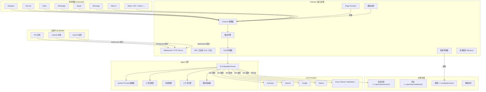
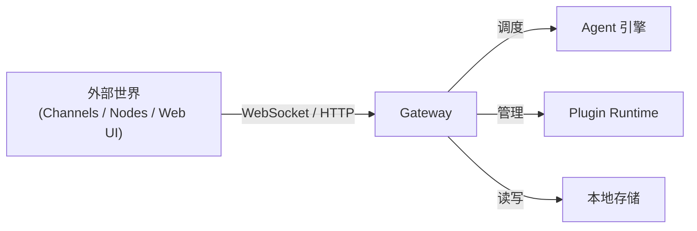
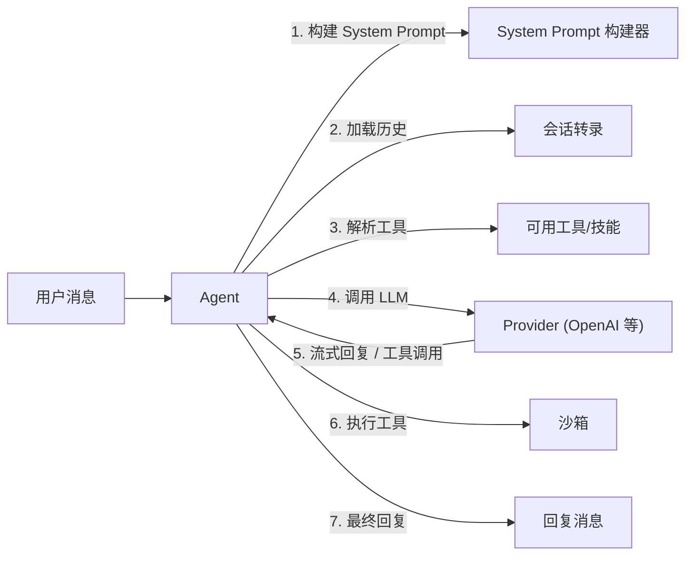
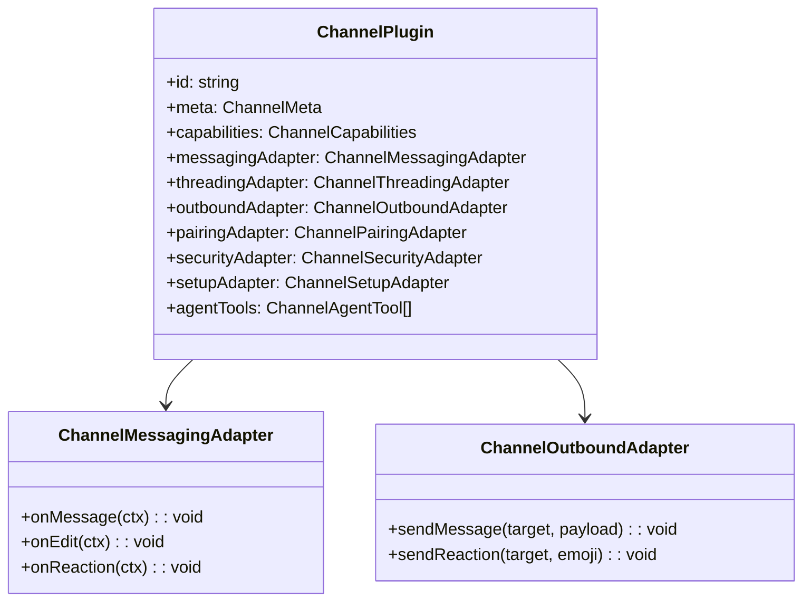
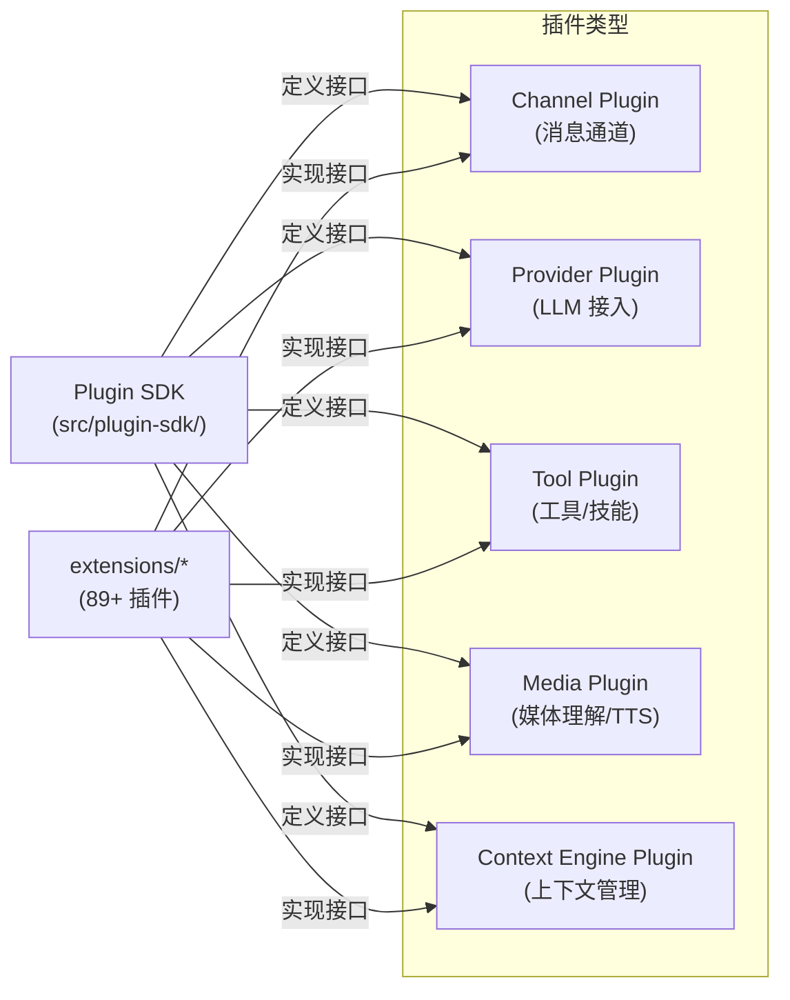
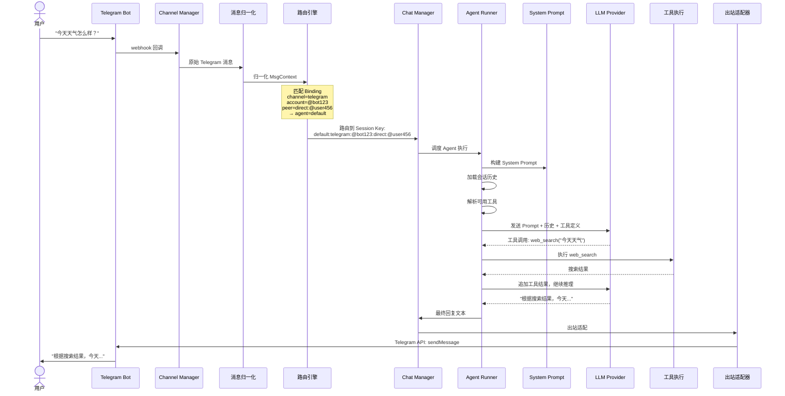

# 第一章 · 序言：全局视角

> **读完本章你将获得**：对 OpenClaw 整体架构的完整心智模型 — 知道它是什么、由哪些模块组成、数据怎么流转、代码在哪里找。后续章节的每一个深入话题，你都能在这张"地图"上找到它的位置。

---

## 1.1 项目定位与设计哲学

### OpenClaw 是什么

OpenClaw 是一个 **开源的、本地优先的个人 AI 助手平台**。它的核心能力是：

1. **把大语言模型（LLM）变成一个始终在线、可通过任意消息平台触达的私人助理**
2. 运行在用户自己的设备上（笔记本、服务器、树莓派均可），而非云端
3. 通过插件架构接入 Telegram、Discord、Slack、WhatsApp、Signal、iMessage 等 20+ 消息平台
4. 通过 Provider 插件接入 OpenAI、Anthropic、Google、Ollama 等 35+ LLM 提供者

用一句话概括：**OpenClaw = 本地 Gateway + 多通道消息路由 + 可编排的 Agent 引擎 + 可扩展的插件生态**。

### 四条设计原则

| 原则 | 含义 |
|------|------|
| **本地优先 (Local-first)** | Gateway 进程跑在用户自有设备上；数据不经第三方中转服务器。隐私是默认值，不是可选项 |
| **通道无关 (Channel-agnostic)** | Agent 不关心消息来自哪个平台。统一的消息归一化层让 Telegram 消息和 Discord 消息到达 Agent 时看起来一模一样 |
| **插件驱动 (Plugin-driven)** | Channel、Provider、工具、上下文引擎 — 一切皆可通过插件扩展，核心尽可能薄 |
| **开发者友好 (Developer-first)** | CLI 是一等公民；配置即代码（YAML + Zod Schema）；TypeScript 全栈 |

---

## 1.2 架构全景图



**核心流转**：消息从 Channel 进入 → Channel Manager 归一化 → Router 决策路由到哪个 Agent/Session → Chat 管理器调度 → Agent Runner 组装 Prompt 调用 LLM → 结果经原路返回 Channel。

---

## 1.3 核心概念词典

### Gateway（网关）

系统的中枢进程。它是一个 HTTP + WebSocket 服务器，管理着所有 Channel 连接、Agent 调度、插件运行时和配置状态。



**一句话**：Gateway 是 OpenClaw 的"操作系统内核"— 所有消息进出、所有模块协作都经过它。

| 关键属性 | 值 |
|---------|---|
| 代码位置 | `src/gateway/` |
| 入口函数 | `startGatewayServer()` @ `src/gateway/server.impl.ts` |
| 协议版本 | 3 |
| 默认端口 | 3000（可配置） |
| 暴露方法 | 114+ RPC methods |

---

### Agent（代理）

LLM 驱动的对话实体。每个 Agent 有自己的身份（agentId）、模型配置、工具集和会话历史。



| 关键属性 | 值 |
|---------|---|
| 代码位置 | `src/agents/` |
| 执行入口 | `runEmbeddedPiAgent()` @ `src/agents/pi-embedded-runner/run.ts` |
| System Prompt | `buildAgentSystemPrompt()` @ `src/agents/system-prompt.ts` |

---

### Channel（通道）

一个消息平台的适配器。每个 Channel 是一个实现了标准接口的插件（`ChannelPlugin`），负责：
- **入站**：接收平台消息 → 归一化为统一格式
- **出站**：将 Agent 回复 → 转换为平台格式并发送



| 关键属性 | 值 |
|---------|---|
| 内置 Channel | Telegram, Discord, Slack, WhatsApp, Signal, iMessage, Web |
| 扩展 Channel | Matrix, IRC, MS Teams, Google Chat, Line, Feishu 等 20+ |
| 接口定义 | `src/channels/plugins/types.plugin.ts` |
| 注册表 | `src/channels/registry.ts` |

---

### Session（会话）

Agent 与特定用户（或群组、线程）之间的持久对话上下文。Session 由一个 **Session Key** 唯一标识。

```
Session Key 格式: {agentId}:{channel}:{accountId}:{peerKind}:{peerId}
示例: default:telegram:@bot123:direct:@user456
```

| 关键属性 | 值 |
|---------|---|
| 持久化位置 | `~/.openclaw/sessions/{sessionId}/` |
| 会话状态 | 转录（transcript）、元数据、模型覆盖 |
| 代码位置 | `src/sessions/`, `src/routing/session-key.ts` |

---

### Plugin（插件）

OpenClaw 的扩展单元。每个插件是一个独立的 npm 包，通过 `openclaw.plugin.json` 声明自己的能力。



| 关键属性 | 值 |
|---------|---|
| 插件目录 | `extensions/` (89+ 内置插件) |
| SDK 公共表面 | `src/plugin-sdk/` (199 文件) |
| 运行时 | `src/plugins/runtime/` |
| 声明文件 | `openclaw.plugin.json` |

---

### Binding（绑定）

路由引擎用来决定"这条消息交给哪个 Agent"的映射规则。

```
Binding = Channel + Account + Peer → Agent
```

匹配优先级（从高到低）：
1. Peer + Roles（最精确）
2. Guild/Team
3. Account + Peer
4. Account
5. Channel
6. Default Agent

| 代码位置 | `src/routing/resolve-route.ts`, `src/routing/bindings.ts` |
|---------|---|

---

### Provider（提供者）

LLM API 的接入层。每个 Provider 是一个插件，负责将 OpenClaw 的通用请求翻译成特定 API 的调用。

| 内置 Provider | OpenAI, Anthropic, Google, Groq, Mistral, DeepSeek, Ollama 等 35+ |
|---------|---|
| 接口 | `OpenClawPluginApi` @ `src/plugin-sdk/` |
| Model Catalog | `src/agents/model-catalog.ts` |
| Auth Profile | `src/agents/auth-profiles/` |

---

### Node（节点）

通过 WebSocket 配对的远程设备（iOS/Android/macOS 应用）。Node 可以执行 Agent 下发的命令（拍照、读日历、获取位置等）。

| 代码位置 | `src/infra/device-pairing.ts`, `apps/` |
|---------|---|

---

### Context Engine（上下文引擎）

管理 Agent 对话历史的 Token 预算和压缩策略。当对话过长时，Context Engine 决定保留什么、压缩什么。

| 接口 | `ContextEngine` @ `src/context-engine/types.ts` |
|---------|---|
| 操作 | `assemble()` (组装)、`compact()` (压缩)、`ingest()` (摄入) |

---

## 1.4 代码库地图

```
openclaw/
├── src/                          # 核心源码
│   ├── cli/                      # CLI 入口与命令注册
│   ├── gateway/                  # Gateway 服务器 (HTTP/WS/RPC)
│   ├── agents/                   # Agent 引擎 (PI Runner, 工具, 模型)
│   ├── channels/                 # Channel 注册表与插件类型系统
│   ├── routing/                  # 消息路由与 Session Key 构建
│   ├── sessions/                 # 会话生命周期与转录
│   ├── plugins/                  # 插件发现、加载与运行时
│   ├── plugin-sdk/               # 插件 SDK 公共 API (199 文件)
│   ├── config/                   # 配置 Schema (Zod) 与加载
│   ├── media/                    # 媒体处理管道
│   ├── media-understanding/      # 视觉/语音分析
│   ├── security/                 # 安全审计与策略
│   ├── infra/                    # 基础设施 (认证/发现/心跳/进程)
│   ├── commands/                 # CLI 命令实现 (158 文件)
│   ├── auto-reply/               # 自动回复调度
│   ├── context-engine/           # 上下文压缩引擎
│   ├── shared/                   # 跨模块共享类型
│   ├── hooks/                    # 全局 Hook 系统
│   ├── cron/                     # 定时任务
│   ├── i18n/                     # 国际化
│   ├── image-generation/         # 图像生成
│   ├── link-understanding/       # 链接预览/提取
│   ├── tts/                      # 文本转语音
│   ├── web-search/               # 网页搜索集成
│   ├── secrets/                  # 密钥管理
│   ├── flows/                    # 工作流
│   ├── terminal/                 # 终端 UI 工具
│   ├── tui/                      # TUI 组件
│   ├── canvas-host/              # Canvas 渲染宿主
│   ├── daemon/                   # 守护进程模式
│   ├── process/                  # 进程管理
│   └── entry.ts                  # 主入口
│
├── extensions/                   # 插件 (89+)
│   ├── openai/                   # OpenAI Provider
│   ├── anthropic/                # Anthropic Provider
│   ├── google/                   # Google Gemini Provider
│   ├── telegram/                 # Telegram Channel
│   ├── discord/                  # Discord Channel
│   ├── slack/                    # Slack Channel
│   ├── deepgram/                 # 语音识别
│   ├── elevenlabs/               # TTS
│   ├── memory-core/              # 记忆系统
│   └── ...                       # 更多 Provider / Channel / 工具插件
│
├── apps/                         # 原生客户端
│   ├── ios/                      # iOS (Swift/SwiftUI)
│   ├── android/                  # Android (Kotlin/Compose)
│   └── macos/                    # macOS (Swift)
│
├── ui/                           # Web 控制面 (Lit.js + Vite)
├── packages/                     # 内部共享包
├── Swabble/                      # 语音唤醒守护进程 (Swift)
├── docs/                         # 文档 (Mintlify)
├── scripts/                      # 构建/发布/工具脚本
├── test/                         # 全局测试 fixtures
└── patches/                      # pnpm 补丁
```

**按层次理解**：

| 层 | 目录 | 职责 |
|---|------|------|
| **入口层** | `src/entry.ts` → `src/cli/` | 进程启动、CLI 解析、命令分发 |
| **服务层** | `src/gateway/` | HTTP/WS 服务器、RPC 协议、连接管理 |
| **引擎层** | `src/agents/` | LLM 调用、工具执行、System Prompt、重试 |
| **通道层** | `src/channels/` + `extensions/` | 消息平台适配、归一化、出站 |
| **路由层** | `src/routing/` + `src/sessions/` | 路由决策、会话管理、转录 |
| **插件层** | `src/plugins/` + `src/plugin-sdk/` | 插件生命周期、SDK 接口 |
| **配置层** | `src/config/` | Schema 定义、加载、验证、热重载 |
| **基础设施层** | `src/infra/` | 认证、发现、心跳、进程、文件安全 |
| **媒体层** | `src/media/` + `src/media-understanding/` | 文件处理、转码、AI 分析 |
| **安全层** | `src/security/` | 审计、策略、沙箱 |

---

## 1.5 一次典型交互的极简全流程

**场景**：用户在 Telegram 发送 "今天天气怎么样？"，OpenClaw 回复天气信息。



**关键调用路径**：

```
src/channels/ (Telegram webhook)
  → src/channels/plugins/normalize/ (消息归一化)
  → src/routing/resolve-route.ts::resolveAgentRoute()
  → src/gateway/server-chat.ts (Chat 管理器调度)
  → src/agents/pi-embedded-runner/run.ts::runEmbeddedPiAgent()
    → src/agents/system-prompt.ts::buildAgentSystemPrompt()
    → src/agents/pi-embedded-runner/attempt.ts::runEmbeddedAttempt()
      → LLM Provider API 调用 (流式)
      → 工具执行 → 结果反馈 → 再次调用 LLM
    → 最终文本
  → src/channels/plugins/types.plugin.ts (ChannelOutboundAdapter)
  → Telegram API
```

---

## 1.6 技术栈速览

| 维度 | 选型 |
|------|------|
| 语言 | TypeScript (ESM, 严格模式) |
| 运行时 | Node.js 22+（Bun 亦支持开发/脚本） |
| 包管理 | pnpm (monorepo workspace) |
| 构建 | tsdown → `dist/` |
| 测试 | Vitest (V8 coverage, forks pool) |
| Lint/Format | Oxlint + Oxfmt |
| CLI 框架 | Commander.js + @clack/prompts |
| Web UI | Lit.js + Vite |
| iOS | Swift / SwiftUI / Xcode |
| Android | Kotlin / Jetpack Compose / Gradle |
| macOS | Swift / SwiftPM |
| 语音唤醒 | Swift (Speech.framework) |
| 配置校验 | Zod |
| WebSocket | ws 库 |

---

### 质检报告

**完整性**
- [x] 项目定位与设计哲学已覆盖
- [x] 架构全景图（一张 Mermaid 图看懂系统骨架）
- [x] 核心概念词典（Gateway / Agent / Channel / Session / Plugin / Binding / Provider / Node / Context Engine — 每个有定义 + 关系 + 配图）
- [x] 代码库地图（顶层目录 + 分层职责表）
- [x] 典型交互极简全流程（Telegram 消息完整路径 + 序列图 + 调用链）

**准确性**
- [x] 路径与仓库实际结构一致（`src/gateway/server.impl.ts`, `src/agents/pi-embedded-runner/run.ts`, `src/routing/resolve-route.ts` 等已验证）
- [x] Gateway 114+ RPC 方法、Protocol Version 3 已确认
- [x] 89+ 插件数量已确认
- [x] 未确认项已标注 [需源码验证]（本章无）

**可读性**
- [x] 从"是什么"→"全景图"→"概念"→"代码地图"→"全流程"的递进连贯
- [x] 术语首次出现均有解释
- [x] 无前序概念未讲清就被引用的情况

**勘误建议**
- 无
