# 第二章 · 数据流全景

> **读完本章你将获得**：对 OpenClaw 中所有核心数据流的完整认知 — 消息怎么进来、Agent 怎么处理、回复怎么出去、媒体怎么流转、插件何时介入、Gateway 怎么启停。每个场景都有文字说明 + 序列图 + 关键调用路径。

---

## 2.1 场景总览

OpenClaw 的数据流可以分为以下核心场景：

| # | 场景 | 关键参与者 | 复杂度 |
|---|------|-----------|--------|
| 1 | 入站消息处理 | Channel → Router → Agent | ★★★ |
| 2 | Agent 执行与 LLM 交互 | Agent Runner → Provider → Tool | ★★★★ |
| 3 | 出站消息发送 | Agent → Outbound Adapter → Channel API | ★★ |
| 4 | Web UI 聊天 (流式) | Web Client → Gateway WS → Agent → 流式回写 | ★★★ |
| 5 | 媒体处理管道 | 入站附件 → 存储 → 分析 → 出站转换 | ★★★ |
| 6 | 插件生命周期 | 发现 → 加载 → 注册 → Hook 调用 | ★★ |
| 7 | Gateway 启动与关闭 | 配置加载 → 服务启动 → 健康监控 → 优雅停止 | ★★★ |
| 8 | 设备配对与 Node 通信 | Node → Gateway 握手 → 双向命令 | ★★ |
| 9 | 配置热重载 | 文件变更 → Diff → 重载计划 → 热更新/重启 | ★★ |

---

## 2.2 场景一：入站消息处理

**概述**：一条消息从 Telegram/Discord/Slack 等平台到达 OpenClaw，经过归一化、路由、分发，最终交给正确的 Agent 处理。

### 时序图

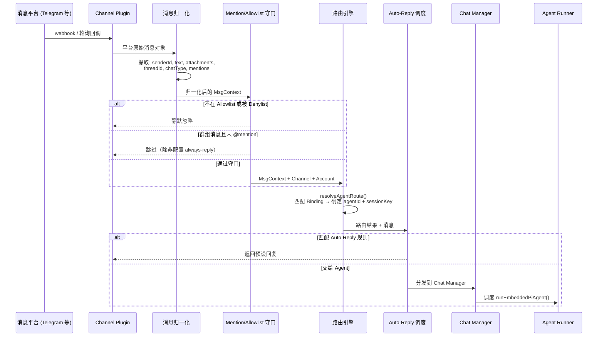

### 关键调用路径

```
Channel webhook handler
  → src/channels/plugins/normalize/{channel}.ts  (归一化)
  → src/channels/allowlists/                     (Allowlist/Denylist 检查)
  → src/channels/mention-gating.ts               (Mention 守门)
  → src/routing/resolve-route.ts::resolveAgentRoute()
  → src/auto-reply/dispatch.ts::dispatchInboundMessage()
  → src/gateway/server-chat.ts                   (Chat 调度)
  → src/agents/pi-embedded-runner/run.ts::runEmbeddedPiAgent()
```

### 设计要点

- **归一化是关键屏障**：不同平台的消息格式千差万别（Telegram 有 `message.text`，Discord 有 `content`，Slack 有 `blocks`），归一化层把它们统一成 `MsgContext`，让下游完全不感知平台差异。
- **Allowlist 前置**：在路由之前就过滤掉不允许的发送者，避免浪费 Agent 资源。
- **Auto-Reply 独立于 Agent**：简单的自动回复（如"我现在不在"）不需要调用 LLM。

---

## 2.3 场景二：Agent 执行与 LLM 交互

**概述**：这是 OpenClaw 最复杂的数据流。Agent 接到消息后，构建提示词、调用 LLM、可能执行工具、可能多轮迭代，最终产出回复。

### 时序图

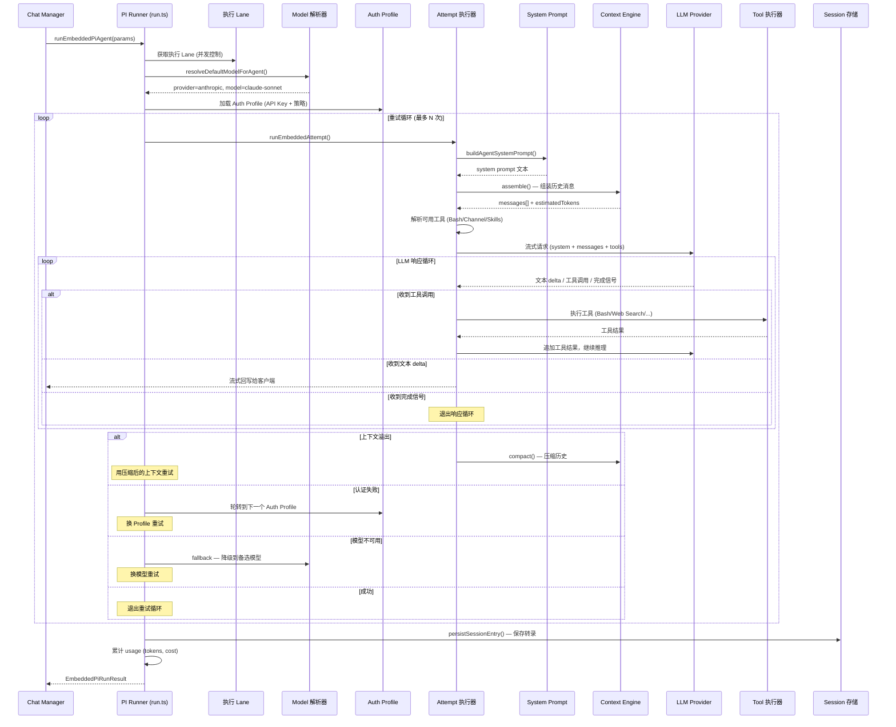

### 关键调用路径

```
src/agents/pi-embedded-runner/run.ts::runEmbeddedPiAgent()
  → src/agents/model-selection.ts::resolveDefaultModelForAgent()
  → src/agents/auth-profiles/ (加载/轮转凭证)
  → src/agents/pi-embedded-runner/attempt.ts::runEmbeddedAttempt()
    → src/agents/system-prompt.ts::buildAgentSystemPrompt()
    → src/context-engine/ (assemble / compact)
    → src/agents/skills.ts::buildWorkspaceSkillSnapshot()
    → LLM Provider (流式调用)
    → src/agents/bash-tools*.ts / 其他工具执行器
  → src/agents/pi-embedded-runner/ (持久化结果)
```

### 设计要点

- **Lane 并发控制**：每个 Session 有自己的执行 Lane，防止同一会话的多条消息同时调用 LLM。
- **三级重试**：上下文溢出 → 压缩重试；认证失败 → 换 Profile 重试；模型不可用 → 降级重试。
- **流式是一等公民**：LLM 的每个 token 增量都实时推送给客户端，而不是等全部完成。

---

## 2.4 场景三：出站消息发送

**概述**：Agent 生成回复或用户通过 CLI 发送消息时，消息经出站适配器转换为平台格式，通过 Channel API 发出。

### 时序图

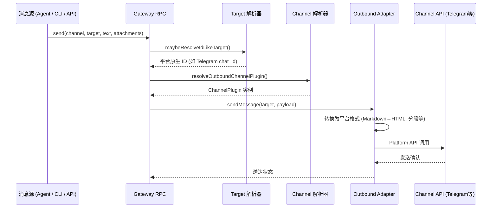

### 关键调用路径

```
src/gateway/server-methods/send.ts::sendHandlers["send"]
  → src/infra/outbound/target-resolver.ts::maybeResolveIdLikeTarget()
  → src/infra/outbound/channel-resolution.ts::resolveOutboundChannelPlugin()
  → ChannelPlugin.outboundAdapter.sendMessage()
  → Platform API
```

### 设计要点

- **Target 解析**：用户可以用人类可读名称（如 `@username`）指定目标，解析器翻译为平台原生 ID。
- **消息格式转换**：Markdown 需要转换为各平台的格式（Telegram HTML、Slack mrkdwn、Discord Markdown）。
- **长消息分段**：超过平台长度限制的消息自动分成多条。

---

## 2.5 场景四：Web UI 聊天（流式）

**概述**：Web UI 通过 WebSocket 与 Gateway 通信，发送聊天消息并接收流式回复。这是理解 Gateway WS 协议的最佳场景。

### 时序图

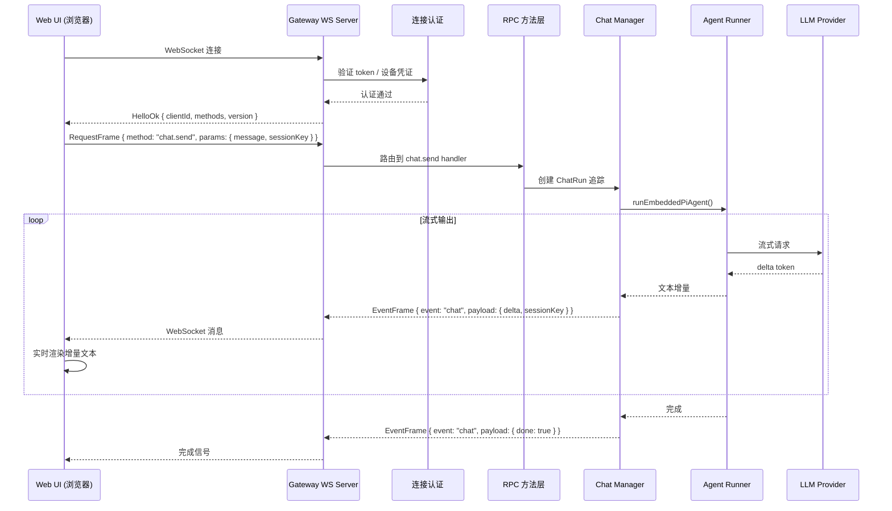

### 协议帧类型

| 帧类型 | 方向 | 用途 |
|-------|------|------|
| **RequestFrame** | Client → Server | RPC 调用（`method` + `params`） |
| **ResponseFrame** | Server → Client | RPC 响应（`result` 或 `error`） |
| **EventFrame** | Server → Client | 推送事件（`event` + `payload`） |

### 关键调用路径

```
ui/src/ui/gateway.ts::connectToGateway()
  → WebSocket 握手 + 认证
  → src/gateway/server/ws-connection/message-handler.ts (消息路由)
  → src/gateway/server-methods/chat.ts::chatHandlers["chat.send"]
  → src/gateway/server-chat.ts (Chat Run 追踪 + 事件订阅)
  → src/agents/pi-embedded-runner/run.ts::runEmbeddedPiAgent()
  → EventFrame 流式推送
```

---

## 2.6 场景五：媒体处理管道

**概述**：当消息包含图片、音频、视频或文档时，媒体管道负责接收、存储、分析（AI 理解）和出站转换。

### 流程图

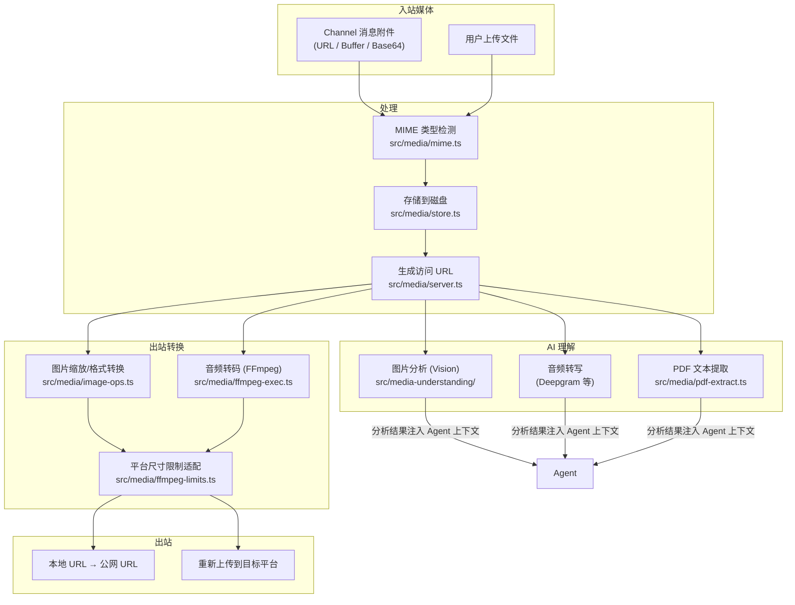

### 关键调用路径

```
入站:
  Channel 消息 → src/media/fetch.ts (远程拉取)
    → src/media/mime.ts (类型检测)
    → src/media/store.ts::saveMediaBuffer() (存储)
    → src/media/server.ts (HTTP 服务 /media/{fileId})

AI 理解:
  src/media-understanding/runtime.ts::runMediaUnderstandingFile()
    → describeImageFile() (视觉分析)
    → transcribeAudioFile() (语音转写)
  src/media/pdf-extract.ts::extractPdfText() (PDF 提取)

出站:
  src/media/image-ops.ts (缩放/转换)
  → src/media/ffmpeg-exec.ts (音视频转码)
  → src/plugin-sdk/outbound-media.ts::resolveOutboundMediaDeliveryAddress()
```

### 设计要点

- **懒处理**：媒体文件先存后分析，不阻塞消息接收。
- **平台限制适配**：每个平台对文件大小/格式有不同限制（`ffmpeg-limits.ts`），出站时自动适配。
- **TTL 清理**：临时媒体文件有 24h~7d 的生存时间，由维护定时器清理。

---

## 2.7 场景六：插件生命周期

**概述**：插件从文件系统中被发现，经过注册、加载、初始化，最终在 Hook 点参与消息处理。

### 时序图

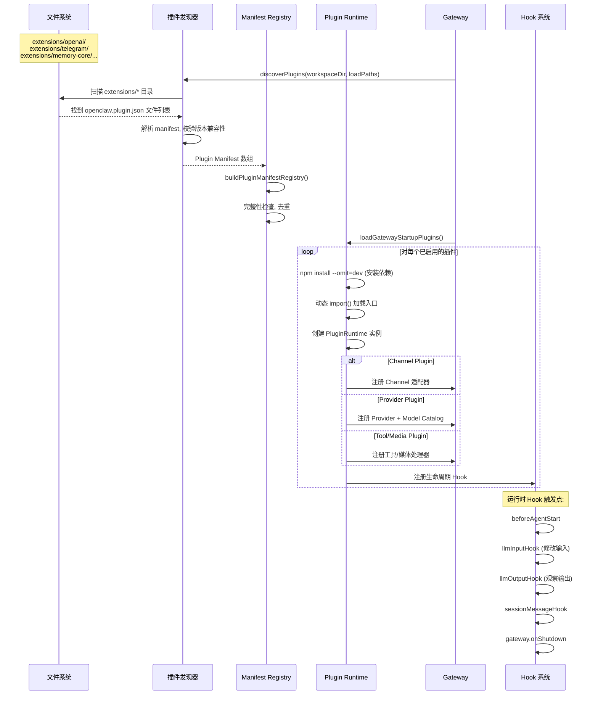

### 关键调用路径

```
src/plugins/discovery.ts::discoverPlugins()
  → src/plugins/manifest-registry.ts::buildPluginManifestRegistry()
  → src/gateway/server-plugin-bootstrap.ts::loadGatewayStartupPlugins()
    → src/plugins/runtime/index.ts::createPluginRuntime()
    → 动态 import() 各插件入口
  → src/plugins/hooks.ts (注册/调用各 Hook)
```

### 设计要点

- **Lazy Loading**：插件按需加载，未启用的插件不占资源。
- **隔离安装**：每个插件在自己目录下 `npm install --omit=dev`，不污染全局 `node_modules`。
- **Hook 是非侵入式的**：插件通过 Hook 注入行为，不需要修改核心代码。

---

## 2.8 场景七：Gateway 启动与关闭

### 启动流程

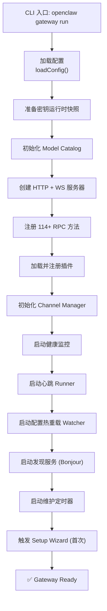

### 关闭流程

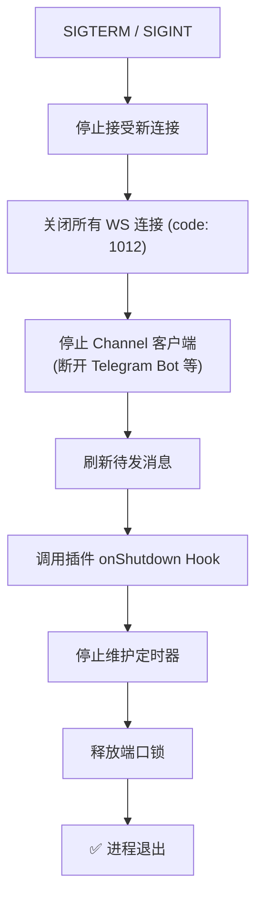

### 关键调用路径

```
启动:
  src/entry.ts → src/cli/run-main.ts::runCli()
    → src/gateway/server.impl.ts::startGatewayServer()
    → src/gateway/server-http.ts (HTTP 服务器创建)
    → src/gateway/server/ws-connection.ts (WS 处理器)
    → src/gateway/server-methods-list.ts (方法注册)
    → src/gateway/server-plugin-bootstrap.ts (插件加载)
    → src/gateway/server-channels.ts (Channel 管理器)
    → src/gateway/channel-health-monitor.ts (健康监控)
    → src/infra/heartbeat-runner.ts (心跳)
    → src/gateway/config-reload.ts (配置热重载)
    → src/gateway/server-discovery.ts (Bonjour)

关闭:
  src/gateway/server-close.ts::createGatewayCloseHandler()
```

---

## 2.9 场景八：设备配对与 Node 通信

**概述**：iOS/Android/macOS 应用通过 WebSocket 配对到 Gateway，成为可执行命令的远程 Node。

### 时序图

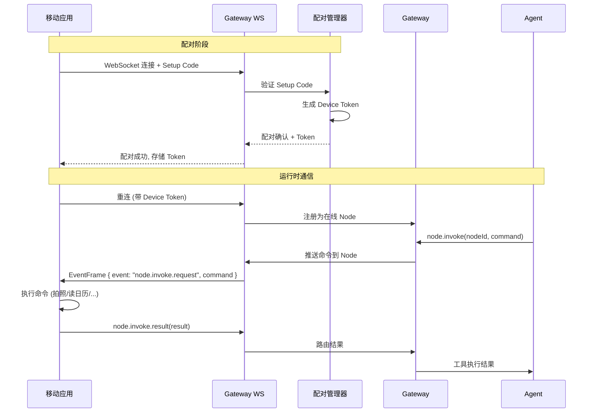

### 关键调用路径

```
配对:
  src/infra/device-pairing.ts
  → src/gateway/server-methods/ (node.pair.* 方法)

运行时:
  src/gateway/server-node-events.ts (Node 事件处理)
  → src/gateway/server-node-subscriptions.ts (订阅管理)
```

---

## 2.10 场景九：配置热重载

**概述**：当用户修改配置文件时，Gateway 检测变更并决定是热更新还是重启。

### 流程图

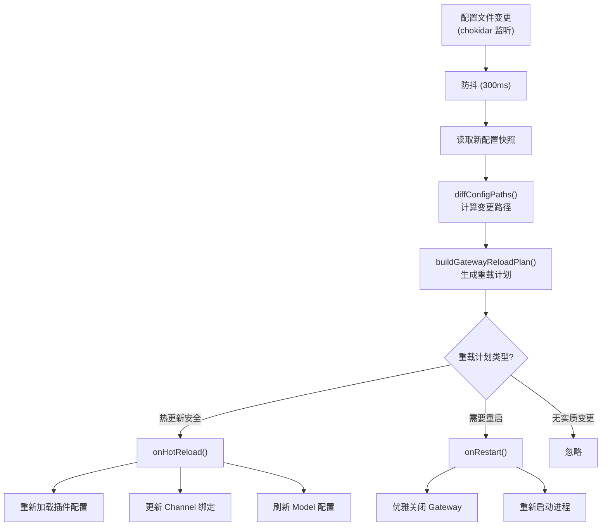

### 重载模式

| 模式 | 行为 |
|------|------|
| `off` | 不监听变更 |
| `hot` | 只做热更新（变更需要重启时报错） |
| `restart` | 总是重启 |
| `hybrid` | 先尝试热更新，不行就重启 |

### 关键调用路径

```
src/gateway/config-reload.ts::startGatewayConfigReloader()
  → chokidar.watch() (文件监听)
  → src/gateway/config-reload-plan.ts::buildGatewayReloadPlan() (分析变更)
  → onHotReload() 或 onRestart()
```

---

## 2.11 数据流总结图

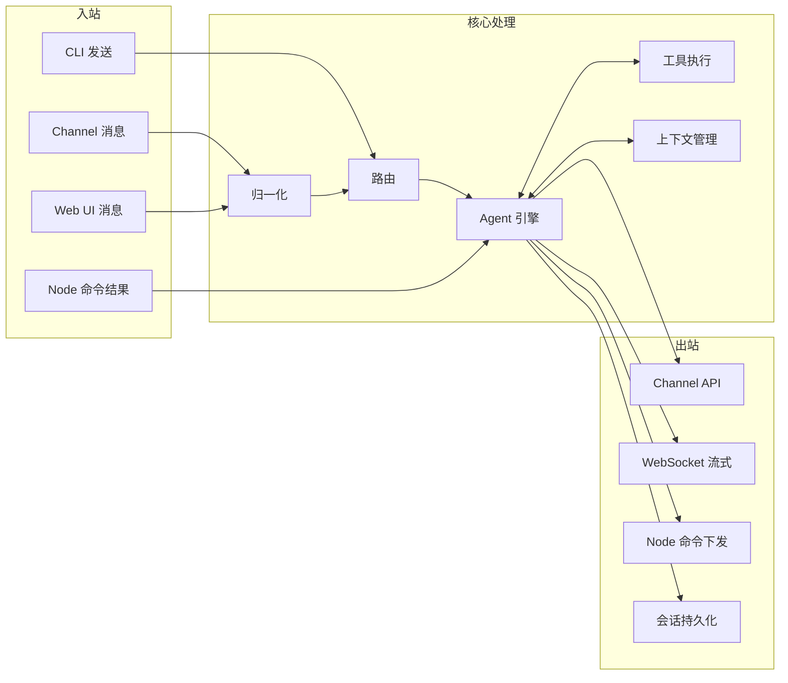

---

### 质检报告

**完整性**
- [x] 9 个核心场景全覆盖（入站、Agent 执行、出站、Web UI、媒体、插件、Gateway 生命周期、设备配对、配置热重载）
- [x] 每个场景都有文字说明 + 图表 + 调用路径
- [x] 核心流程（Agent 执行循环、入站消息处理）有详细序列图

**准确性**
- [x] 调用路径与仓库实际文件一致
- [x] Gateway RPC 方法、协议帧类型与源码一致
- [x] 未确认项：无

**可读性**
- [x] 从场景总览 → 逐个场景深入 → 总结图，递进清晰
- [x] 每个场景独立可读，也可串联理解
- [x] 图表形式根据场景选择（序列图用于时序、流程图用于决策/阶段）

**勘误建议**
- 无
