# 第三章 · Gateway：系统心脏

> **读完本章你将获得**：对 Gateway 内部机制的完整理解 — 它怎么启动、怎么处理连接、怎么路由 RPC 调用、怎么做认证、怎么热重载配置、怎么监控健康状态。你将能说清 Gateway 从启动到关闭的每一步。

---

## 3.1 Gateway 是什么

Gateway 是 OpenClaw 的核心进程 — 一个 HTTP + WebSocket 服务器，承载着所有消息进出、Agent 调度、插件管理和状态维护。

**类比**：如果 OpenClaw 是一个操作系统，Gateway 就是内核。所有用户态进程（Channel、Agent、Plugin）都通过它交互。

| 属性 | 值 |
|------|---|
| 代码位置 | `src/gateway/` (~150 文件) |
| 入口函数 | `startGatewayServer()` @ `src/gateway/server.impl.ts` |
| 默认端口 | 18789 |
| 协议版本 | 3 |
| RPC 方法 | 114+ (基础) + Channel 插件贡献 |
| 推送事件 | 20+ 类型 |

---

## 3.2 启动：十二步初始化

Gateway 的启动是一个严格有序的过程。顺序很重要 — 后面的步骤依赖前面的结果。

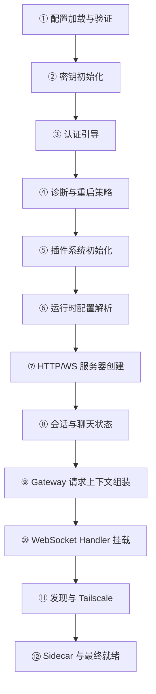

### 各步骤详解

| 步骤 | 代码位置 | 做了什么 |
|------|---------|---------|
| ① 配置加载 | `server.impl.ts:383-426` | 读取配置快照、遗留配置迁移、插件自动启用、验证 |
| ② 密钥初始化 | `server.impl.ts:428-479` | 建立密钥激活锁、创建运行时快照准备函数 |
| ③ 认证引导 | `server.impl.ts:480-515` | 解析 auth 模式、生成/持久化 token |
| ④ 诊断与重启 | `server.impl.ts:516-560` | 诊断心跳、SIGUSR1 重启策略 |
| ⑤ 插件系统 | `server.impl.ts:561-620` | 初始化子 Agent 注册表、加载插件、解析 Channel 运行时 |
| ⑥ 运行时配置 | `server.impl.ts:621-700` | 绑定地址/端口、TLS、限流器、Control UI 路径 |
| ⑦ 服务器创建 | `server.impl.ts:701-1000` | Channel Manager、HTTP/WS 基础设施、客户端连接预算 |
| ⑧ 会话状态 | `server.impl.ts:1001-1100` | ChatRunRegistry、Session 事件/消息订阅、工具事件路由 |
| ⑨ 请求上下文 | `server.impl.ts:1101-1217` | 组装全局请求上下文对象（所有 Handler 共享） |
| ⑩ WS Handler | `server.impl.ts:1224-1247` | 挂载 WS 连接处理器、额外 Handler（插件/审批/密钥） |
| ⑪ 发现服务 | `server.impl.ts:1248-1276` | 更新检查、Tailscale 暴露 |
| ⑫ 最终就绪 | `server.impl.ts:1278-1449` | 重载延迟插件、启动 Sidecar、创建关闭 Handler |

### 函数签名

```typescript
// src/gateway/server.impl.ts
export async function startGatewayServer(
  port: number = 18789,
  opts: GatewayServerOptions = {},
): Promise<GatewayServer>

type GatewayServerOptions = {
  bind?: "loopback" | "lan" | "tailnet" | "auto";
  host?: string;
  controlUiEnabled?: boolean;
  openAiChatCompletionsEnabled?: boolean;
  openResponsesEnabled?: boolean;
  auth?: GatewayAuthConfig;
  tailscale?: GatewayTailscaleConfig;
};

type GatewayServer = {
  close: (opts?: {
    reason?: string;
    restartExpectedMs?: number | null;
  }) => Promise<void>;
};
```

**设计要点**：返回值只有一个 `close()` 方法。Gateway 一旦启动就是自治的 — 外部唯一能做的就是要求它关闭。所有交互通过 WebSocket RPC 进行。

---

## 3.3 WebSocket 协议

Gateway 使用自定义的 WebSocket 协议（Protocol Version 3）与所有客户端通信。

### 协议帧类型

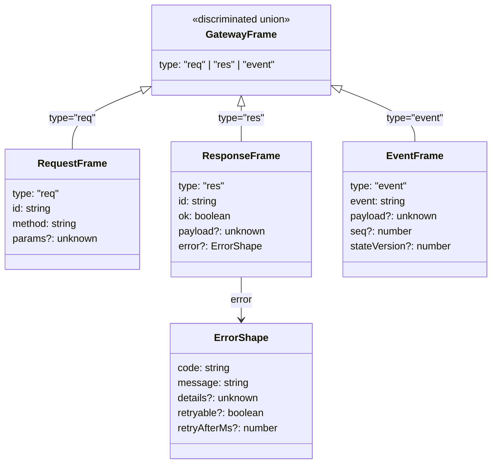

### 连接握手

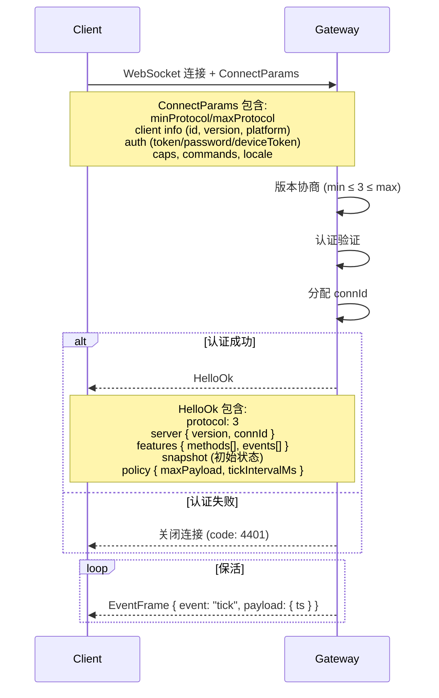

### 关键代码位置

| 组件 | 文件 |
|------|------|
| 帧 Schema 定义 | `src/gateway/protocol/schema/frames.ts` |
| 协议版本常量 | `src/gateway/protocol/index.ts` |
| 连接处理 | `src/gateway/server/ws-connection/` |
| 消息路由 | `src/gateway/server/ws-connection/message-handler.ts` |

---

## 3.4 RPC 方法体系

Gateway 通过 RPC 方法暴露所有能力。客户端发送 `RequestFrame`，Gateway 路由到对应的 Handler，返回 `ResponseFrame`。

### 方法分类

```mermaid
flowchart LR
    subgraph Methods["114+ RPC 方法"]
        direction TB
        A["会话管理 (9)<br/>sessions.list/create/send<br/>sessions.subscribe/abort/delete"]
        B["聊天 (4)<br/>chat.history/send/abort/inject"]
        C["Agent 控制 (9)<br/>agent/agents.list/create<br/>agent.identity.get/wait"]
        D["Node 管理 (13)<br/>node.pair.*/invoke<br/>node.list/describe"]
        E["配置 (5)<br/>config.get/set/apply<br/>config.patch/schema"]
        F["执行审批 (7)<br/>exec.approvals.*/approval.*"]
        G["定时任务 (6)<br/>cron.list/add/update<br/>cron.remove/run"]
        H["工具与技能 (5)<br/>tools.catalog/effective<br/>skills.status/install"]
        I["系统控制 (8)<br/>health/status/usage<br/>logs.tail/update.run"]
        J["Channel (4)<br/>channels.status/logout<br/>talk.config/speak"]
    end
```

### 方法注册机制

```typescript
// src/gateway/server-methods-list.ts

// 基础方法列表（硬编码）
const BASE_METHODS = ["health", "chat.send", "sessions.list", ...]; // 114+

// Channel 插件可以贡献额外方法
export function listGatewayMethods(): string[] {
  const channelMethods = listChannelPlugins()
    .flatMap((plugin) => plugin.gatewayMethods ?? []);
  return Array.from(new Set([...BASE_METHODS, ...channelMethods]));
}
```

**设计要点**：方法列表 = 固定基础集 ∪ 插件贡献。去重后在 `HelloOk` 中发送给客户端，客户端据此知道服务器支持哪些能力。

### 事件类型

| 事件 | 触发时机 |
|------|---------|
| `chat` | Agent 流式输出文本增量 |
| `agent` | Agent 执行状态变更 |
| `session.message` | 会话新消息 |
| `sessions.changed` | 会话列表变更 |
| `tick` | 保活心跳 |
| `shutdown` | Gateway 即将关闭 |
| `health` | 健康状态变更 |
| `node.pair.requested/resolved` | 设备配对请求/完成 |
| `node.invoke.request` | Node 命令下发 |
| `exec.approval.requested/resolved` | 执行审批流 |
| `presence` | 用户在线状态 |
| `cron` | 定时任务事件 |

---

## 3.5 认证体系

### 四种认证模式

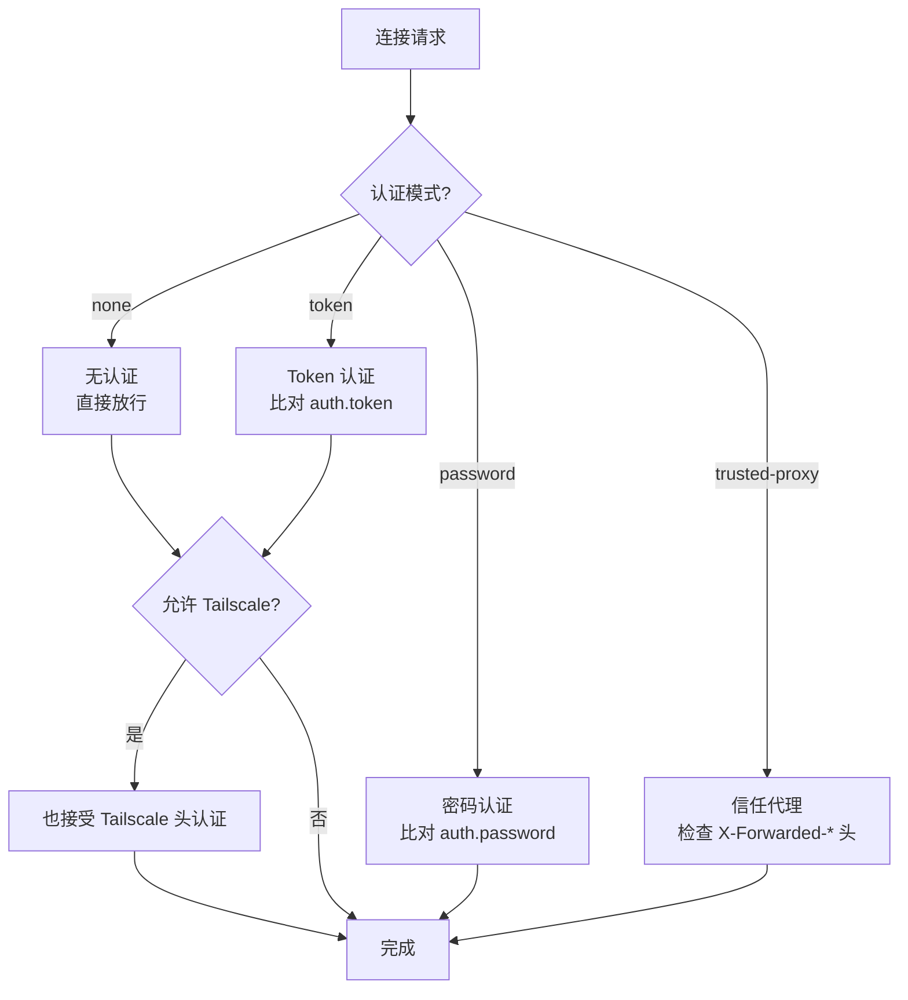

### 认证解析优先级

```
CLI/环境覆盖 > config.gateway.auth.mode > password字段存在 > token字段存在 > 默认(token)
```

### Token 生成与持久化

```typescript
// src/gateway/startup-auth.ts
// 当模式为 token 但无 token 时，自动生成：
const token = crypto.randomBytes(24).toString("hex");
// 如果 persist === true 且不是 CLI 覆盖，写入配置文件
```

### 限流保护

```
src/gateway/auth-rate-limit.ts
```

连续认证失败时触发限流，返回 `retryAfterMs` 提示客户端等待。

| 代码位置 | 文件 |
|---------|------|
| 认证核心 | `src/gateway/auth.ts` |
| 启动认证 | `src/gateway/startup-auth.ts` |
| 限流 | `src/gateway/auth-rate-limit.ts` |
| WS 认证上下文 | `src/gateway/server/ws-connection/auth-context.ts` |

---

## 3.6 Chat 管理与流式输出

### ChatRunRegistry：追踪进行中的聊天

当客户端调用 `chat.send` 时，Gateway 创建一个 **ChatRun** 来追踪这次执行：

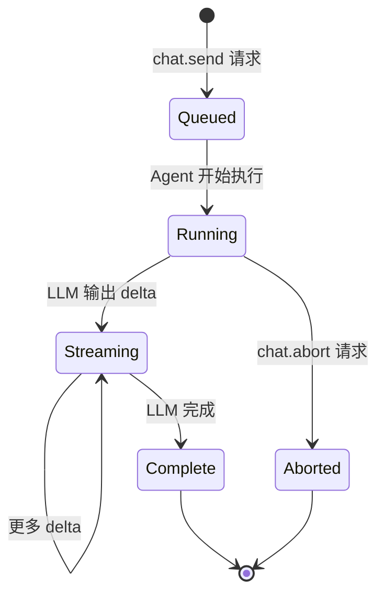

### 数据结构

```typescript
// src/gateway/server-chat.ts

// 每个 ChatRun 的追踪条目
type ChatRunEntry = {
  sessionKey: string;
  clientRunId: string;   // 客户端生成的唯一 ID
};

// ChatRunRegistry: 每个 sessionId 维护一个 FIFO 队列
type ChatRunRegistry = {
  add(sessionId, entry): void;       // 入队
  peek(sessionId): ChatRunEntry;     // 查看队首
  shift(sessionId): ChatRunEntry;    // 出队
  remove(sessionId, clientRunId): ChatRunEntry;  // 按 ID 移除
  clear(): void;
};
```

### 流式事件分发

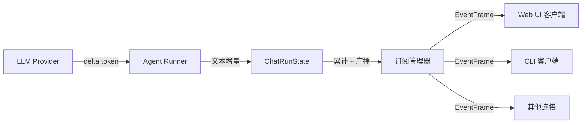

**三层订阅管理器**：

| 管理器 | 用途 | 粒度 |
|-------|------|------|
| `SessionEventSubscriberRegistry` | 订阅所有会话事件 | 全局 |
| `SessionMessageSubscriberRegistry` | 订阅特定会话的消息 | 按 sessionKey |
| `ToolEventRecipientRegistry` | 路由工具执行事件 | 按 runId |

---

## 3.7 配置热重载

### 重载模式

| 模式 | 行为 |
|------|------|
| `off` | 不监听变更 |
| `hot` | 仅热更新（需重启时报错） |
| `restart` | 总是重启 |
| `hybrid` | 先尝试热更新，失败则重启 |

### 重载决策流程

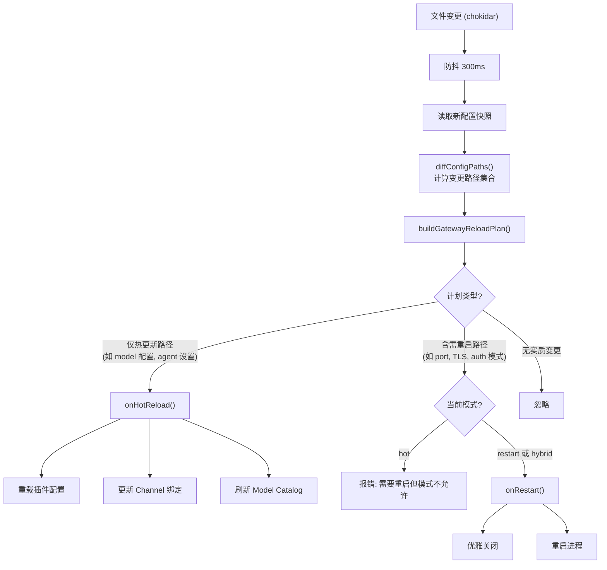

### 关键代码

```
src/gateway/config-reload.ts::startGatewayConfigReloader()
  → chokidar.watch() (监听配置文件)
  → 防抖 + 重试 (最多 2 次, 150ms 间隔)
  → src/gateway/config-reload-plan.ts::buildGatewayReloadPlan()
```

---

## 3.8 健康监控

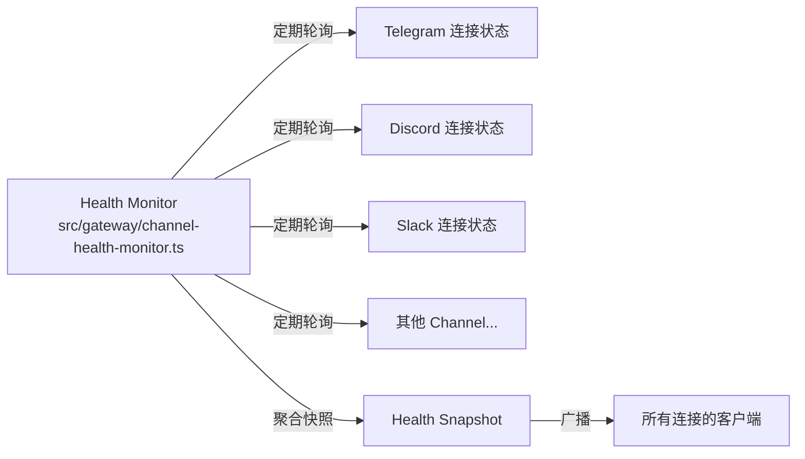

**Health Snapshot** 包含每个 Channel 的连接状态、最后活跃时间和错误信息。通过 `health` 事件定期广播。

---

## 3.9 发现服务

Gateway 通过 **Bonjour/mDNS** 在局域网公告自己的存在，让移动应用和其他客户端自动发现。

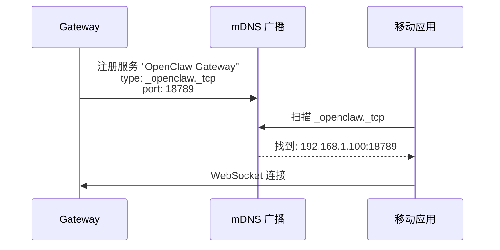

### 辅助解析

| 功能 | 代码 |
|------|------|
| Bonjour 实例名格式化 | `formatBonjourInstanceName()` |
| CLI 路径解析 | `resolveBonjourCliPath()` |
| Tailscale DNS 提示 | `resolveTailnetDnsHint()` |

---

## 3.10 Gateway 关闭

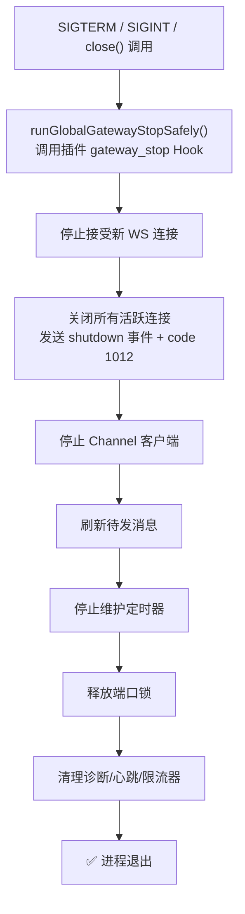

**设计要点**：
- 先发 `shutdown` EventFrame 通知所有客户端，再断连。客户端收到后可以选择自动重连。
- `restartExpectedMs` 字段告诉客户端"预计多久后 Gateway 会回来"，用于自动重连等待。

---

### 质检报告

**完整性**
- [x] Gateway 启动十二步全覆盖
- [x] WebSocket 协议帧类型与握手流程
- [x] RPC 方法体系与注册机制
- [x] 四种认证模式与解析优先级
- [x] Chat 管理与流式输出分发
- [x] 配置热重载机制
- [x] 健康监控
- [x] 发现服务 (Bonjour)
- [x] 优雅关闭流程

**准确性**
- [x] 函数签名与 `server.impl.ts` 一致
- [x] 帧 Schema 与 `protocol/schema/frames.ts` 一致
- [x] 认证模式与 `auth.ts` 一致
- [x] 默认端口 18789 已确认

**可读性**
- [x] 从"是什么"→ 启动 → 协议 → RPC → 认证 → Chat → 配置 → 健康 → 发现 → 关闭，递进连贯
- [x] 每个核心机制都有图
- [x] 术语与第一章一致

**勘误建议**
- 无
