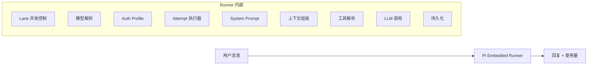
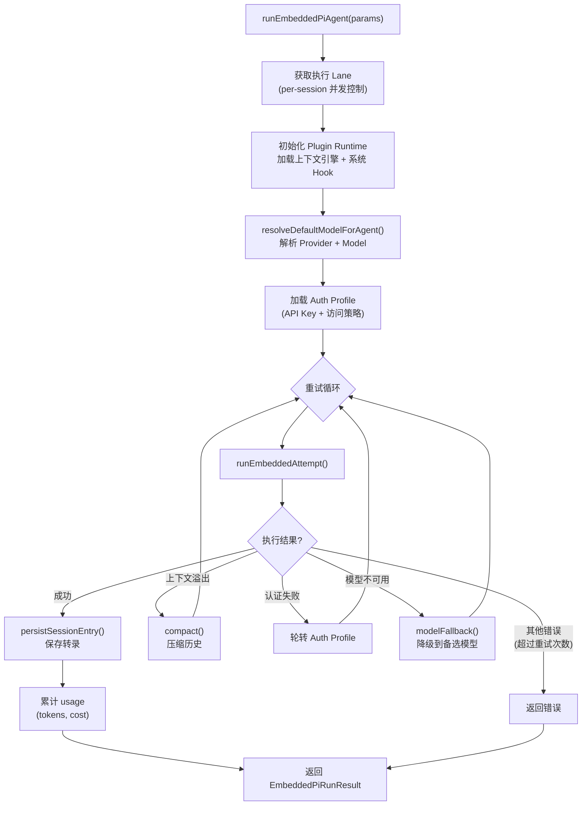
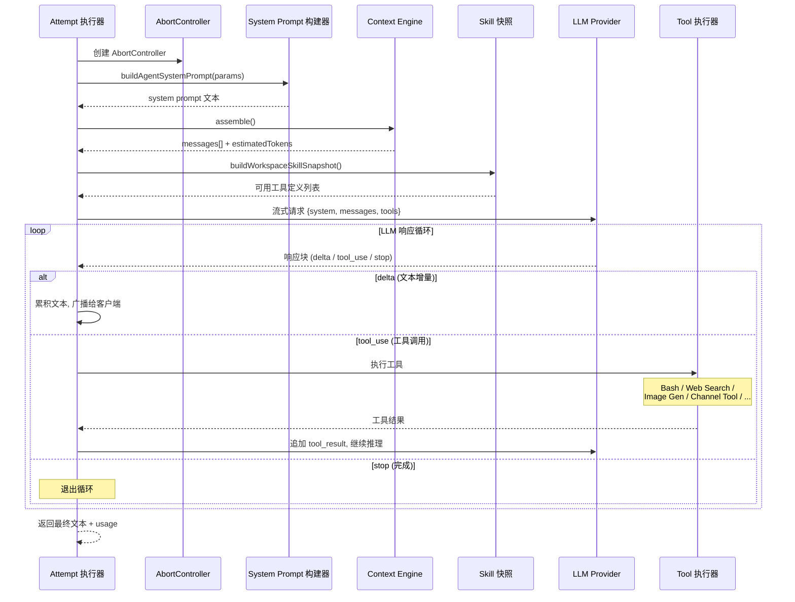
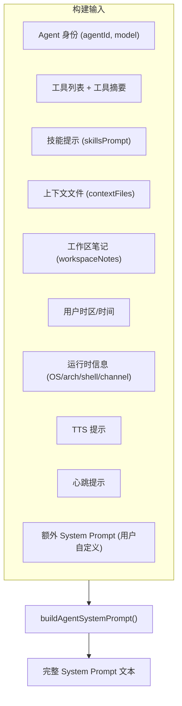
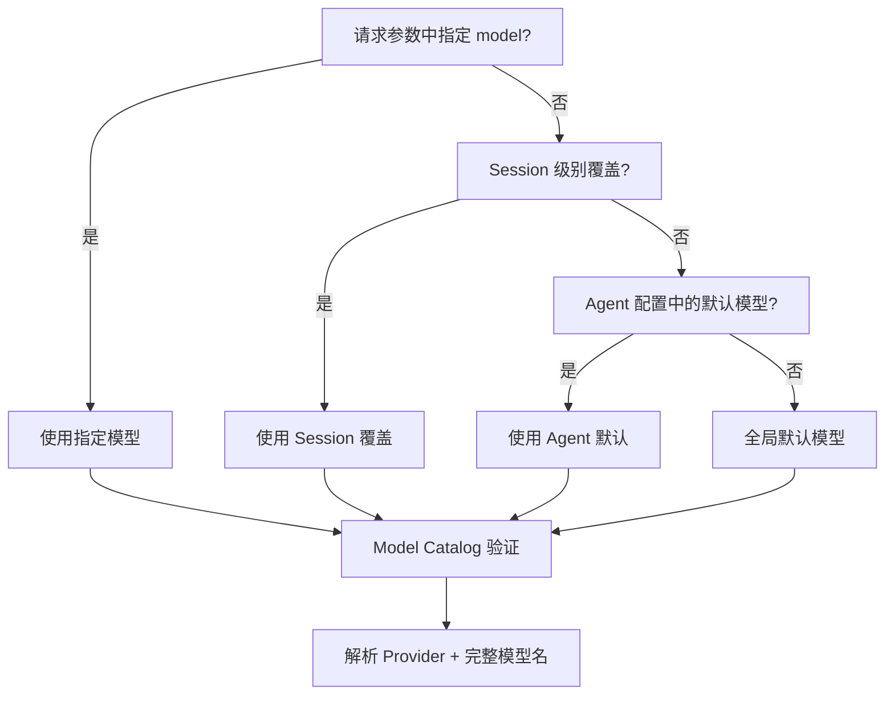
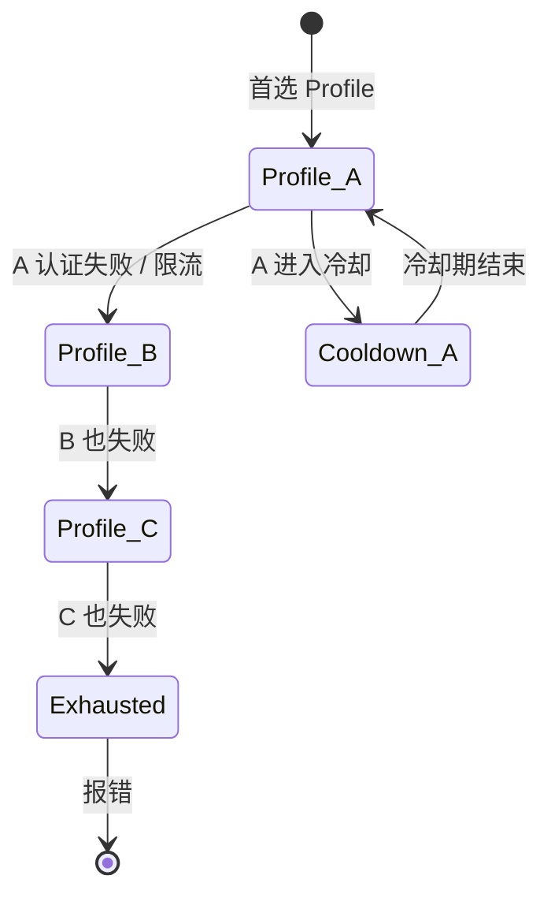
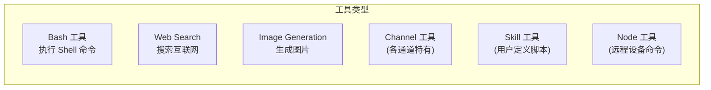
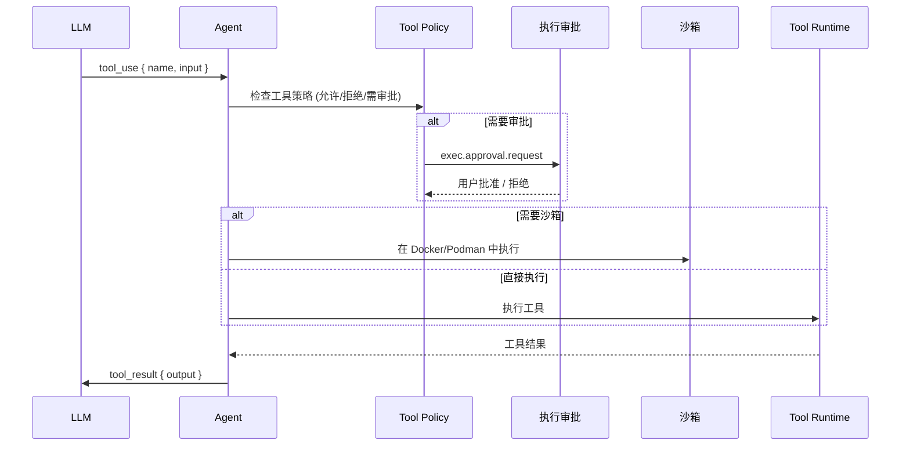
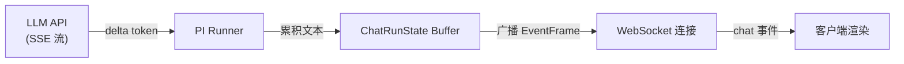

# 第四章 · Agent 引擎：从提示到回答

> **读完本章你将获得**：对 Agent 执行全流程的深入理解 — PI Embedded Runner 如何编排一次完整的 LLM 交互，包括 System Prompt 构建、模型选择、Auth Profile 轮转、重试策略、工具执行和流式输出。

---

## 4.1 Agent 引擎是什么

Agent 引擎是 OpenClaw 的"大脑" — 它接收用户消息，构建完整的提示词上下文，调用 LLM，处理工具调用，最终生成回复。

**核心入口**：`runEmbeddedPiAgent()` @ `src/agents/pi-embedded-runner/run.ts`（约 1400 行，是项目中最大的单文件之一）。



---

## 4.2 执行参数与返回值

### 输入

```typescript
// src/agents/pi-embedded-runner/run.ts
interface RunEmbeddedPiAgentParams {
  runId: string;                    // 本次执行的唯一 ID
  sessionId: string;                // 会话 ID
  sessionKey?: string;              // 会话键
  config: OpenClawConfig;           // 全局配置
  prompt: string;                   // 用户消息文本
  agentId?: string;                 // Agent ID (默认 "default")
  workspaceDir: string;             // 工作区目录
  provider?: string;                // 指定 Provider ("anthropic" 等)
  model?: string;                   // 指定模型 ("claude-sonnet" 等)
  authProfileId?: string;           // 指定 Auth Profile
  lane?: string;                    // 执行 Lane 名称
  messageProvider?: string;         // 消息来源平台
  messageChannel?: string;          // 消息来源通道
  trigger?: string;                 // 触发源标识
  toolResultFormat?: "markdown" | "plain";
  enqueue?: (task, opts) => Promise<T>;  // 自定义任务入队
}
```

### 输出

```typescript
interface EmbeddedPiRunResult {
  meta: EmbeddedPiAgentMeta;     // 执行元数据 (耗时, 重试次数等)
  result: unknown;                // 最终文本或结构化结果
  usage: UsageAccumulator;        // Token 使用量 (输入/输出/总计)
  error?: Error;                  // 错误 (如果有)
}
```

---

## 4.3 执行主循环



### Lane 并发控制

每个 Session 有自己的执行 Lane。Lane 是一个信号量 — 同一 Session 同时只允许一个 Agent 执行。这防止了：
- 同一会话的多条消息同时调用 LLM（导致历史不一致）
- 资源争抢

### 三级重试策略

| 级别 | 触发条件 | 恢复动作 |
|------|---------|---------|
| **上下文溢出** | LLM 报告 context_length_exceeded | `compact()` 压缩历史后重试 |
| **认证失败** | 401/403 或 API Key 无效 | 切换到下一个 Auth Profile |
| **模型不可用** | 模型限流/下线/超时 | 降级到配置的 fallback 模型 |

---

## 4.4 Attempt 执行器：单次 LLM 交互

`runEmbeddedAttempt()` 是单次 LLM 交互的完整流程：



---

## 4.5 System Prompt 构建

System Prompt 是发送给 LLM 的第一条消息，定义了 Agent 的身份、能力和行为规则。



### 关键代码

```
src/agents/system-prompt.ts::buildAgentSystemPrompt()
```

**约 800 行**，包含大量条件拼接逻辑。核心组成部分：

| 部分 | 内容 |
|------|------|
| 身份声明 | "You are {agentId}, running on {os}/{arch}..." |
| 运行时信息 | 当前时间、时区、模型名、通道名 |
| 工具说明 | 可用工具列表及用法摘要 |
| 技能区块 | 从 Skill 快照注入的能力描述 |
| 上下文文件 | 用户指定的参考文件内容 |
| 工作区笔记 | `.openclaw/notes/` 下的笔记 |
| 用户自定义 | `config.agents[].systemPrompt` 字段 |
| 行为约束 | 安全规则、输出格式要求等 |

### Prompt 模式

| 模式 | 用途 |
|------|------|
| `full` | 主 Agent — 包含所有部分 |
| `minimal` | Subagent — 只保留核心指令 |
| `none` | 透传 — 不添加系统提示 |

---

## 4.6 模型选择

### 解析链



### Model Catalog

```
src/agents/model-catalog.ts
```

Model Catalog 是所有可用模型的注册表。它从两个来源合并：
1. **内置模型**：硬编码在 Catalog 中的已知模型
2. **插件贡献**：Provider 插件通过 `providerCatalog` Hook 注册额外模型

### 模型回退链

```typescript
// src/agents/model-fallback.ts
// 当首选模型不可用时，按配置的 fallback 链降级
// config.agents[].models.fallback = ["claude-sonnet", "gpt-4", "ollama/llama3"]
```

---

## 4.7 Auth Profile 轮转

### Auth Profile 是什么

Auth Profile 是一组 API 凭证 + 访问策略。一个 Provider 可以有多个 Auth Profile（比如多个 OpenAI API Key）。



### 轮转机制

| 步骤 | 行为 |
|------|------|
| 1 | 选择首选 Profile（配置优先级或上次成功的） |
| 2 | 调用 LLM API |
| 3 | 如果 401/403/429 → 标记当前 Profile 进入冷却 |
| 4 | 选择下一个可用 Profile 重试 |
| 5 | 所有 Profile 耗尽 → 报错 |

### 关键代码

```
src/agents/auth-profiles/ (目录)
  ├── rotation.ts     — 轮转逻辑
  ├── cooldown.ts     — 冷却管理
  ├── storage.ts      — Profile 持久化
  └── doctor.ts       — 诊断工具
```

---

## 4.8 工具执行

Agent 可以调用工具来获取外部信息或执行操作。工具执行是 Agent 推理循环的一部分。

### 工具类型



### 工具执行流程



### Bash 工具

```
src/agents/bash-tools.ts           — Bash 执行入口
src/agents/bash-tools.approval.ts  — 审批流
src/agents/bash-tools.process.ts   — 进程监控
```

Bash 工具是最常用的工具类型。Agent 可以执行 Shell 命令来读写文件、运行脚本等。关键安全机制：
- **执行审批**：高风险命令需要用户确认
- **沙箱隔离**：可配置在 Docker/Podman 容器中执行
- **超时控制**：命令有最大执行时间

---

## 4.9 流式输出

Agent 执行过程中，LLM 的每个 token 增量都实时推送给客户端。



**设计要点**：
- 每个 delta 不是独立发送，而是累积后以适当频率广播
- `deltaSentAt` 和 `deltaLastBroadcastLen` 控制发送节奏，避免过于频繁
- 工具执行期间也有状态事件（"正在搜索..."、"正在执行命令..."）

---

## 4.10 使用量追踪

```typescript
// UsageAccumulator 追踪每次执行的 Token 消耗
type UsageAccumulator = {
  inputTokens: number;    // 输入 Token 数
  outputTokens: number;   // 输出 Token 数
  totalTokens: number;    // 总计
  cost?: number;          // 估算费用 (基于 model-pricing-cache)
  attempts: number;       // 重试次数
};
```

**定价缓存**：`src/agents/model-pricing-cache.ts` 维护各模型的单价信息，用于费用估算。

---

## 4.11 会话持久化

每次 Agent 执行完成后，结果保存到 Session 转录文件：

```
~/.openclaw/sessions/{sessionId}/
  ├── transcript.jsonl    — 消息历史 (JSON Lines)
  ├── metadata.json       — 会话元数据
  └── attachments/        — 媒体附件
```

**transcript.jsonl** 每行是一条消息：
```json
{"role": "user", "content": "今天天气怎么样？", "ts": 1711500000}
{"role": "assistant", "content": "根据搜索...", "ts": 1711500005, "usage": {...}}
```

---

### 质检报告

**完整性**
- [x] PI Embedded Runner 主循环全覆盖
- [x] Attempt 执行器单次交互流程
- [x] System Prompt 构建机制
- [x] 模型选择解析链
- [x] Auth Profile 轮转机制
- [x] 工具执行流程与类型
- [x] 流式输出机制
- [x] 使用量追踪
- [x] 会话持久化

**准确性**
- [x] 函数入口 `runEmbeddedPiAgent()` 路径正确
- [x] System Prompt 构建器 ~800 行已确认
- [x] PI Runner ~1400 行已确认
- [x] Auth Profile 目录结构与源码一致

**可读性**
- [x] 从全局视图 → 参数/返回值 → 主循环 → 单次执行 → 各子系统，递进清晰
- [x] 三级重试策略用表格对比，清晰易懂
- [x] 所有核心流程有图

**勘误建议**
- 无
