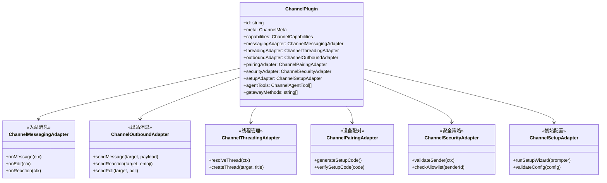
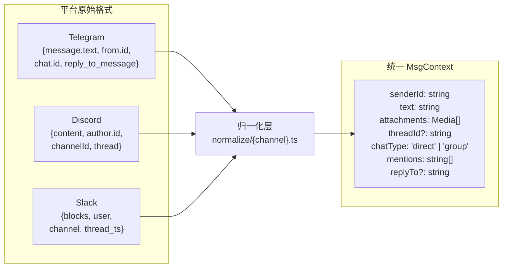
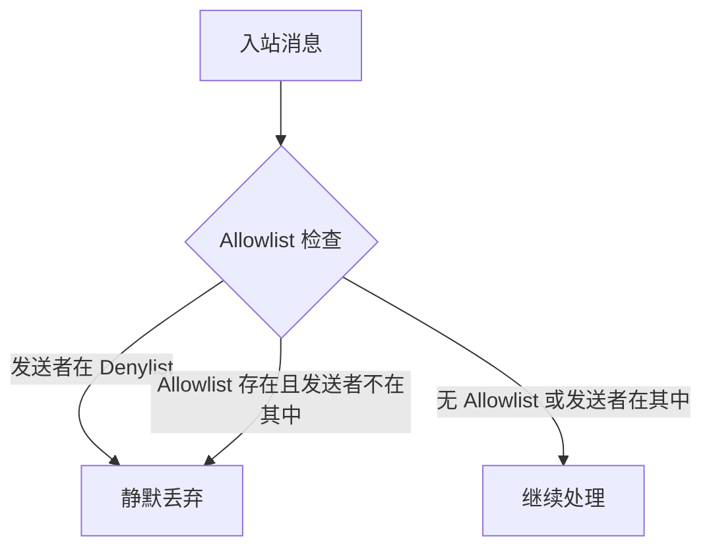
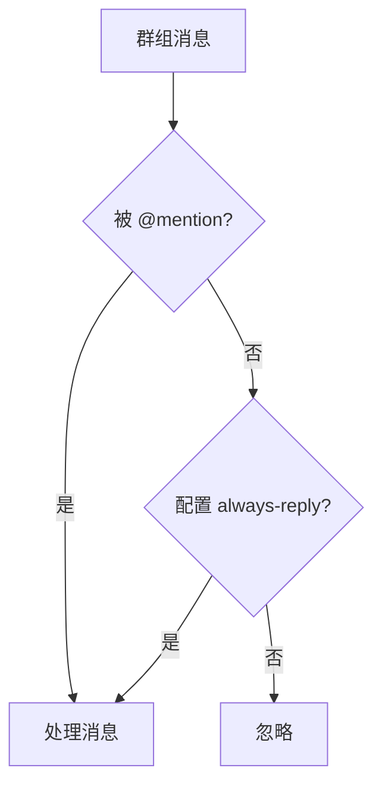
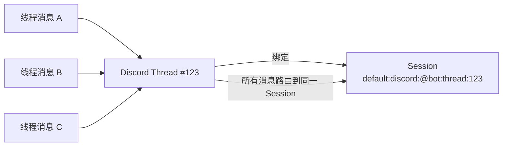
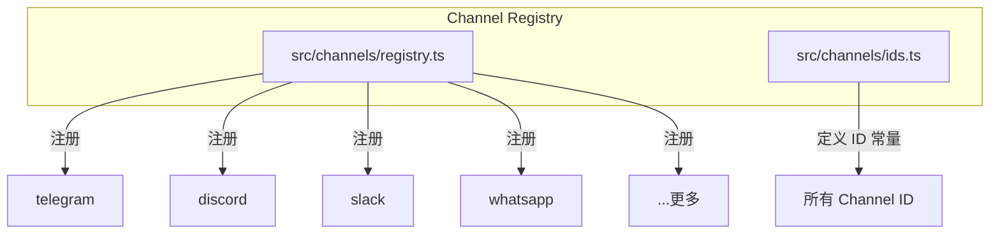

# 第五章 · Channel 系统：多平台消息适配

> **读完本章你将获得**：理解 OpenClaw 如何通过统一的 Channel Plugin 架构接入 20+ 消息平台 — 适配器体系如何设计、消息如何归一化、能力如何声明、线程绑定如何工作。

---

## 5.1 Channel 系统是什么

Channel 系统是 OpenClaw 的"翻译层" — 它让核心引擎不需要知道消息来自 Telegram 还是 Discord，只需要和统一的 `MsgContext` 打交道。

**核心类比**：Channel 之于 OpenClaw，就像设备驱动之于操作系统。每个 Channel Plugin 是一个"驱动程序"，把特定平台的协议翻译成系统通用的接口。

| 属性 | 值 |
|------|---|
| 代码位置 | `src/channels/` (核心类型) + `extensions/` (实现) |
| 内置 Channel | Telegram, Discord, Slack, WhatsApp, Signal, iMessage, Web |
| 扩展 Channel | Matrix, IRC, MS Teams, Google Chat, Line, Feishu 等 |
| 核心接口 | `ChannelPlugin` @ `src/channels/plugins/types.plugin.ts` |

---

## 5.2 ChannelPlugin 接口



### 适配器职责

| 适配器 | 职责 | 示例 |
|-------|------|------|
| **MessagingAdapter** | 接收并归一化入站消息 | Telegram webhook → MsgContext |
| **OutboundAdapter** | 发送出站消息到平台 | Agent 回复 → Telegram sendMessage API |
| **ThreadingAdapter** | 管理线程/话题 | Discord 线程、Slack thread_ts |
| **PairingAdapter** | 设备配对流程 | QR Code、Setup Code |
| **SecurityAdapter** | 发送者验证、权限检查 | Allowlist、DM 策略 |
| **SetupAdapter** | 首次配置向导 | "输入 Telegram Bot Token" |

---

## 5.3 消息归一化

每个平台的消息格式截然不同。归一化层将它们统一为 `MsgContext`：



**设计要点**：归一化是 Channel 系统的核心价值。下游（路由、Agent）完全不感知平台差异。

---

## 5.4 能力声明

每个 Channel 声明自己支持的能力，让核心引擎做出正确决策：

```typescript
type ChannelCapabilities = {
  reactions?: boolean;           // 支持表情反应
  reactionsCustom?: boolean;     // 支持自定义表情
  threads?: boolean;             // 支持线程
  threadReplies?: boolean;       // 支持线程回复
  messageEditing?: boolean;      // 支持编辑已发消息
  messageDeleting?: boolean;     // 支持删除消息
  polls?: boolean;               // 支持投票
  voiceMessages?: boolean;       // 支持语音消息
  fileUpload?: boolean;          // 支持文件上传
  maxMessageLength?: number;     // 最大消息长度
  markdown?: MarkdownFlavor;     // Markdown 支持的风格
};
```

**为什么需要能力声明**：Agent 需要知道它能做什么。比如，如果 Channel 不支持 `reactions`，Agent 就不会尝试发送表情。如果 `maxMessageLength` 是 4096（Telegram），长回复需要自动分段。

---

## 5.5 Allowlist 与 Mention 守门

### Allowlist/Denylist



配置位置：`config.channels.{channel}.allowFrom` / `config.channels.{channel}.denyFrom`

### Mention 守门

在群组中，Agent 默认只回应 @mention 它的消息：



---

## 5.6 线程绑定

在支持线程的平台（Discord、Slack），消息可以在线程上下文中传递。线程绑定管理器维护线程与 Session 的映射关系。



**关键文件**：
```
src/channels/transport/thread-bindings*.ts
```

---

## 5.7 Channel 注册表



注册表维护所有已注册 Channel Plugin 的映射。插件加载时通过 `registerChannelPlugin()` 注册到全局注册表。

---

### 质检报告

**完整性**
- [x] ChannelPlugin 接口及所有适配器
- [x] 消息归一化流程
- [x] 能力声明机制
- [x] Allowlist/Denylist 与 Mention 守门
- [x] 线程绑定
- [x] Channel 注册表

**准确性**
- [x] 接口定义与 `types.plugin.ts` 一致
- [x] 注册表路径正确

**可读性**
- [x] 类比（Channel = 设备驱动）帮助理解
- [x] 从接口 → 归一化 → 能力 → 守门 → 线程 → 注册表，递进清晰

**勘误建议**
- 无
