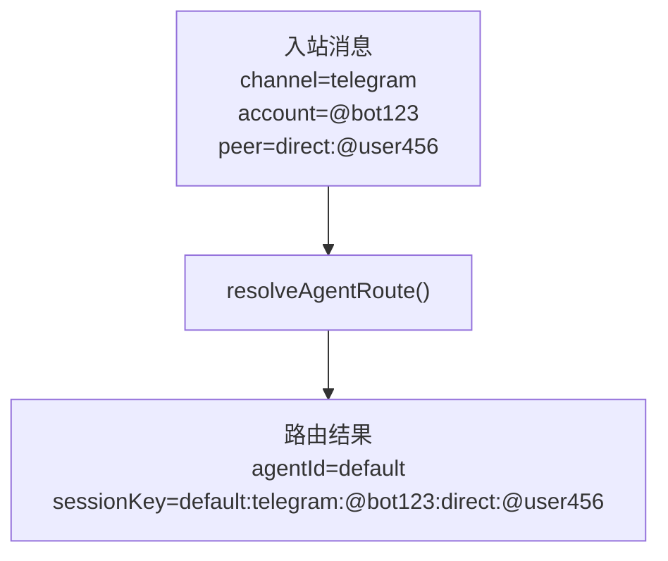
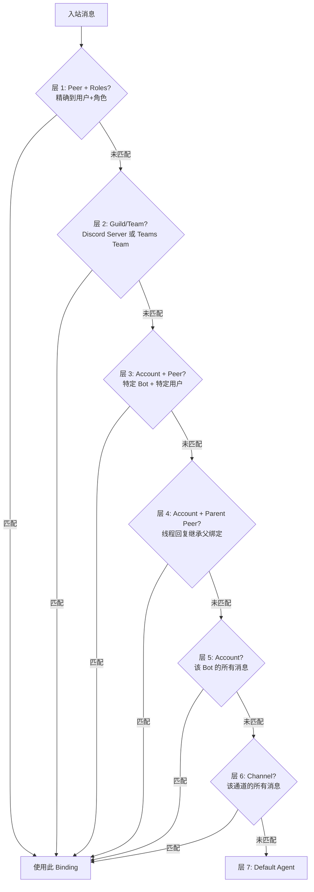
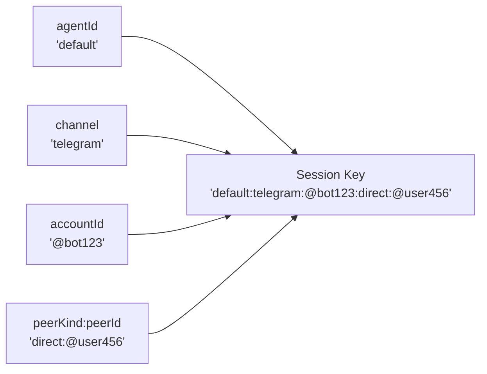
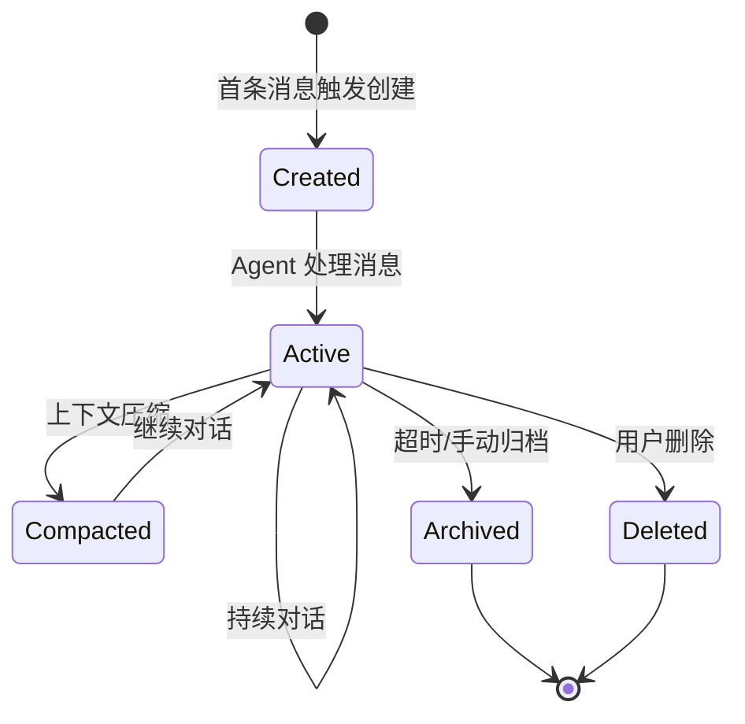

# 第六章 · 路由与会话

> **读完本章你将获得**：理解一条消息如何被路由到正确的 Agent 和 Session — Binding 匹配规则、Session Key 构建逻辑、会话生命周期和转录持久化。

---

## 6.1 路由引擎

路由引擎回答一个核心问题：**这条消息应该交给哪个 Agent 的哪个 Session 处理？**



### 输入参数

```typescript
// src/routing/resolve-route.ts
type ResolveAgentRouteInput = {
  cfg: OpenClawConfig;
  channel: string;                // "telegram", "discord" 等
  accountId?: string | null;       // Bot/App 的 Account ID
  peer?: RoutePeer | null;         // 发送者
  parentPeer?: RoutePeer | null;   // 线程父消息的发送者
  guildId?: string | null;         // Discord Guild ID
  teamId?: string | null;          // MS Teams Team ID
  memberRoleIds?: string[];        // 成员角色 ID 列表
};

type RoutePeer = {
  kind: "direct" | "group" | "channel";
  id: string;
};
```

### 输出

```typescript
type ResolvedAgentRoute = {
  agentId: string;          // 目标 Agent
  channel: string;          // 通道
  accountId: string;        // Account
  sessionKey: string;       // 完整 Session Key
  mainSessionKey: string;   // 主 Session Key
  lastRoutePolicy: "main" | "session";
  matchedBy: string;        // 匹配的 Binding 描述
};
```

---

## 6.2 Binding 匹配：六层优先级

Binding 是路由规则的配置单元。路由引擎按优先级从高到低尝试匹配：



### Binding 配置示例

```yaml
# config.yaml
agents:
  - id: default
    model: claude-sonnet
  - id: coder
    model: gpt-4

channels:
  telegram:
    bindings:
      - peer: "@alice"        # Alice 的消息 → coder Agent
        agent: coder
      - account: "@bot123"    # bot123 的所有其他消息 → default
        agent: default
```

### Binding 数据结构

```typescript
// src/routing/bindings.ts
type Binding = {
  channel: string;
  agent: string;
  account?: string;
  peer?: { kind: string; id: string };
  guildId?: string;
  teamId?: string;
  roles?: string[];
};
```

---

## 6.3 Session Key 构建

Session Key 是一个层级字符串，唯一标识一个会话：

```
格式: {agentId}:{channel}:{accountId}:{peerKind}:{peerId}
示例: default:telegram:@bot123:direct:@user456
```



### DM Scope 策略

DM Scope 决定 Session Key 的粒度：

| 策略 | Session Key 结构 | 含义 |
|------|----------------|------|
| `main` | `{agentId}` | 所有消息共享一个会话 |
| `per-peer` | `{agentId}:...:direct:{peerId}` | 每个用户一个会话 |
| `per-channel-peer` | `{agentId}:{channel}:...:direct:{peerId}` | 每个通道×用户一个会话 |
| `per-account-channel-peer` | 完整 Key | 每个 Account×通道×用户一个会话（最细） |

### 关键代码

```
src/routing/session-key.ts::buildAgentSessionKey()
  → 构建 Session Key
src/routing/resolve-route.ts::resolveAgentRoute()
  → 完整路由决策
```

---

## 6.4 会话生命周期



### 会话存储结构

```
~/.openclaw/sessions/{sessionId}/
  ├── transcript.jsonl     — 消息转录 (JSON Lines 格式)
  ├── metadata.json        — 会话元数据
  ├── level-overrides.json — 会话级设置覆盖
  ├── model-overrides.json — 会话级模型覆盖
  └── attachments/         — 媒体附件目录
```

### Session 生命周期事件

```typescript
// src/sessions/session-lifecycle-events.ts
type SessionLifecycleEvent =
  | "session.created"
  | "session.message"
  | "session.compacted"
  | "session.archived"
  | "session.deleted"
  | "session.reset";
```

---

## 6.5 转录持久化

### JSONL 格式

```json
{"role":"user","content":"你好","ts":1711500000,"channel":"telegram","sender":"@user456"}
{"role":"assistant","content":"你好！有什么可以帮你？","ts":1711500002,"usage":{"input":42,"output":15}}
{"role":"user","content":"帮我搜索天气","ts":1711500010}
{"role":"tool","name":"web_search","content":"搜索结果...","ts":1711500012}
{"role":"assistant","content":"今天天气晴朗...","ts":1711500015,"usage":{"input":120,"output":30}}
```

**设计要点**：
- **Append-only**：只追加，不修改。简单可靠。
- **JSON Lines**：每行一条记录，便于流式读取和截断。
- **独立于 Channel**：转录不包含平台特有信息，只有统一格式。

---

### 质检报告

**完整性**
- [x] 路由引擎输入/输出全覆盖
- [x] 六层 Binding 优先级匹配
- [x] Session Key 构建与 DM Scope 策略
- [x] 会话生命周期
- [x] 转录持久化格式

**准确性**
- [x] `resolveAgentRoute` 参数与源码一致
- [x] Session Key 格式与 `session-key.ts` 一致
- [x] Binding 匹配优先级与 `resolve-route.ts` 一致

**可读性**
- [x] 从路由问题出发 → Binding 规则 → Session Key → 生命周期 → 持久化，逻辑连贯
- [x] 六层匹配用流程图清晰展示

**勘误建议**
- 无
