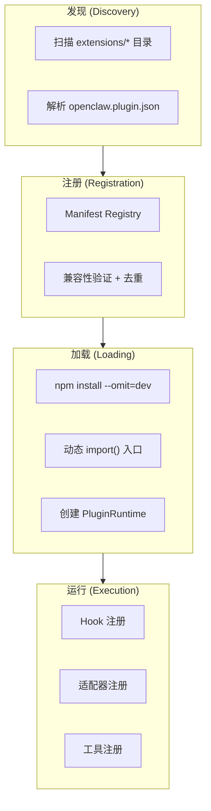
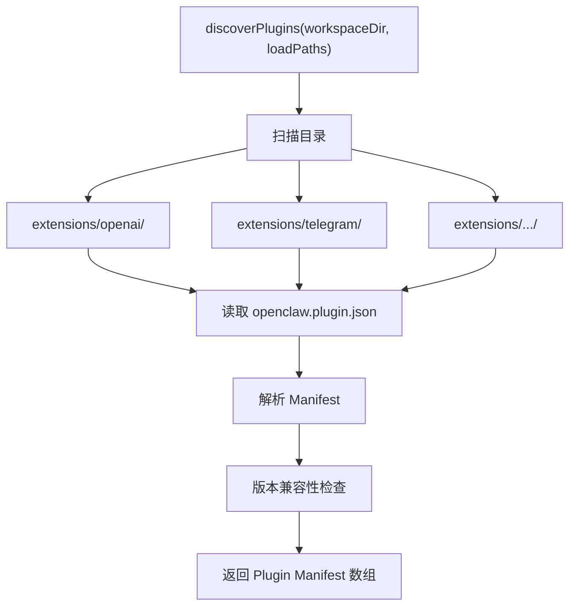
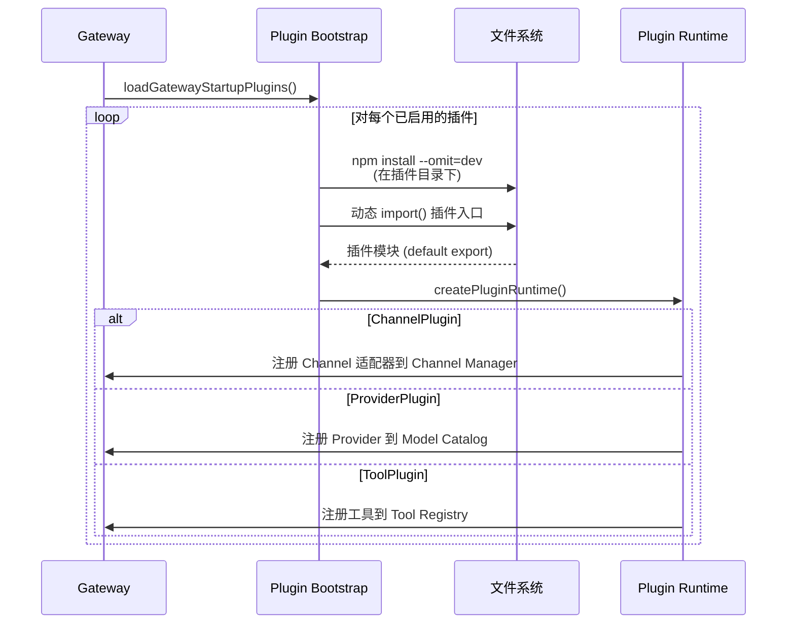
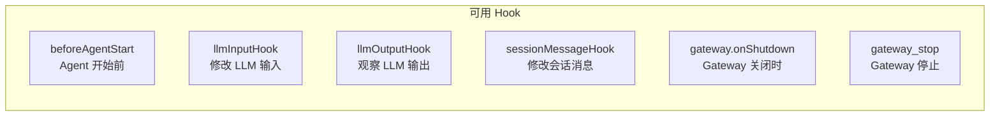
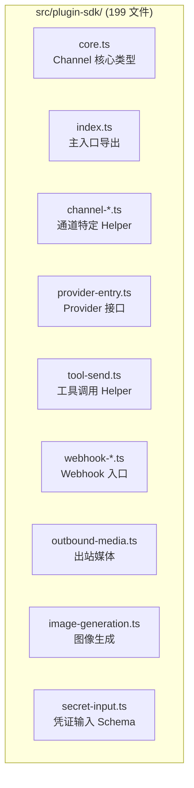

# 第七章 · 插件系统

> **读完本章你将获得**：理解 OpenClaw 插件系统的完整生命周期 — 从发现、注册、加载到运行时 Hook 调用，以及 Plugin SDK 的公共 API 表面。

---

## 7.1 插件系统总览

OpenClaw 的插件系统是其可扩展性的核心。几乎所有非核心功能都以插件形式存在。



---

## 7.2 插件声明文件

每个插件通过 `openclaw.plugin.json` 声明自己的身份和能力：

```json
{
  "id": "openai",
  "version": "1.0.0",
  "openclaw": {
    "install": {
      "npmSpec": "@openclaw/openai"
    },
    "providers": ["openai"],
    "auth": {
      "choices": [
        { "type": "api-key", "envVar": "OPENAI_API_KEY" }
      ]
    },
    "cli": {
      "backends": ["openai"]
    }
  }
}
```

### 声明字段

| 字段 | 用途 |
|------|------|
| `id` | 插件唯一标识 |
| `openclaw.install.npmSpec` | npm 安装包名 |
| `openclaw.providers` | 提供的 LLM Provider 名称 |
| `openclaw.channel.id` | 提供的 Channel ID |
| `openclaw.auth` | 认证方式声明 |
| `openclaw.cli.backends` | CLI 后端名称 |

---

## 7.3 插件发现



**关键代码**：`src/plugins/discovery.ts::discoverPlugins()`

扫描路径包括：
1. 内置 `extensions/` 目录
2. 配置中指定的额外加载路径 (`config.plugins.load.paths`)

---

## 7.4 Manifest Registry

```typescript
// src/plugins/manifest-registry.ts
function buildPluginManifestRegistry(params: {
  workspace: string;
  loadPaths: string[];
  config: OpenClawConfig;
}): PluginManifestRegistry

type PluginManifestRegistry = {
  get(id: string): PluginManifest | undefined;
  list(): PluginManifest[];
  getEnabled(): PluginManifest[];
  isEnabled(id: string): boolean;
};
```

Registry 维护所有发现的插件清单，并根据配置决定哪些启用。

---

## 7.5 插件加载与运行时

### 加载流程



**关键代码**：
```
src/gateway/server-plugin-bootstrap.ts::loadGatewayStartupPlugins()
src/plugins/runtime/index.ts::createPluginRuntime()
```

### PluginRuntime API

```typescript
// src/plugins/runtime/index.ts
type PluginRuntime = {
  agent: AgentRuntimeApi;          // Agent 运行时操作
  channel: ChannelRuntimeApi;      // 通道通信
  media: MediaRuntimeApi;          // 媒体理解
  subagent: SubagentRuntimeApi;    // 子 Agent
  config: ConfigRuntimeApi;        // 配置访问
  system: SystemRuntimeApi;        // 系统调用
};
```

---

## 7.6 Hook 系统

插件通过 Hook 在关键时刻注入行为，无需修改核心代码。



### Hook 调用时机

| Hook | 调用时机 | 能力 |
|------|---------|------|
| `beforeAgentStart` | Agent 执行前 | 修改配置、注入上下文 |
| `llmInputHook` | LLM 请求发出前 | **修改** prompt、messages、tools |
| `llmOutputHook` | LLM 响应收到后 | **观察** 输出（只读） |
| `sessionMessageHook` | 消息保存到 Session 前 | **修改** 消息内容 |
| `gateway.onShutdown` | Gateway 关闭时 | 清理资源 |

**关键代码**：`src/plugins/hooks.ts`

---

## 7.7 Plugin SDK 公共表面

Plugin SDK 是插件开发者的唯一合法依赖。它定义了所有插件可用的类型和接口。



### 跨包引用规则

| 引用方向 | 允许 | 路径 |
|---------|------|------|
| Extension → Plugin SDK | ✅ | `openclaw/plugin-sdk/*` |
| Extension → 本地 barrel | ✅ | `./api.ts`, `./runtime-api.ts` |
| Extension → Core `src/**` | ❌ | 禁止 |
| Extension → 另一个 Extension | ❌ | 禁止 |

---

## 7.8 插件类型一览

| 类型 | 数量 | 示例 |
|------|------|------|
| **LLM Provider** | 35+ | openai, anthropic, google, ollama, groq, mistral |
| **Channel** | 20+ | telegram, discord, slack, matrix, irc, msteams |
| **媒体理解** | 3+ | deepgram (STT), elevenlabs (TTS), microsoft (Speech) |
| **记忆** | 2 | memory-core, memory-lancedb |
| **工具** | 10+ | browser, duckduckgo, tavily, brave, firecrawl |
| **其他** | 10+ | lobster, diagnostics-otel, copilot-proxy, voice-call |

---

### 质检报告

**完整性**
- [x] 发现 → 注册 → 加载 → 运行时全生命周期
- [x] openclaw.plugin.json 声明文件
- [x] Manifest Registry
- [x] PluginRuntime API
- [x] Hook 系统与调用时机
- [x] Plugin SDK 公共表面与引用规则
- [x] 插件类型一览

**准确性**
- [x] 89+ 插件数量已确认
- [x] 引用规则与 AGENTS.md 一致
- [x] Hook 名称与 hooks.ts 一致

**可读性**
- [x] 从总览 → 声明 → 发现 → 加载 → Hook → SDK，递进清晰
- [x] 每个阶段有图

**勘误建议**
- 无
