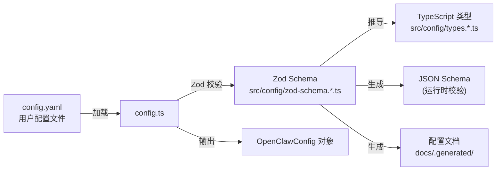
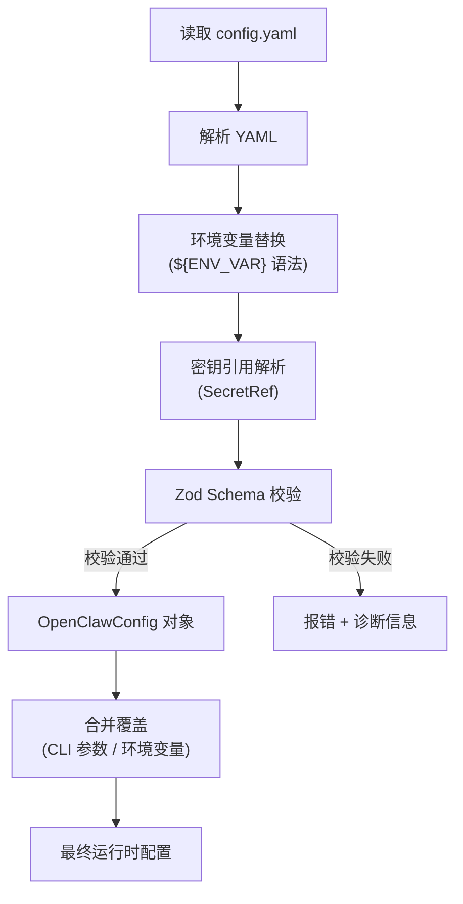
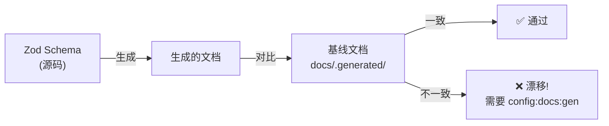

# 第八章 · 配置体系

> **读完本章你将获得**：理解 OpenClaw 的配置系统如何工作 — Zod Schema 驱动的类型安全配置、加载与合并逻辑、配置文档自动生成和漂移检测机制。

---

## 8.1 配置系统概览

OpenClaw 的配置体系是 **Schema-first** 的：所有配置先在 Zod 中定义 Schema，然后自动派生出 TypeScript 类型、JSON Schema（用于文档和编辑器验证）、以及配置文档。



---

## 8.2 配置文件位置

```
~/.config/openclaw/config.yaml     — 主配置文件
~/.openclaw/credentials/           — 凭证存储
~/.openclaw/sessions/              — 会话数据
```

---

## 8.3 Schema 组织

`src/config/` 包含 160+ 文件，按领域组织：

| Schema 文件 | 覆盖领域 |
|------------|---------|
| `types.agents.ts` | Agent 定义（模型、工具、技能） |
| `types.channels.ts` | Channel 配置 |
| `types.gateway.ts` | Gateway 认证、绑定、TLS |
| `types.plugins.ts` | 插件启用列表、自动启用规则 |
| `types.sandbox.ts` | Docker/Podman 沙箱配置 |
| `types.secrets.ts` | 密钥引用、环境变量替换 |
| `types.hooks.ts` | Cron/事件钩子 |
| `types.models.ts` | 模型别名、默认值 |
| `types.browser.ts` | 无头浏览器/CDP |
| `types.approvals.ts` | 工具执行审批工作流 |
| `types.tts.ts` | 文本转语音提供者 |
| `types.tools.ts` | HTTP 工具安全策略 |
| `types.memory.ts` | 上下文引擎注册 |
| `types.mcp.ts` | Model Context Protocol |
| `types.{channel}.ts` | 各 Channel 专有配置 (×10+) |

对应的 Zod Schema 定义在 `zod-schema.*.ts` 文件中。

---

## 8.4 配置加载与合并



**关键代码**：
```
src/config/config.ts::loadConfig()
```

### SecretRef 机制

配置中的敏感值可以用 SecretRef 间接引用：

```yaml
# 直接写值（不推荐）
channels:
  telegram:
    token: "123456:ABCDEF"

# 使用 SecretRef（推荐）
channels:
  telegram:
    token:
      env: "TELEGRAM_BOT_TOKEN"      # 从环境变量读取
    # 或
    token:
      file: "~/.openclaw/credentials/telegram"  # 从文件读取
```

---

## 8.5 核心配置结构

```yaml
# config.yaml 顶层结构
agents:                    # Agent 列表
  - id: default
    model: claude-sonnet
    systemPrompt: "..."
    tools: [bash, web_search]
    skills: [...]
    models:
      fallback: [gpt-4]

channels:                  # Channel 配置
  telegram:
    token: {env: TELEGRAM_BOT_TOKEN}
    allowFrom: ["@alice", "@bob"]
  discord:
    token: {env: DISCORD_BOT_TOKEN}

gateway:                   # Gateway 设置
  auth:
    mode: token
    token: "..."
  bind: loopback
  port: 18789

plugins:                   # 插件管理
  enabled: [openai, anthropic, telegram]
  autoEnable: true

sandbox:                   # 沙箱配置
  enabled: false
  runtime: podman

hooks:                     # 钩子
  cron: [...]

models:                    # 模型别名
  aliases:
    fast: gpt-4-mini
    smart: claude-sonnet

approvals:                 # 执行审批
  enabled: true
  policy: ask-on-dangerous
```

---

## 8.6 配置文档生成与漂移检测

### 文档生成

```
pnpm config:docs:gen
```

从 Zod Schema 自动生成配置文档，输出到 `docs/.generated/`。

### 漂移检测

```
pnpm config:docs:check
```

检查生成的文档是否与当前 Schema 一致。如果 Schema 变了但文档没更新，CI 会报错。



**同样的模式也用于 Plugin SDK API**：
- `pnpm plugin-sdk:api:gen` — 生成 SDK API 基线
- `pnpm plugin-sdk:api:check` — 检测 SDK API 漂移

---

## 8.7 配置热重载

已在第三章详述。核心机制：
- chokidar 监听配置文件变更
- `diffConfigPaths()` 计算变更路径
- `buildGatewayReloadPlan()` 决定热更新 vs 重启
- 详见 `src/gateway/config-reload.ts`

---

### 质检报告

**完整性**
- [x] Schema-first 设计理念
- [x] 配置文件位置
- [x] Schema 组织与领域分类
- [x] 加载与合并流程
- [x] SecretRef 机制
- [x] 核心配置结构
- [x] 文档生成与漂移检测

**准确性**
- [x] 160+ Schema 文件数量已确认
- [x] 漂移检测命令与 AGENTS.md 一致

**可读性**
- [x] 从 Schema-first 理念 → 加载流程 → 配置结构 → 文档生成，递进清晰

**勘误建议**
- 无
