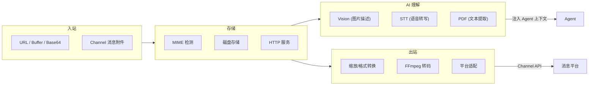
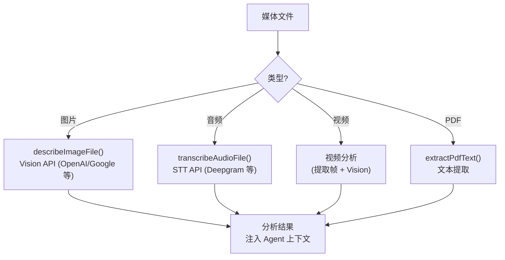
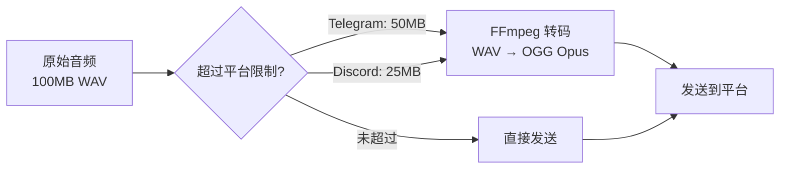

# 第九章 · 媒体管道

> **读完本章你将获得**：理解 OpenClaw 如何处理图片、音频、视频和文档 — 从入站接收、存储、AI 分析到出站转换的完整管道。

---

## 9.1 媒体管道总览



---

## 9.2 入站媒体处理

### 接收来源

| 来源 | 格式 | 处理方式 |
|------|------|---------|
| Channel 消息附件 | 平台 URL | `src/media/fetch.ts` 远程拉取 |
| Web UI 上传 | Base64 / Buffer | 直接存储 |
| CLI 发送 | 本地文件路径 | `src/media/input-files.ts` 加载 |

### MIME 类型检测

```
src/media/mime.ts
```

基于文件头 (magic bytes) 和扩展名双重检测，确保正确识别文件类型。

### 存储

```typescript
// src/media/store.ts
function saveMediaBuffer(
  buffer: Buffer,
  mimeType: string,
  opts?: { ttl?: number }
): { fileId: string; url: string }
```

文件存储在本地磁盘，通过内置 HTTP 服务器提供访问。

### 媒体 HTTP 服务器

```
src/media/server.ts
路由: GET /media/{fileId}
```

为存储的媒体文件提供 HTTP 访问 URL，配合 TTL（24h~7d）自动过期清理。

---

## 9.3 AI 媒体理解



**核心代码**：`src/media-understanding/runtime.ts`

| 函数 | 用途 |
|------|------|
| `runMediaUnderstandingFile()` | 通用入口，按类型分发 |
| `describeImageFile()` | 图片描述（调用 Vision Provider 插件） |
| `transcribeAudioFile()` | 音频转写（调用 STT Provider 插件） |

**Provider 可插拔**：媒体理解的实际能力由 Provider 插件提供（如 Deepgram 插件提供 STT，OpenAI 插件提供 Vision）。

---

## 9.4 图片处理

```
src/media/image-ops.ts
```

| 操作 | 用途 |
|------|------|
| 缩放 (resize) | 适配平台尺寸限制 |
| 格式转换 | PNG ↔ JPEG ↔ WebP |
| QR 码生成 | 设备配对场景 |

---

## 9.5 音视频处理

```
src/media/ffmpeg-exec.ts  — FFmpeg 执行封装
src/media/audio.ts        — 音频处理
src/media/audio-tags.ts   — 音频元数据提取
src/media/ffmpeg-limits.ts — 平台尺寸限制
```

### 平台限制适配



`ffmpeg-limits.ts` 维护各平台的文件大小和格式限制，出站时自动适配。

---

## 9.6 PDF/文档处理

```typescript
// src/media/pdf-extract.ts
function extractPdfText(filePath: string): Promise<string>
```

提取 PDF 文本内容，注入 Agent 上下文以便回答相关问题。

---

## 9.7 出站媒体

```typescript
// src/plugin-sdk/outbound-media.ts
function resolveOutboundMediaDeliveryAddress(
  filePath: string,
  cfg: OpenClawConfig,
  channel: string,
): string // 返回可访问的 URL
```

将本地文件路径转换为目标平台可访问的 URL（本地 HTTP URL 或重新上传到平台）。

---

### 质检报告

**完整性**
- [x] 入站接收 (URL/Buffer/Base64)
- [x] MIME 检测与存储
- [x] AI 媒体理解 (Vision/STT/PDF)
- [x] 图片处理
- [x] 音视频处理与平台适配
- [x] 出站媒体转换

**准确性**
- [x] 文件路径与仓库一致
- [x] FFmpeg 限制机制已确认

**可读性**
- [x] 管道式从入站到出站，清晰易懂

**勘误建议**
- 无
