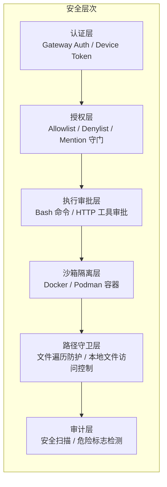
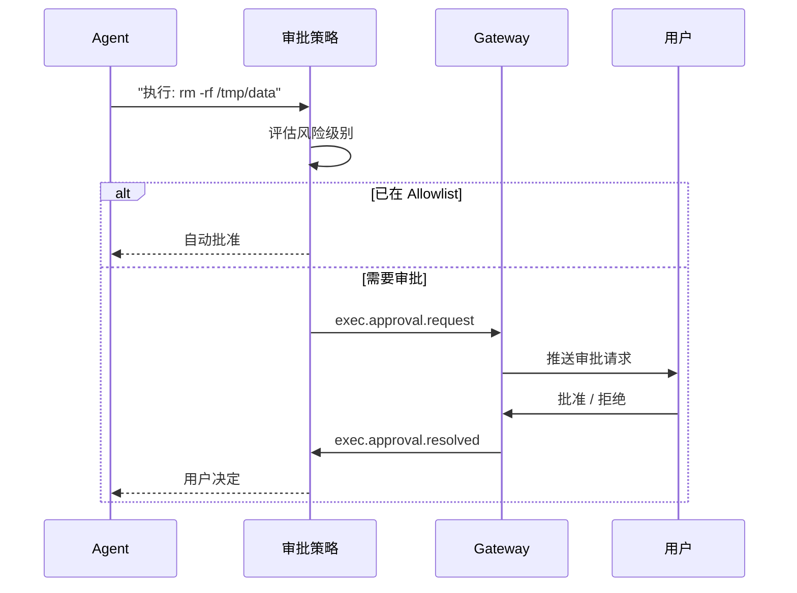
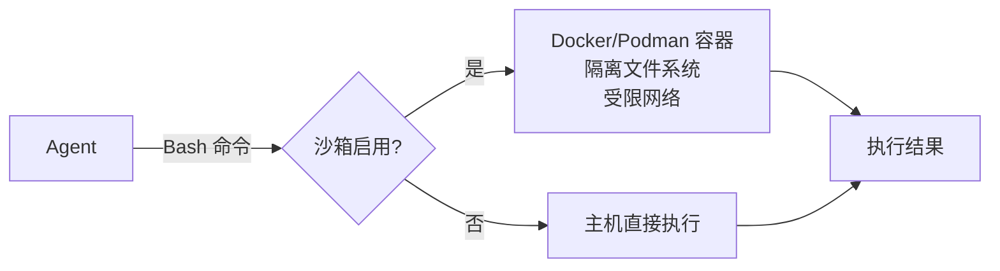
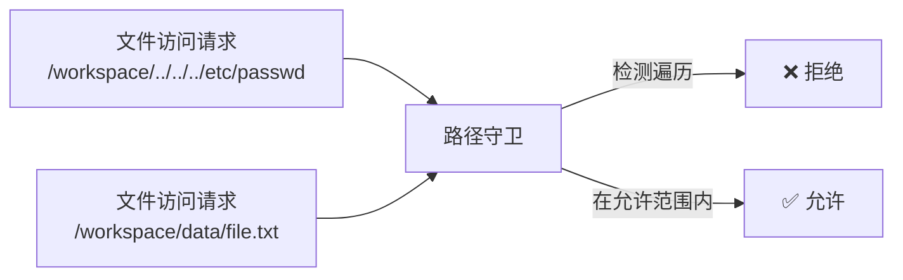

# 第十章 · 安全体系

> **读完本章你将获得**：理解 OpenClaw 的多层安全机制 — 安全审计框架、执行审批系统、沙箱隔离、路径守卫和密钥管理。

---

## 10.1 安全架构总览



---

## 10.2 安全审计框架

```
src/security/audit.ts — 主编排器
```

### 审计发现结构

```typescript
type SecurityAuditSeverity = "info" | "warn" | "critical";

type SecurityAuditFinding = {
  checkId: string;          // 检查 ID
  severity: SecurityAuditSeverity;
  title: string;            // 标题
  detail: string;           // 详情
  remediation?: string;     // 修复建议
};

type SecurityAuditReport = {
  ts: number;
  summary: { critical: number; warn: number; info: number };
  findings: SecurityAuditFinding[];
};
```

### 审计模块

| 模块 | 文件 | 检查内容 |
|------|------|---------|
| 文件权限 | `audit-fs.ts` | 配置文件/凭证文件权限 (world-readable?) |
| 工具策略 | `audit-tool-policy.ts` | HTTP 工具 Allowlist/Denylist |
| Channel 安全 | `audit-channel.*.ts` | DM 策略、群组安全 |
| 危险标志 | `dangerous-config-flags.ts` | 不安全的配置选项 |
| 危险工具 | `dangerous-tools.ts` | 高风险 HTTP 工具 |
| 正则安全 | `safe-regex.ts` | ReDoS 防护 |
| Windows ACL | `windows-acl.ts` | Windows 文件权限 |
| 技能扫描 | `skill-scanner.ts` | 技能代码安全检查 |
| 外部内容 | `external-content.ts` | SSRF/内容验证 |
| 临时路径 | `temp-path-guard.ts` | 临时文件隔离 |

---

## 10.3 执行审批系统

当 Agent 尝试执行高风险操作（如 Bash 命令、HTTP 请求）时，执行审批系统要求用户确认。



### 审批策略模式

| 模式 | 行为 |
|------|------|
| `always-ask` | 每条命令都需确认 |
| `ask-on-dangerous` | 只对危险命令确认 |
| `auto-approve` | 全部自动批准（不推荐） |

**关键代码**：
```
src/infra/exec-approvals*.ts
src/agents/bash-tools.approval.ts
```

---

## 10.4 沙箱隔离

Agent 执行的工具命令可以在 Docker/Podman 容器中隔离运行。



配置：
```yaml
sandbox:
  enabled: true
  runtime: podman    # 或 docker
```

---

## 10.5 路径守卫

```
src/infra/path-guards.ts  — 路径边界检查
src/infra/path-safety.ts  — 路径遍历防护
src/infra/fs-safe.ts      — 安全文件操作
```

防止路径遍历攻击（`../../../etc/passwd`），确保文件操作不超出允许的目录范围。



---

## 10.6 密钥管理

```
src/secrets/
```

密钥管理支持多种存储方式：

| 方式 | 配置 |
|------|------|
| 环境变量 | `{ env: "API_KEY" }` |
| 文件 | `{ file: "~/.openclaw/credentials/key" }` |
| 配置直写 | `token: "sk-xxx"` (不推荐) |

**运行时快照**：Gateway 启动时创建密钥的内存快照，避免反复读取文件/环境变量。

---

### 质检报告

**完整性**
- [x] 六层安全架构全覆盖
- [x] 安全审计框架与所有审计模块
- [x] 执行审批系统与策略模式
- [x] 沙箱隔离
- [x] 路径守卫
- [x] 密钥管理

**准确性**
- [x] 审计模块文件名与仓库一致
- [x] 审批策略与源码一致

**可读性**
- [x] 分层架构图帮助理解整体安全策略
- [x] 审批流程用序列图清晰展示

**勘误建议**
- 无
