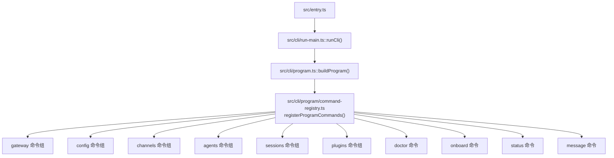
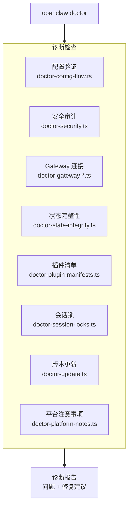
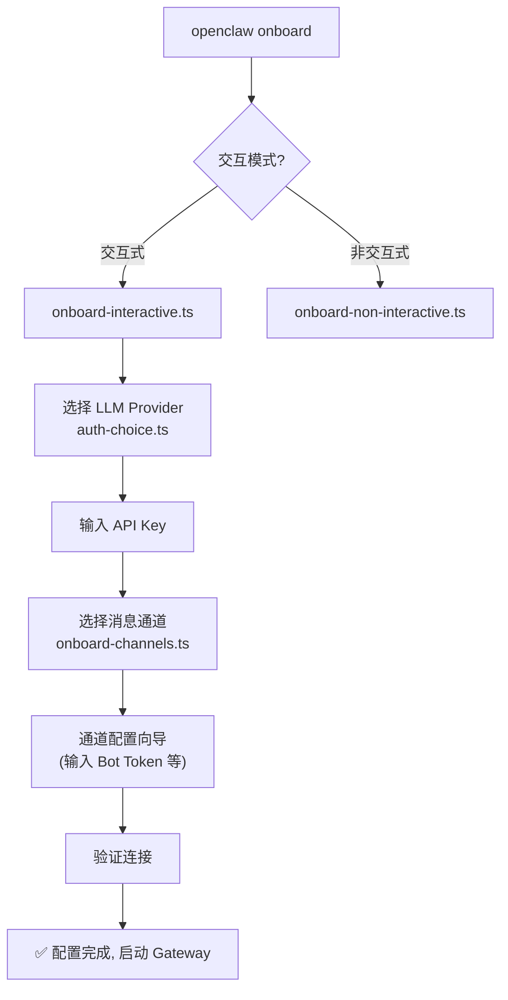

# 第十一章 · 命令系统 (CLI)

> **读完本章你将获得**：理解 OpenClaw CLI 的架构 — Commander.js 骨架、命令注册模式、Doctor 诊断体系和 Onboard 交互流程。

---

## 11.1 CLI 架构

OpenClaw 的 CLI 基于 Commander.js 构建，是系统的主要交互入口。



### 启动链

```
src/entry.ts
  → 环境规范化 (Windows argv, 警告过滤)
  → 编译缓存启用
  → 进程 respawn 检查
  → src/cli/run-main.ts::runCli()
    → src/cli/program.ts::buildProgram()
      → Commander 实例创建
      → Program Context (版本, 配置, deps)
      → Help 格式化
      → Pre-action Hooks
      → 命令注册
    → program.parseAsync(argv)
```

---

## 11.2 命令分类

| 命令组 | 示例 | 代码位置 |
|-------|------|---------|
| **gateway** | `openclaw gateway run` | `src/commands/gateway-*.ts` |
| **config** | `openclaw config set/get/edit` | `src/commands/configure*.ts` |
| **channels** | `openclaw channels status/setup` | `src/commands/channels*.ts` |
| **agents** | `openclaw agents list/add/bind` | `src/commands/agents*.ts` |
| **sessions** | `openclaw sessions list/delete` | `src/commands/sessions*.ts` |
| **plugins** | `openclaw plugins list/install` | CLI 插件相关 |
| **message** | `openclaw message send` | `src/commands/message.ts` |
| **status** | `openclaw status [--all] [--deep]` | `src/commands/status*.ts` |
| **doctor** | `openclaw doctor` | `src/commands/doctor*.ts` |
| **onboard** | `openclaw onboard` | `src/commands/onboard*.ts` |
| **models** | `openclaw models list/set` | `src/commands/models.ts` |

---

## 11.3 Doctor 诊断体系

`openclaw doctor` 是一个全面的系统诊断工具，用于发现和修复配置问题。



### 诊断模块

| 模块 | 检查内容 |
|------|---------|
| 配置验证 | Schema 校验、必填项、类型错误 |
| 安全审计 | 凭证权限、危险配置、工具策略 |
| Gateway 连接 | 端口占用、进程状态、WebSocket 连通性 |
| 状态完整性 | 会话目录、配置目录、凭证目录 |
| 插件清单 | 插件完整性、版本兼容性 |
| 会话锁 | 孤儿锁检测和清理 |
| 版本更新 | 检查新版本可用性 |

---

## 11.4 Onboard 流程

`openclaw onboard` 是首次使用的引导向导。



### Auth Choice

```
src/commands/auth-choice.ts
```

交互式 Provider 选择器，列出所有可用的 LLM Provider，引导用户输入 API Key 或选择本地模型（Ollama）。

---

## 11.5 Status 输出

```
openclaw status           — 基本状态
openclaw status --all     — 完整状态 (只读/可粘贴)
openclaw status --deep    — 深度探测 (实际检测连接)
```

使用 `src/terminal/table.ts::renderTable()` 输出 ANSI 格式化的表格。

---

### 质检报告

**完整性**
- [x] CLI 启动链
- [x] Commander 命令注册
- [x] 命令分类一览
- [x] Doctor 诊断体系
- [x] Onboard 交互流程
- [x] Status 输出

**准确性**
- [x] 入口路径与源码一致
- [x] 命令文件路径已确认

**可读性**
- [x] 从启动到命令注册到具体命令，递进清晰

**勘误建议**
- 无
