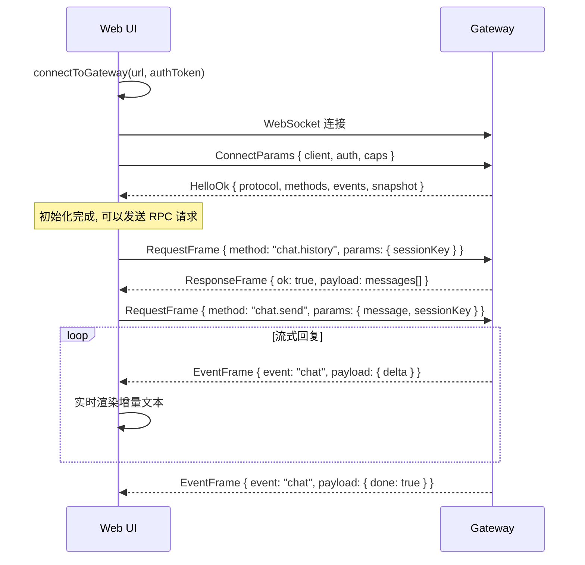
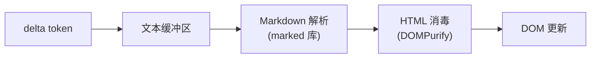
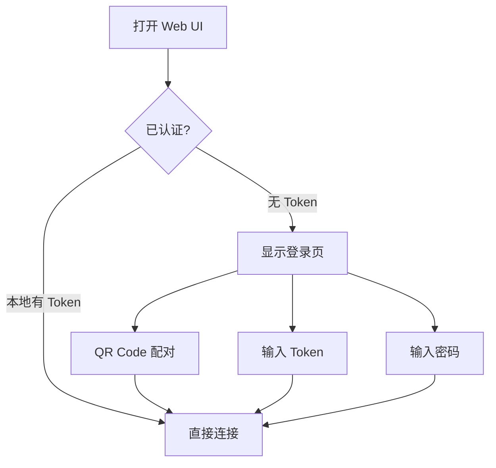

# 第十二章 · Web UI 控制面

> **读完本章你将获得**：理解 Web UI 如何与 Gateway 通信 — Lit.js 架构、WebSocket 连接、聊天流式渲染和 Canvas Host。

---

## 12.1 Web UI 概览

OpenClaw 提供一个浏览器端的控制面 UI，用于聊天、配置和系统监控。

| 属性 | 值 |
|------|---|
| 技术栈 | Lit.js (Web Components) + TypeScript + Vite |
| 代码位置 | `ui/` |
| 构建 | `vite build` → 静态资源 |
| 测试 | Vitest + Playwright |
| 包名 | `openclaw-control-ui` |

---

## 12.2 与 Gateway 的连接



**关键代码**：`ui/src/ui/gateway.ts::connectToGateway()`

---

## 12.3 聊天流式渲染

Web UI 接收 `chat` 事件中的 delta 文本增量，实时渲染 Markdown：



**依赖**：
- `marked` — Markdown → HTML
- `dompurify` — 防 XSS 消毒
- `@create-markdown/preview` — Markdown 预览组件

---

## 12.4 认证

Web UI 支持的认证方式与 Gateway 一致：
- **Token**：URL 参数或本地存储
- **设备配对**：QR Code 扫码
- **密码**：Basic Auth



**加密**：设备配对使用 Ed25519 签名（`@noble/ed25519`）。

---

## 12.5 Canvas Host

Canvas Host 是 Gateway 管理的浏览器自动化运行时，用于需要浏览器能力的 Agent 操作。

```
src/canvas-host/
```

通过独立的 WebSocket 通道连接，支持 CDP (Chrome DevTools Protocol) 控制。

---

### 质检报告

**完整性**
- [x] Web UI 技术栈与架构
- [x] Gateway 连接流程
- [x] 聊天流式渲染
- [x] 认证方式
- [x] Canvas Host 概述

**准确性**
- [x] 依赖库与 ui/package.json 一致
- [x] 连接协议与第三章一致

**可读性**
- [x] 从连接到聊天到认证，递进清晰

**勘误建议**
- 无
