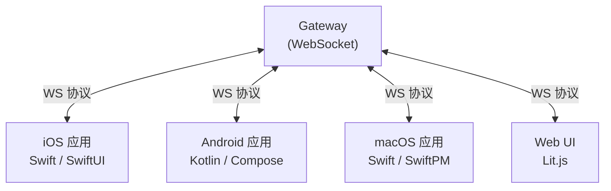
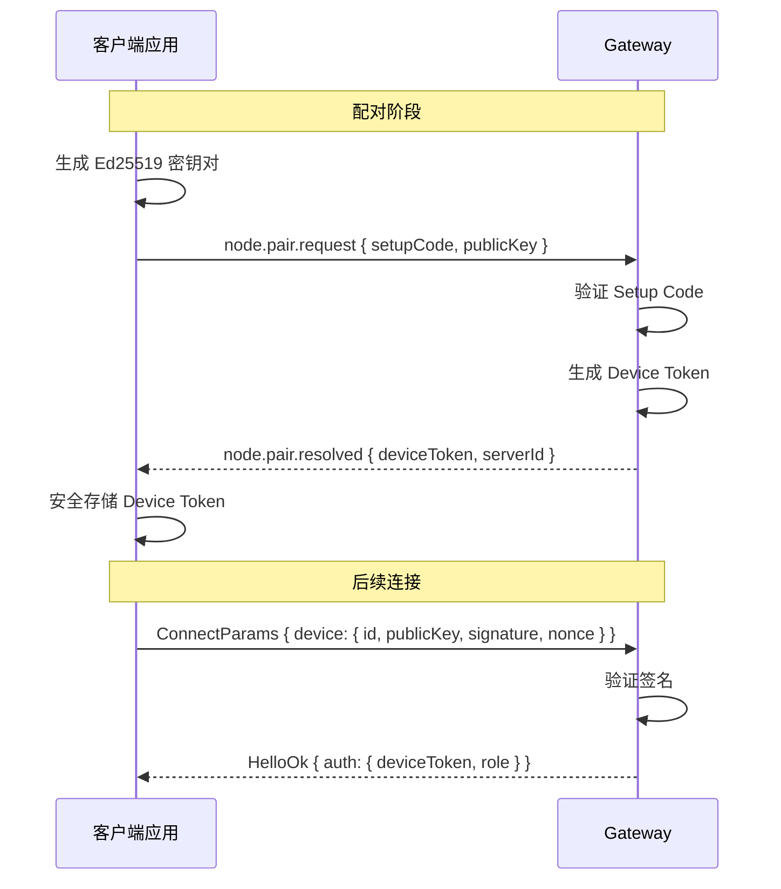

# 第十三章 · 原生客户端

> **读完本章你将获得**：理解 iOS、Android、macOS 原生客户端的架构定位、技术选型和与 Gateway 的通信方式。

---

## 13.1 客户端生态



所有客户端使用相同的 WebSocket 协议（Protocol Version 3）与 Gateway 通信。

---

## 13.2 iOS 应用

| 属性 | 值 |
|------|---|
| 代码位置 | `apps/ios/` |
| 状态 | Super-Alpha（内部使用） |
| 技术栈 | Swift, SwiftUI, Xcode 16+ |
| 构建 | xcodegen → Xcode → TestFlight |
| 分发 | Fastlane |

### 关键能力

- 设备配对（Setup Code / QR / 手动） 
- Node 命令执行：摄像头、屏幕录制、位置、联系人、日历、提醒、照片、运动数据
- 后台位置（地理围栏、运动触发）
- APNs 推送通知
- Share Extension（从其他 App 分享到 OpenClaw）
- Watch App（Apple Watch 支持）

### 架构特点

- **前台优先**：Socket 在后台会被 iOS 挂起，严格限制后台命令执行
- **Observation 框架**：使用 `@Observable` / `@Bindable`（非旧式 `ObservableObject`）

---

## 13.3 Android 应用

| 属性 | 值 |
|------|---|
| 代码位置 | `apps/android/` |
| 状态 | Extremely Alpha |
| 技术栈 | Kotlin, Jetpack Compose, API 31+ |
| 构建 | Gradle 8.x |

### 构建变体

| 变体 | 用途 |
|------|------|
| **Play** | Google Play Store（移除 SMS/Call Log 权限） |
| **ThirdParty** | 完整权限（SMS、Call Log、无障碍） |

### 关键能力

- 4 种配对方式（Setup Code / 手动 / QR 扫描 / mDNS 发现）
- 加密持久化认证
- 聊天、语音、屏幕 Tab
- 推送通知
- 生物识别锁
- Macrobenchmark 性能测试套件

---

## 13.4 macOS 应用

| 属性 | 值 |
|------|---|
| 代码位置 | `apps/macos/` |
| 技术栈 | Swift, SwiftPM |

macOS 应用是 Gateway 的菜单栏宿主 — Gateway 进程实际运行在 macOS 应用内部。

---

## 13.5 设备配对协议



**密钥存储**：
- iOS: Keychain
- Android: EncryptedSharedPreferences
- macOS: Keychain

---

## 13.6 Swabble 语音唤醒

```
Swabble/
```

macOS 上的语音唤醒守护进程，使用 Speech.framework 实现本地语音识别。

| 属性 | 值 |
|------|---|
| 语言 | Swift 6.2 |
| 平台 | macOS 15+ / iOS 17+ |
| 默认唤醒词 | "clawd" |
| 处理方式 | 完全本地（不联网） |

唤醒后执行配置的 Hook 命令，通常是 `openclaw-mac agent --message "${text}"`。

---

### 质检报告

**完整性**
- [x] iOS / Android / macOS 三平台覆盖
- [x] 技术栈与关键能力
- [x] 设备配对协议
- [x] Swabble 语音唤醒

**准确性**
- [x] 状态（Super-Alpha / Extremely Alpha）与 README 一致
- [x] 构建变体与 `build.gradle.kts` 一致

**可读性**
- [x] 表格 + 序列图清晰展示各客户端特点

**勘误建议**
- 无
