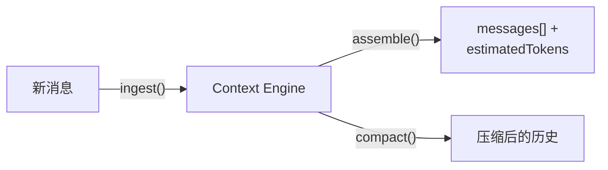
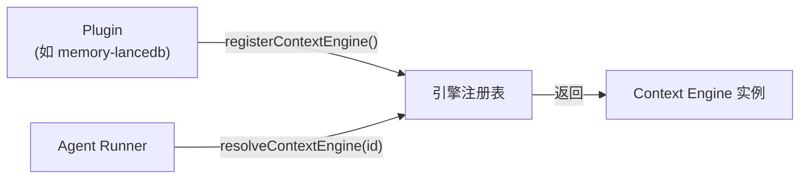
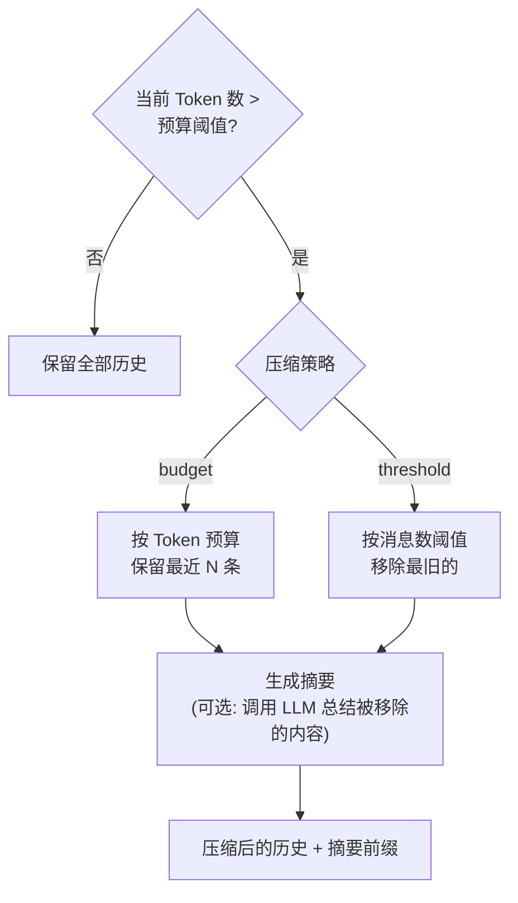
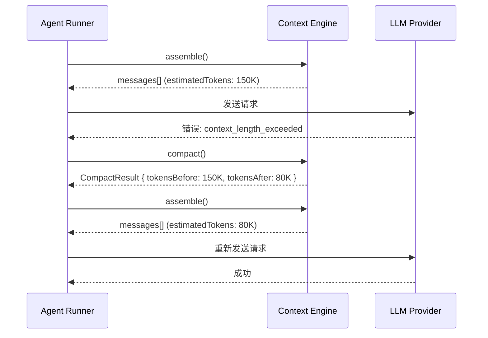

# 第十四章 · 上下文引擎与压缩

> **读完本章你将获得**：理解 OpenClaw 如何管理 Agent 的对话历史 — Context Engine 接口、Token 预算机制和压缩策略。

---

## 14.1 为什么需要上下文引擎

LLM 有固定的上下文窗口（如 128K tokens）。当对话历史超出窗口时，系统需要决定保留什么、丢弃什么。上下文引擎（Context Engine）就是做这个决策的模块。

---

## 14.2 Context Engine 接口

```typescript
// src/context-engine/types.ts
type ContextEngine = {
  id: string;                    // 引擎唯一标识
  name: string;                  // 可读名称
  managesOwnCompaction: boolean; // 是否自管理压缩

  ingest(msg): IngestResult;              // 摄入单条消息
  ingestBatch(msgs): IngestBatchResult;   // 批量摄入
  assemble(): AssembleResult;             // 组装上下文
  compact(options?): CompactResult;       // 压缩历史
  bootstrap(): BootstrapResult;           // 初始化
  maintenance(): MaintenanceResult;       // 维护操作
};
```

### 核心操作



| 操作 | 用途 | 返回 |
|------|------|------|
| `ingest()` | 摄入新消息到引擎 | 摄入确认 |
| `assemble()` | 组装当前上下文（用于发送给 LLM） | 消息数组 + Token 估算 |
| `compact()` | 当上下文超出预算时压缩 | 压缩结果 + 摘要 |
| `bootstrap()` | 加载已有会话历史 | 初始化状态 |

### AssembleResult

```typescript
type AssembleResult = {
  messages: AgentMessage[];      // 组装后的消息数组
  estimatedTokens: number;       // Token 估算
  systemPromptAddition?: string; // 额外的系统提示（如压缩摘要）
};
```

### CompactResult

```typescript
type CompactResult = {
  ok: boolean;
  compacted: boolean;             // 是否实际执行了压缩
  reason?: string;                // 原因说明
  result?: {
    summary?: string;             // 压缩生成的摘要
    firstKeptEntryId?: string;    // 保留的第一条消息 ID
    tokensBefore: number;         // 压缩前 Token 数
    tokensAfter?: number;         // 压缩后 Token 数
  };
};
```

---

## 14.3 引擎注册与解析



```typescript
// src/context-engine/registry.ts
function registerContextEngine(engine: ContextEngine): void;
function resolveContextEngine(id: string): ContextEngine | undefined;
function listContextEngineIds(): string[];
```

---

## 14.4 压缩策略

### Legacy 引擎

内置的默认引擎，使用简单的 Token 预算 + 截断策略：



### 自定义引擎

通过插件注册自定义引擎，如 `memory-lancedb`（使用向量数据库做语义检索）：

```yaml
# config.yaml
agents:
  - id: default
    contextEngine: lancedb    # 使用 LanceDB 引擎
```

---

## 14.5 压缩触发时机



---

### 质检报告

**完整性**
- [x] Context Engine 接口全覆盖
- [x] 核心操作 (ingest/assemble/compact)
- [x] 引擎注册与解析
- [x] Legacy 压缩策略
- [x] 自定义引擎
- [x] 压缩触发时机

**准确性**
- [x] 接口定义与 `types.ts` 一致
- [x] 注册表 API 与 `registry.ts` 一致

**可读性**
- [x] 从为什么需要 → 接口 → 注册 → 策略 → 触发，递进清晰

**勘误建议**
- 无
