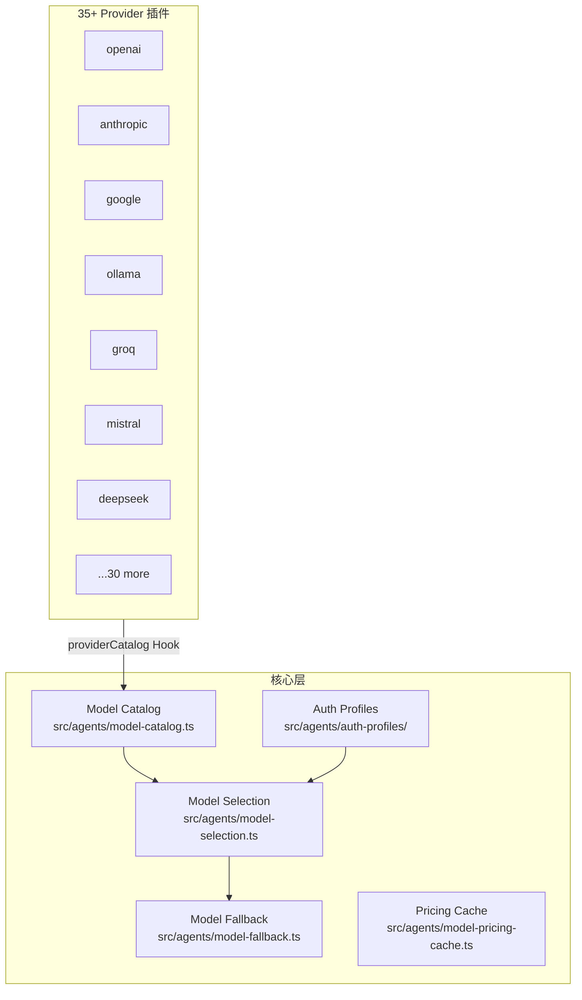
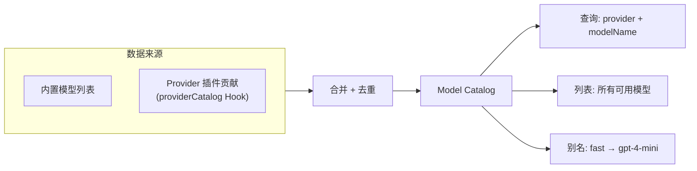
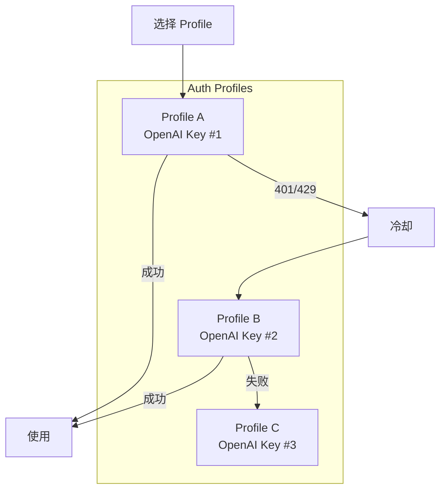
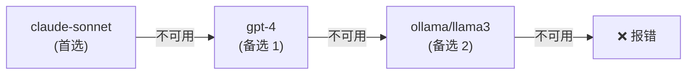

# 第十五章 · 模型与 Provider

> **读完本章你将获得**：理解 OpenClaw 如何接入 35+ LLM 提供者 — Model Catalog、Provider 插件接口、Auth Profile 轮转、模型回退链和动态模型解析。

---

## 15.1 Provider 体系总览



---

## 15.2 Provider 插件接口

```typescript
// src/plugin-sdk/provider-entry.ts (简化)
type OpenClawPluginApi = {
  // 模型目录贡献
  providerCatalog?: (ctx) => ProviderCatalogResult;
  
  // 动态模型准备
  providerPrepareDynamicModel?: (ctx) => Promise<PreparedModel>;
  
  // 模型解析
  providerResolveModel?: (ctx) => Promise<ResolvedModel>;
  
  // 运行时认证准备
  providerPrepareRuntimeAuth?: (ctx) => Promise<PreparedAuth>;
  
  // 流式包装
  providerWrapStream?: (ctx) => AsyncIterable<StreamChunk>;
};
```

每个 Provider 插件实现这些 Hook 来告诉核心"我有哪些模型"和"怎么调用它们"。

---

## 15.3 Model Catalog

Model Catalog 是所有可用模型的注册表：



### 模型别名

```yaml
# config.yaml
models:
  aliases:
    fast: gpt-4-mini
    smart: claude-sonnet
    local: ollama/llama3
```

用户可以用简短别名指代具体模型。

---

## 15.4 Auth Profile 管理



### Profile 生命周期

| 状态 | 含义 |
|------|------|
| Active | 可用，首选 |
| Cooldown | 认证失败/限流，等待恢复 |
| Exhausted | 所有 Profile 都不可用 |

**关键代码**：
```
src/agents/auth-profiles/
  ├── rotation.ts    — 轮转逻辑
  ├── cooldown.ts    — 冷却期管理
  ├── storage.ts     — 持久化
  └── doctor.ts      — 诊断
```

---

## 15.5 模型回退链

当首选模型不可用时，按配置的 fallback 链降级：

```yaml
agents:
  - id: default
    model: claude-sonnet
    models:
      fallback:
        - gpt-4              # 第一备选
        - ollama/llama3       # 第二备选（本地）
```



---

## 15.6 定价缓存

```
src/agents/model-pricing-cache.ts
```

维护各模型的输入/输出 Token 单价，用于 `UsageAccumulator` 中的费用估算。

---

### 质检报告

**完整性**
- [x] Provider 插件接口
- [x] Model Catalog 与别名
- [x] Auth Profile 轮转
- [x] 模型回退链
- [x] 定价缓存

**准确性**
- [x] 接口与 plugin-sdk 一致

**可读性**
- [x] 递进清晰，图表辅助理解

**勘误建议**
- 无
