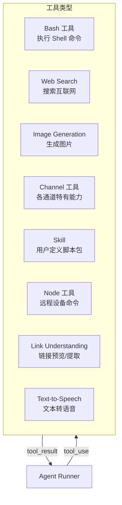
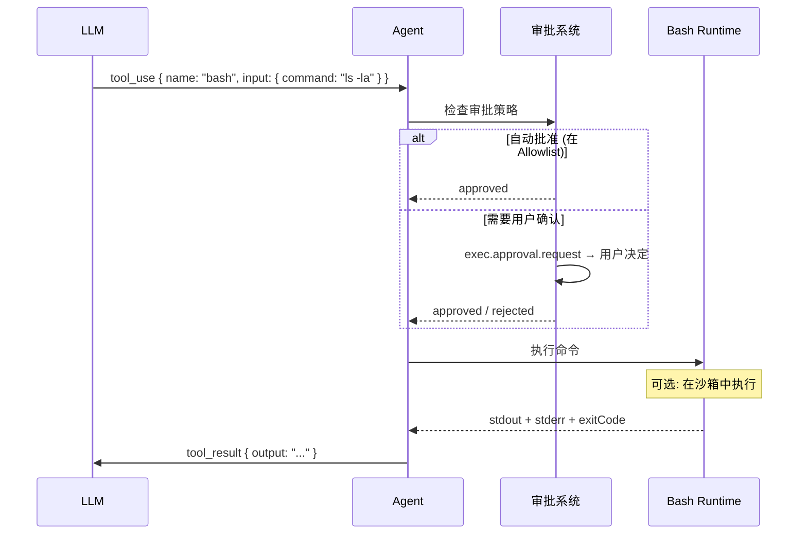
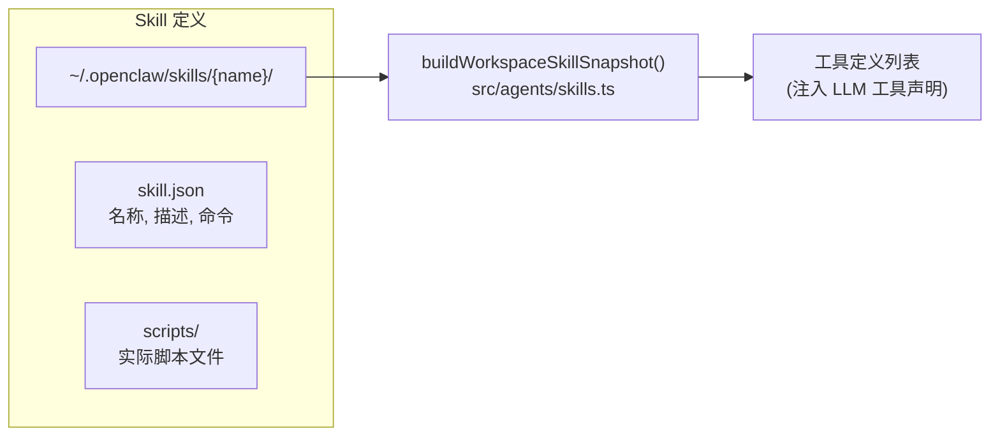

# 第十六章 · 工具与技能

> **读完本章你将获得**：理解 Agent 可调用的工具体系 — Bash 工具、Channel 工具、Skill 机制、工具 Schema 约束和执行审批流。

---

## 16.1 工具体系总览

Agent 通过工具与外部世界交互。工具以 JSON Schema 格式向 LLM 声明，LLM 选择合适的工具调用。



---

## 16.2 Bash 工具

最核心的工具类型。Agent 可以执行 Shell 命令来完成各种操作。



### 安全机制

| 机制 | 代码位置 |
|------|---------|
| 执行审批 | `src/agents/bash-tools.approval.ts` |
| 进程监控 | `src/agents/bash-tools.process.ts` |
| 超时控制 | 配置 `agents[].tools.bash.timeout` |
| 沙箱隔离 | `src/config/types.sandbox.ts` |

---

## 16.3 Skill 系统

Skill 是用户可定义的工具包 — 一组命令或脚本，打包为 Agent 可调用的工具。



### Skill 快照构建

```typescript
// src/agents/skills.ts
function buildWorkspaceSkillSnapshot(
  agentId: string,
  cfg: OpenClawConfig,
): SkillSnapshot
```

在每次 Agent 执行前，构建当前可用 Skill 的快照。

---

## 16.4 Channel 工具

每个 Channel 插件可以注册自己特有的工具：

| Channel | 工具示例 |
|---------|---------|
| Discord | 管理频道权限、发送 Embed |
| Slack | 上传文件到频道、Workflow 触发 |
| Telegram | 发送投票、设置聊天标题 |

通过 `ChannelPlugin.agentTools` 声明：

```typescript
type ChannelPlugin = {
  agentTools?: ChannelAgentTool[] | ChannelAgentToolFactory;
};
```

---

## 16.5 工具 Schema 约束

工具使用 JSON Schema 向 LLM 声明参数格式。OpenClaw 有特定的 Schema 约束（见第一章规范）：

| 约束 | 原因 |
|------|------|
| 不使用 `anyOf` / `oneOf` / `allOf` | 部分 LLM Provider 不支持 |
| 顶层必须是 `type: "object"` | 标准要求 |
| 避免 `format` 属性名 | 某些验证器视为保留字 |
| 字符串枚举用 `stringEnum` | 兼容性更好 |

---

## 16.6 其他内置工具

| 工具 | 代码位置 | 用途 |
|------|---------|------|
| Web Search | `src/web-search/` | 互联网搜索 |
| Image Generation | `src/image-generation/` | AI 图像生成 |
| Link Understanding | `src/link-understanding/` | URL 预览/内容提取 |
| Text-to-Speech | `src/tts/` | 文本转语音 |

---

### 质检报告

**完整性**
- [x] 工具类型全览
- [x] Bash 工具与安全机制
- [x] Skill 系统
- [x] Channel 工具
- [x] Schema 约束
- [x] 其他内置工具

**准确性**
- [x] Schema 约束与 AGENTS.md 一致
- [x] 文件路径正确

**可读性**
- [x] 从总览到各类型再到约束，清晰递进

**勘误建议**
- 无
