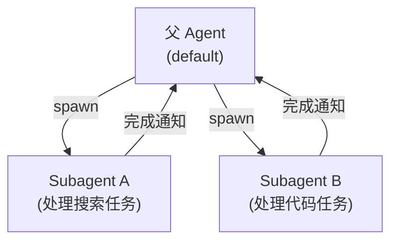
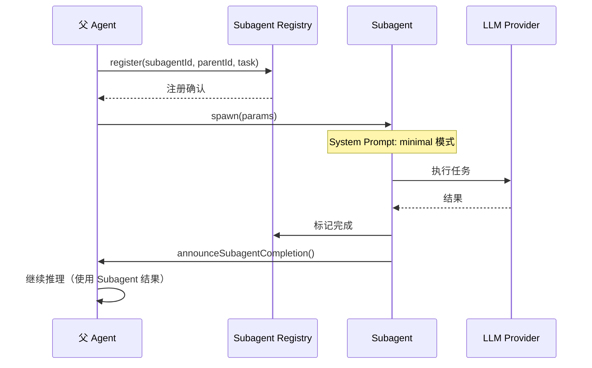

# 第十七章 · 子 Agent 与编排

> **读完本章你将获得**：理解 OpenClaw 的 Subagent 机制 — 父 Agent 如何生成子任务、子 Agent 的生命周期和完成通知。

---

## 17.1 Subagent 是什么

Subagent（子代理）是由父 Agent 在运行时动态生成的子任务执行者。当一个任务过于复杂或需要专门能力时，父 Agent 可以 spawn 一个 Subagent 来处理。



---

## 17.2 Subagent Registry

```
src/agents/subagent-registry.ts
```

维护所有活跃 Subagent 的注册表。核心操作：

| 操作 | 功能 |
|------|------|
| `register()` | 注册新的 Subagent |
| `get()` | 获取 Subagent 信息 |
| `remove()` | 移除已完成的 Subagent |
| `listForParent()` | 列出某父 Agent 的所有 Subagent |

---

## 17.3 Spawn 生命周期



### Spawn 参数

```typescript
// src/agents/subagent-spawn.ts
interface SubagentSpawnParams {
  parentAgentId: string;
  parentSessionKey: string;
  task: string;                // 任务描述
  model?: string;              // 可指定不同模型
  tools?: string[];            // 可指定不同工具集
  promptMode: "minimal";       // Subagent 用精简 Prompt
}
```

---

## 17.4 完成公告

```
src/agents/subagent-announce*.ts
```

Subagent 完成后，通过 `announceSubagentCompletion()` 通知父 Agent。父 Agent 在下一次推理迭代中接收到结果。

---

## 17.5 层级会话

Subagent 有自己的 Session Key（基于父 Session Key 派生），转录独立存储但与父 Session 关联。

```
父 Session: default:telegram:@bot123:direct:@user456
子 Session: default:telegram:@bot123:direct:@user456:sub:taskA
```

---

### 质检报告

**完整性**
- [x] Subagent 概念与用途
- [x] Registry 管理
- [x] Spawn 生命周期
- [x] 完成公告机制
- [x] 层级会话

**准确性**
- [x] 文件路径与仓库一致

**可读性**
- [x] 递进清晰

**勘误建议**
- 无
