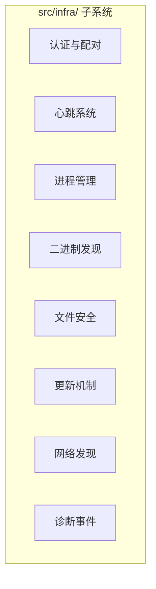
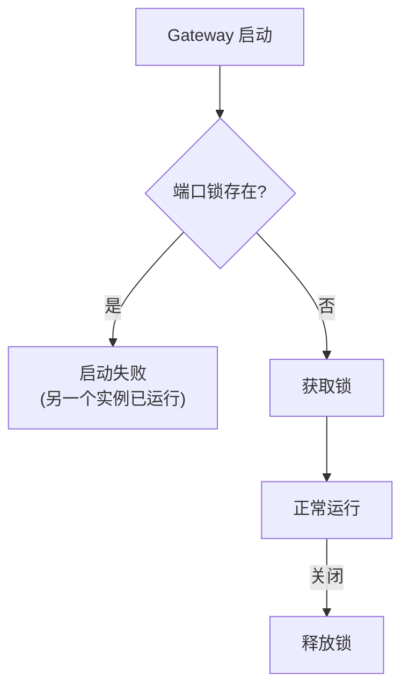

# 第十八章 · 基础设施层

> **读完本章你将获得**：理解 `src/infra/` 中的基础设施模块 — 设备认证、心跳系统、进程管理、二进制发现、文件安全和更新机制。

---

## 18.1 基础设施层总览

`src/infra/` 包含 100+ 文件，是 OpenClaw 的"操作系统服务层"。



---

## 18.2 设备认证与配对

```
src/infra/device-auth.ts      — 设备认证
src/infra/device-pairing.ts   — 配对流程
src/infra/device-identity.ts  — 设备身份
```

### 认证方式

| 方式 | 用途 |
|------|------|
| Setup Code | 简单的数字/字母码（首次配对） |
| QR Code | 移动端扫码配对 |
| Device Token | 配对后的持久令牌 |
| Ed25519 签名 | 设备身份验证 |

---

## 18.3 心跳系统

```
src/infra/heartbeat-runner.ts  — 心跳 Runner
src/infra/heartbeat-events.ts  — 心跳事件类型
```

心跳系统让 Gateway 保持"活性"感知：


**用途**：
- 检测客户端断连
- Gateway 自身健康监控
- Node 在线状态追踪

---

## 18.4 进程管理

```
src/infra/gateway-lock.ts       — 单实例锁 (防止重复启动)
src/infra/gateway-processes.ts  — 进程追踪
src/infra/ports.ts              — 端口可用性检测
src/infra/restart.ts            — 重启延迟与哨兵
src/infra/process-respawn.ts    — 进程 Respawn
```

### 单实例保证



---

## 18.5 二进制发现

```
src/infra/binaries.ts           — 二进制检测与安装
src/infra/executable-path.ts    — 可执行文件路径解析
src/infra/npm-integrity.ts      — NPM 包完整性检查
```

OpenClaw 依赖一些外部二进制（如 FFmpeg）。二进制发现系统负责定位或安装它们。

---

## 18.6 文件安全

```
src/infra/path-guards.ts   — 路径边界检查
src/infra/path-safety.ts   — 路径遍历防护
src/infra/fs-safe.ts        — 安全文件操作
src/infra/file-lock.ts      — 文件锁
```

（详见第十章安全体系）

---

## 18.7 更新机制

```
src/infra/update-check.ts    — 检查新版本
src/infra/update-runner.ts   — 执行更新
src/infra/update-startup.ts  — 启动时计划更新检查
```


---

## 18.8 网络发现

```
src/infra/bonjour*.ts              — mDNS/Bonjour 服务发现
src/infra/network-interfaces.ts    — 网络接口枚举
src/infra/widearea-dns.ts          — DNS 解析
```

（详见第三章 Gateway 发现服务）

---

### 质检报告

**完整性**
- [x] 8 个子系统全覆盖
- [x] 关键文件路径
- [x] 核心机制说明

**准确性**
- [x] 文件路径与仓库一致

**可读性**
- [x] 模块化展示，清晰

**勘误建议**
- 无
