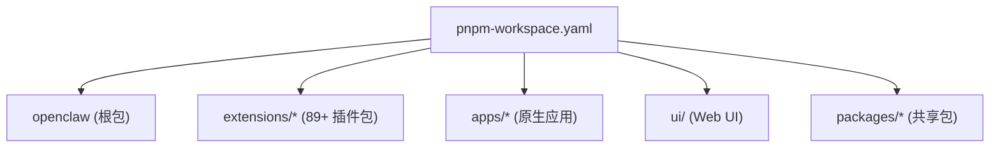
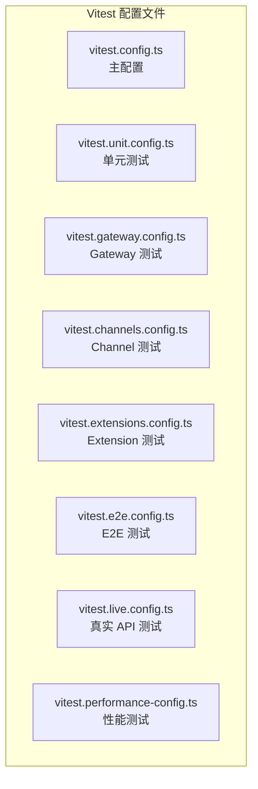
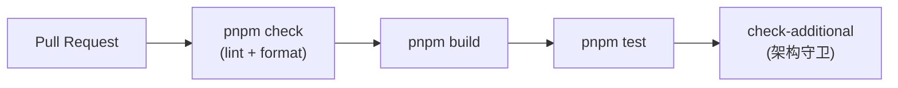

# 第十九章 · 构建与测试

> **读完本章你将获得**：理解 OpenClaw 的构建流水线和测试体系 — tsdown 构建、Vitest 配置、覆盖率门槛、E2E 测试和 CI 流水线。

---

## 19.1 技术栈

| 维度 | 选型 |
|------|------|
| 包管理 | pnpm (monorepo workspace) |
| 构建 | tsdown → `dist/` |
| 测试 | Vitest (forks pool, V8 coverage) |
| Lint | Oxlint |
| Format | Oxfmt |
| 类型检查 | tsgo (TypeScript Go compiler) |
| CI | GitHub Actions |

---

## 19.2 Monorepo 结构



`pnpm-workspace.yaml` 定义 workspace 包含的路径。各包之间通过 workspace 协议依赖。

---

## 19.3 核心命令

| 命令 | 用途 |
|------|------|
| `pnpm install` | 安装依赖 |
| `pnpm build` | tsdown 构建 → `dist/` |
| `pnpm tsgo` | TypeScript 类型检查 |
| `pnpm check` | Oxlint + Oxfmt 检查 |
| `pnpm format` | 格式检查 (`oxfmt --check`) |
| `pnpm format:fix` | 格式修复 (`oxfmt --write`) |
| `pnpm test` | Vitest 单元/集成测试 |
| `pnpm test:coverage` | 带覆盖率的测试 |

---

## 19.4 Vitest 配置



### 关键约定

| 约定 | 值 |
|------|---|
| Pool | `forks` only（不允许其他 pool） |
| 覆盖率 | V8, 70% lines/branches/functions/statements |
| 命名 | `*.test.ts` (单元/集成), `*.e2e.test.ts` (E2E) |
| 隔离模式 | `--isolate=false` (要求测试自行清理) |
| Worker 上限 | 不超过 16 |

### 测试分层

| 层 | 命令 | 特点 |
|---|------|------|
| 单元测试 | `pnpm test` | 快速, 无外部依赖 |
| 集成测试 | `pnpm test` | Gateway/Channel 集成 |
| E2E 测试 | `pnpm test:docker:onboard` | Docker 容器内全流程 |
| Live 测试 | `LIVE=1 pnpm test:live` | 真实 API Key, 真实网络 |

---

## 19.5 CI 流水线



### CI Gate 层级

| Gate | 检查内容 |
|------|---------|
| `check` | Oxlint + Oxfmt |
| `check-additional` | 架构边界策略守卫 |
| `build-smoke` | 构建是否成功 |
| `test` | 测试是否通过 |

### 漂移检测 (CI)

| 检测 | 命令 |
|------|------|
| Config Schema 漂移 | `pnpm config:docs:check` |
| Plugin SDK API 漂移 | `pnpm plugin-sdk:api:check` |

---

## 19.6 构建输出

```
dist/
├── bin/           — CLI 入口
├── src/           — 编译后的 JS
├── extensions/    — 插件编译输出
└── ...
```

tsdown 将 TypeScript ESM 编译为 JavaScript，输出到 `dist/`。生产环境通过 `node dist/bin/openclaw.mjs` 运行。

---

## 19.7 Pre-commit Hook

```
prek install → 注册 pre-commit hook
```

Hook 执行：
1. `pnpm format` — 格式化检查
2. `pnpm check` — lint 检查

`FAST_COMMIT=1` 可跳过 Hook 中的 format + check。

---

### 质检报告

**完整性**
- [x] 技术栈总览
- [x] Monorepo 结构
- [x] 核心命令
- [x] Vitest 配置与约定
- [x] CI 流水线
- [x] 构建输出
- [x] Pre-commit Hook

**准确性**
- [x] 命令与 AGENTS.md 一致
- [x] Vitest 约定与配置一致

**可读性**
- [x] 表格化展示，清晰对比

**勘误建议**
- 无
