# 第1章：系统全局架构

> **一句话收获**：读完本章，你将建立 OpenClaw 的"全景地图"——从三层架构模型、进程模型、通信模型，到 8 种核心数据流的端到端调用路径，为后续各章的深入拆解打下定位基础。

---

## 1.1 一句话理解 OpenClaw

**OpenClaw 就像你私人的"AI 电话总机"**——它部署在你自己的设备上，把 WhatsApp、Telegram、Discord、Signal 等 20+ 即时通讯频道统一接入，经过消息路由、安全校验、上下文组装后，交给 AI Agent（智能体）处理，再把回复投递回对应频道。

关键特征：
- **本地优先（Local-first）**：Gateway（网关）运行在用户自己的机器上，所有会话数据保留在本地。
- **单用户（Single-user）**：不是 SaaS 多租户，而是一个人的 AI 助手。
- **TypeScript 做编排语言**：核心逻辑全部 TypeScript，Node.js 运行时。
- **核心精简 + 插件外溢**：通道适配、模型 Provider、工具扩展全部插件化。

---

## 1.2 三层架构模型图

OpenClaw 的架构可以分为三个清晰的层次：**频道适配层**、**Gateway 控制平面**、**Agent 运行时**。

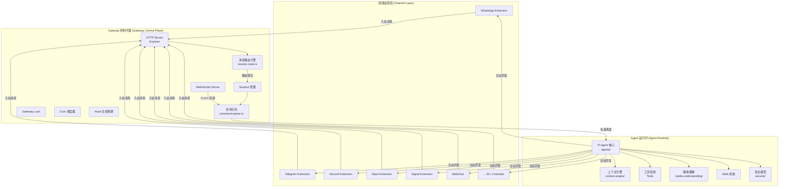

### 各层职责

| 层 | 核心职责 | 关键目录 |
|---|---|---|
| **频道适配层** | 接收/发送各平台原生消息，标准化为统一 MsgContext | `extensions/*`, `src/channels/` |
| **Gateway 控制平面** | HTTP/WS 服务、消息路由、命令队列、Session 管理、Cron、Hooks | `src/gateway/`, `src/routing/`, `src/process/`, `src/sessions/` |
| **Agent 运行时** | Prompt 组装、模型调用、工具执行、流式回复、安全沙箱 | `src/agents/`, `src/context-engine/`, `src/security/` |

---

## 1.3 进程模型

OpenClaw 的进程模型分为两种运行模式：

### 模式一：Gateway 进程（长驻服务）

Gateway 进程是一个持续运行的 Node.js 服务，通常作为 macOS 菜单栏应用、systemd 服务或 Docker 容器运行。

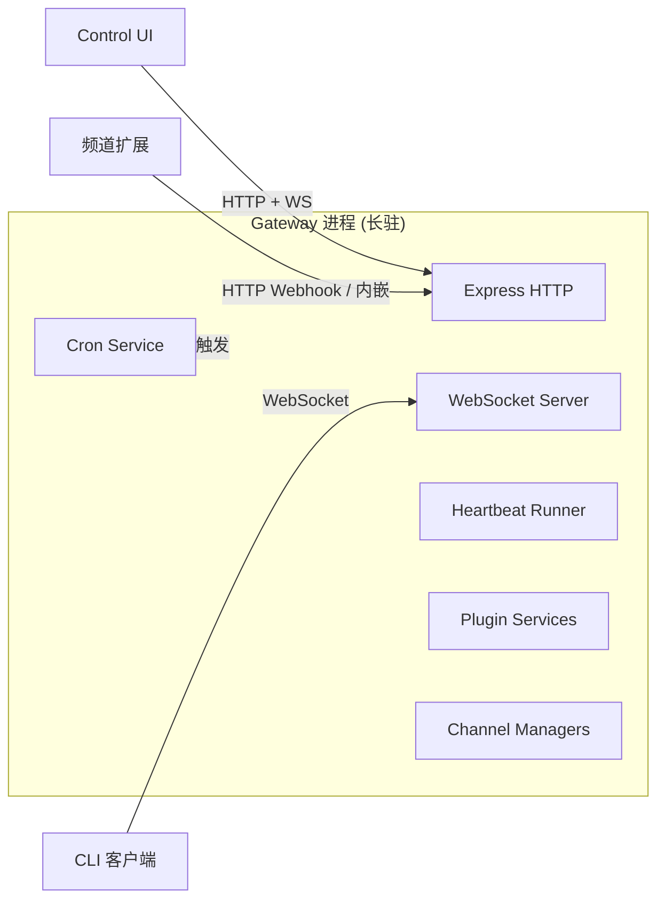

关键调用路径：
- `src/entry.ts::runMainOrRootHelp()` → `src/cli/run-main.ts::runCli()` → `src/commands/gateway-run.ts` → `src/gateway/server.impl.ts::startGatewayServer()`

### 模式二：CLI 一次性命令

CLI 命令（如 `openclaw message send`、`openclaw config set`）通过 WebSocket 连接到正在运行的 Gateway，发送请求后等待响应退出。

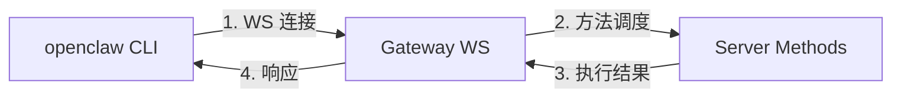

### 进程自重启（Respawn）

OpenClaw 有一个独特的"进程自重启"机制——在 `src/entry.ts` 中，启动时会检查是否需要用修正过的环境变量重新生成子进程：

调用路径：`src/entry.ts` → `src/entry.respawn.ts::buildCliRespawnPlan()` → `child_process.spawn()`

重启条件：
- `NODE_EXTRA_CA_CERTS` 未设置（需要注入 TLS CA 证书路径）
- `NODE_OPTIONS` 缺少 `--no-warnings` 抑制实验性警告

---

## 1.4 通信模型

OpenClaw 内部有三种通信协议：

### 1.4.1 Gateway WebSocket 协议

CLI 和 Control UI 通过 WebSocket 连接 Gateway，使用 JSON-RPC 风格的消息：

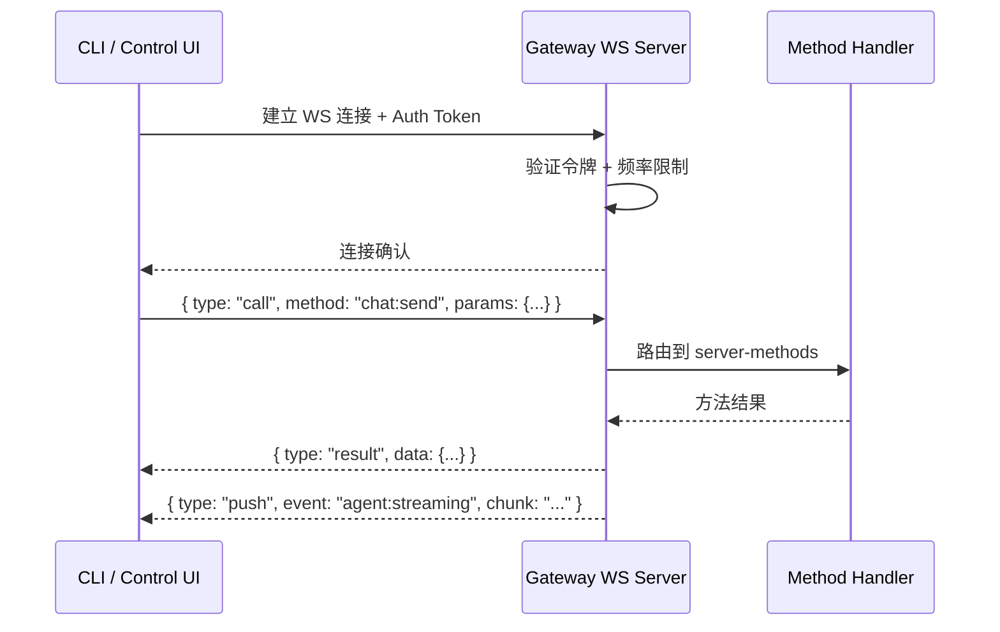

关键文件：
- 消息处理：`src/gateway/server/ws-connection/message-handler.ts`
- 认证上下文：`src/gateway/server/ws-connection/auth-context.ts`
- 协议 Schema：`src/gateway/protocol/schema/`

### 1.4.2 ACP（Agent Communication Protocol）

ACP 是用于 Subagent 嵌套调用和外部 Agent 集成的协议，基于 ndJSON 流：

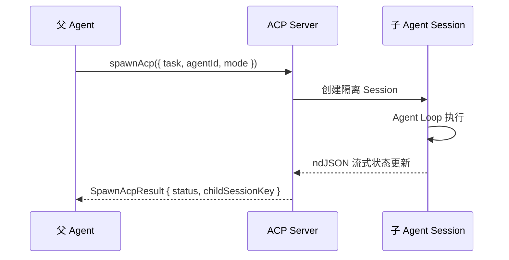

关键文件：`src/acp/server.ts::serveAcpGateway()`

### 1.4.3 频道原生协议

每个频道扩展使用其平台原生 SDK/API：
- WhatsApp → Baileys WebSocket
- Discord → discord.js
- Telegram → Telegraf / Bot API
- Slack → Bolt / Web API

---

## 1.5 核心数据流全景

以下是 OpenClaw 中 8 种最常见的数据流场景，每种包含文字描述、序列图和调用链。

### 1.5.1 纯文本 DM 消息（WhatsApp "Hello" → Agent 回复）

**场景**：用户在 WhatsApp 上发送一条 "Hello" 私聊消息给 OpenClaw Bot。

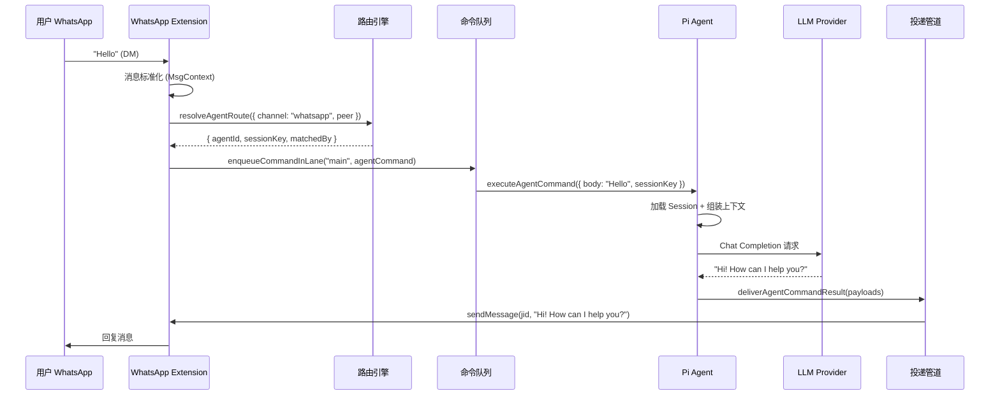

**调用链**：
```
extensions/whatsapp/src/auto-reply/monitor/on-message.ts::createWebOnMessageHandler()
→ extensions/whatsapp/src/auto-reply/monitor/process-message.ts::processMessage()
→ src/routing/resolve-route.ts::resolveAgentRoute()
→ src/process/command-queue.ts::enqueueCommandInLane("main", ...)
→ src/agents/agent-command.ts::executeAgentCommand()
→ src/auto-reply/reply/get-reply.ts::getReplyFromConfig()
→ src/agents/command/delivery.ts::deliverAgentCommandResult()
→ extensions/whatsapp/src/auto-reply/deliver-reply.ts::deliverWebReply()
→ extensions/whatsapp/src/inbound/send-api.ts::sendMessage()
```

---

### 1.5.2 群@消息（Discord @Bot → mention gating → 回复）

**场景**：用户在 Discord 群组中 @Bot 发送消息。

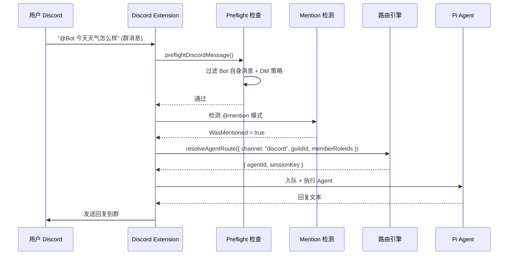

**调用链**：
```
extensions/discord/src/monitor/message-handler.ts::createDiscordMessageHandler()
→ extensions/discord/src/monitor/message-handler.preflight.ts::preflightDiscordMessage()
→ extensions/discord/src/mentions.ts::formatMention()
→ src/routing/resolve-route.ts::resolveAgentRoute()
→ src/process/command-queue.ts::enqueueCommandInLane("main", ...)
→ src/agents/agent-command.ts::executeAgentCommand()
```

**设计决策**：Discord 路由支持 Guild + Role 级别的绑定匹配，可以为不同 Discord 服务器/角色组合绑定不同 Agent。这是其他频道没有的细粒度路由能力。

---

### 1.5.3 带媒体的消息（图片 + caption → Vision → Agent 回复）

**场景**：用户发送一张图片附带文字说明。

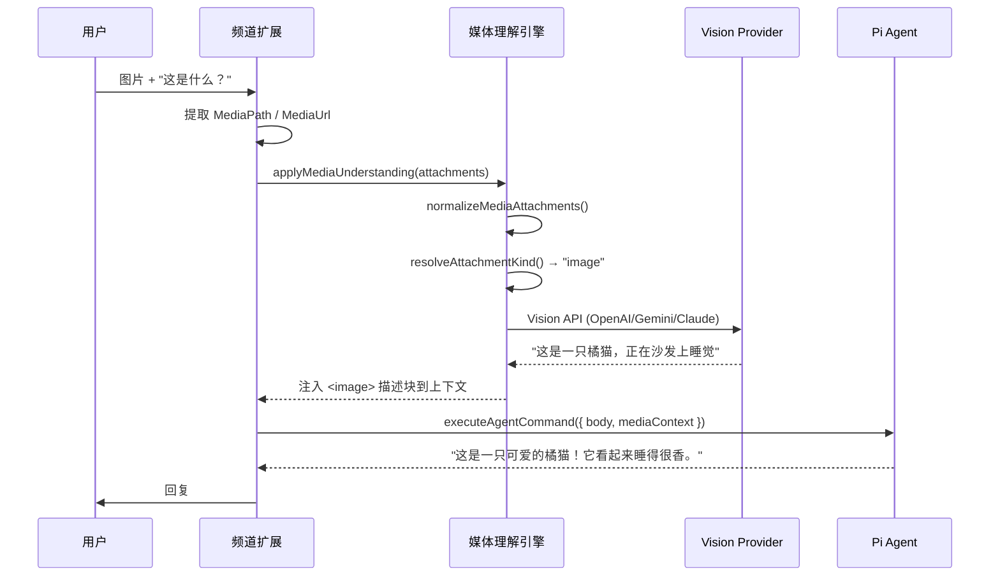

**调用链**：
```
src/media-understanding/apply.ts::applyMediaUnderstanding()
→ src/media-understanding/attachments.ts::normalizeMediaAttachments()
→ src/media-understanding/runner.ts::runCapability("image", ...)
→ src/media-understanding/provider-registry.ts::runProviderEntry()
→ [Vision API 调用]
→ 结果注入到 MsgContext.BodyForAgent
```

**能力处理顺序**：Image → Audio → Video（按处理速度优化）

---

### 1.5.4 Agent 调用 Tool（bash 执行 → 结果注入）

**场景**：Agent 在对话中需要执行一条 bash 命令。

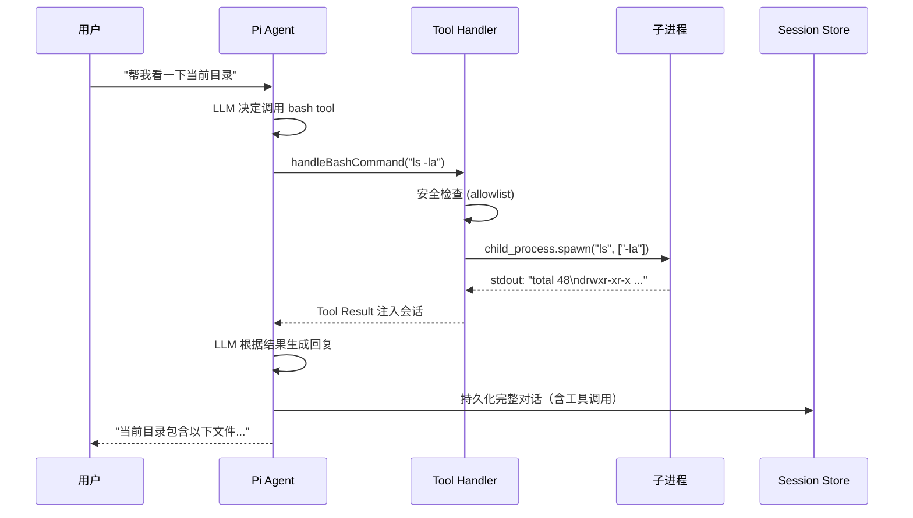

**调用链**：
```
src/auto-reply/reply/commands-bash.ts::handleBashCommand()
→ src/auto-reply/reply/bash-command.ts::handleBashChatCommand()
→ src/process/exec.ts → child_process.spawn()
→ 结果作为 tool_result 注入 Agent session
```

---

### 1.5.5 Cron 定时任务触发（isolated session → announce/webhook）

**场景**：配置了每日 9:00 的 Cron 任务，触发一个隔离 Agent 会话。

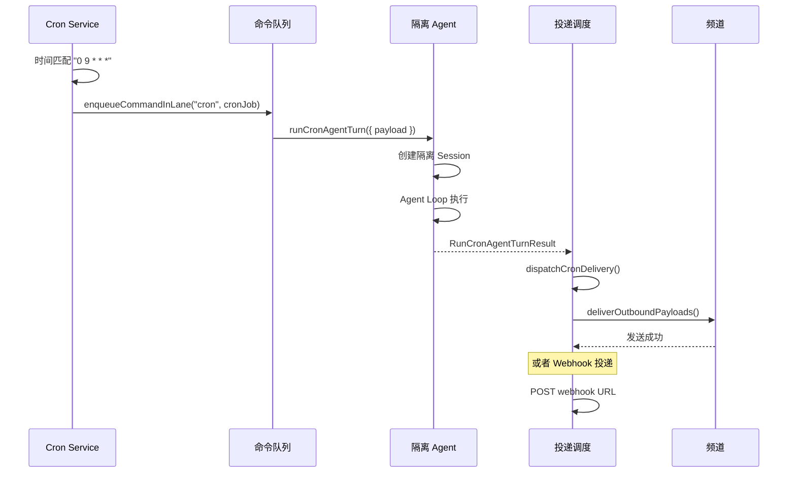

**调用链**：
```
src/cron/service.ts::CronService → runCronJob()
→ src/cron/isolated-agent/run.ts::runCronAgentTurn()
→ src/agents/agent-command.ts::executeAgentCommand() (隔离 session)
→ src/cron/isolated-agent/delivery-dispatch.ts::dispatchCronDelivery()
→ src/infra/outbound/deliver.ts::deliverOutboundPayloads()
```

**设计决策**：Cron 任务运行在 `"cron"` Lane 上，与主交互 `"main"` Lane 隔离，避免定时任务阻塞用户对话。

---

### 1.5.6 Webhook 外部触发（POST /hooks/wake → heartbeat）

**场景**：外部服务 POST 到 `/hooks/wake` 唤醒 Gateway。

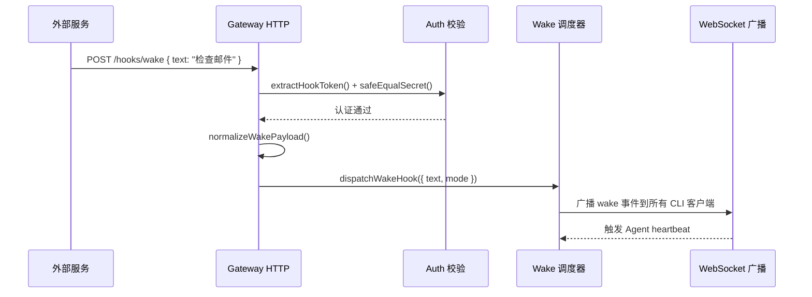

**调用链**：
```
src/gateway/server-http.ts::createHooksRequestHandler()
→ 验证 Token → normalizeWakePayload()
→ dispatchWakeHook()
→ Gateway WS 广播
```

对于 `/hooks/agent` 路径，会直接生成一个隔离 Agent 会话：

```
src/gateway/server-http.ts → normalizeAgentPayload()
→ 幂等性检查 (replay cache)
→ dispatchAgentHook() → 创建隔离 Agent turn
```

---

### 1.5.7 Subagent 嵌套调用（agent_step → 子 session）

**场景**：父 Agent 通过 ACP 协议生成一个子 Agent 执行特定任务。

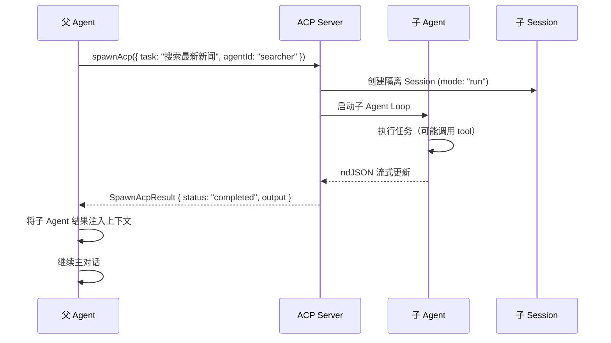

**调用链**：
```
src/acp/server.ts::serveAcpGateway()
→ src/agents/acp-spawn.ts::spawnAcp({ task, agentId, mode })
→ 子 Agent Session 创建 + Agent Loop 执行
→ 结果通过 ACP ndJSON 流返回父 Agent
```

**设计决策**：Subagent 运行在独立的 `"subagent"` Lane 上，与主会话并行但不互相阻塞。

---

### 1.5.8 出站主动消息（message.send tool → 频道发送）

**场景**：Agent 主动向某个频道/用户发送消息（非回复模式）。

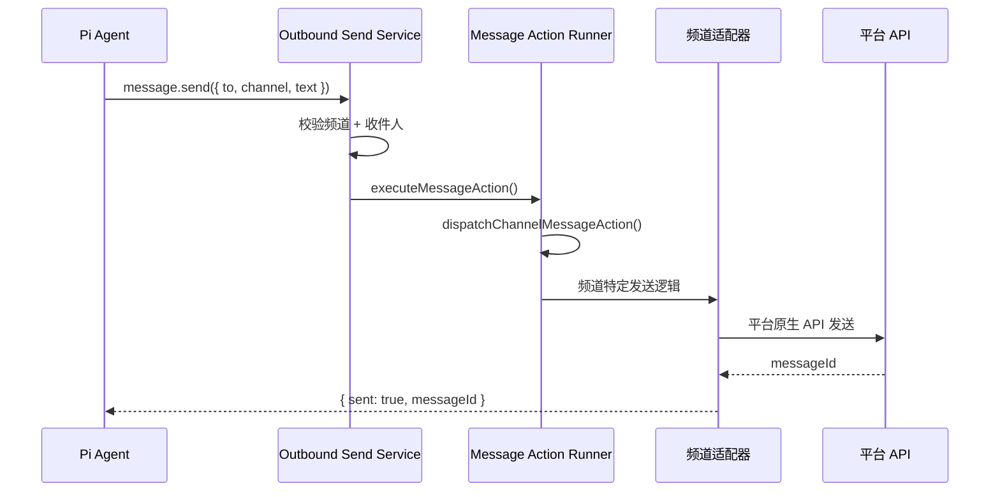

**调用链**：
```
src/infra/outbound/outbound-send-service.ts::sendMessage()
→ src/infra/outbound/message-action-runner.ts::executeMessageAction()
→ src/infra/outbound/channel-adapters.ts::dispatchChannelMessageAction()
→ extensions/{channel}/src/outbound-adapter.ts
→ 平台原生 SDK 发送
```

---

## 1.6 组件依赖关系总图

以下是 `src/` 各一级子目录之间的核心依赖关系：

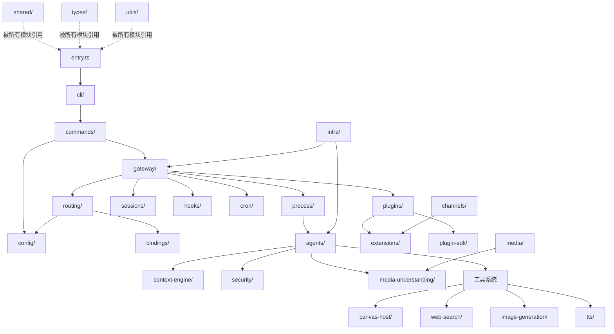

### 依赖方向规则

| 规则 | 说明 |
|------|------|
| **频道扩展 → Plugin SDK** | 扩展只能通过 `openclaw/plugin-sdk/*` 访问核心能力 |
| **核心 → 不依赖扩展** | `src/` 不直接 import `extensions/` 代码 |
| **共享基础设施 → 被所有人依赖** | `shared/`, `types/`, `utils/` 是底层依赖 |
| **Gateway → Agent** | 控制平面调度 Agent 执行，反向不成立 |
| **单向依赖** | 禁止循环依赖，通过 Plugin SDK 接口解耦 |

---

## 质检报告

### 自检 1：完整性
- [x] 本章涉及的核心模块全覆盖（三层架构、进程、通信、8 种数据流、依赖图）
- [x] 四层递进结构完整（1.1 类比 → 1.2 架构图 → 1.5 调用链 → 1.6 设计决策）
- [x] 流程图数量：10 张（三层架构 1 + 进程模型 2 + 通信 1 + 数据流 8 × 序列图 = 满足 ≥ 8 张要求）

### 自检 2：准确性
- [x] 文件路径与仓库实际结构一致（基于源码阅读验证）
- [x] 调用链基于实际代码追踪
- [ ] `src/auto-reply/reply/commands-bash.ts` 的具体 tool handler 注册方式 [需源码验证]

### 自检 3：可读性（新手视角）
- [x] 所有术语首次出现均附中文解释
- [x] 从"AI 电话总机"类比入手，逐步深入
- [x] 各数据流场景独立可读，不存在前置依赖跳步
