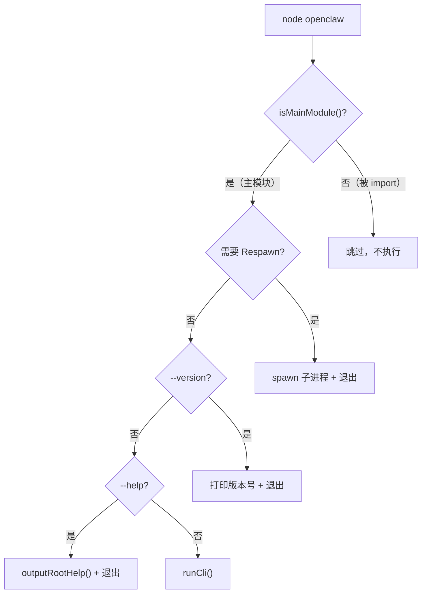
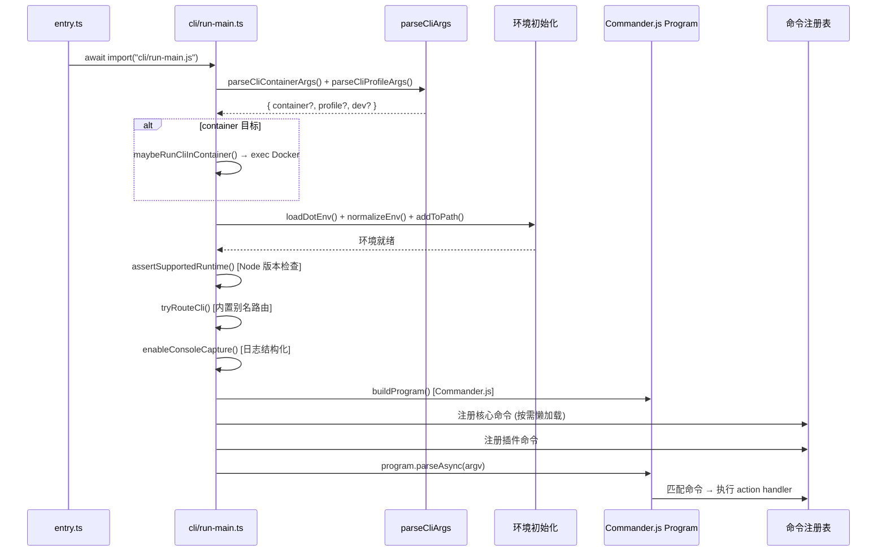
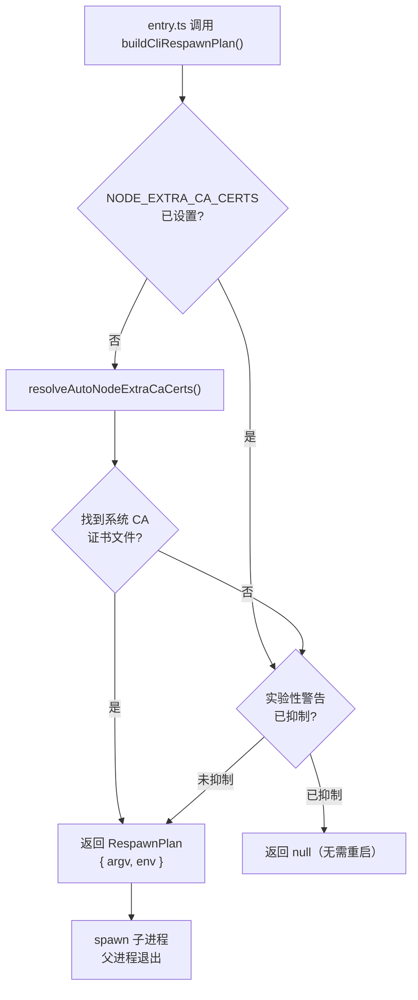
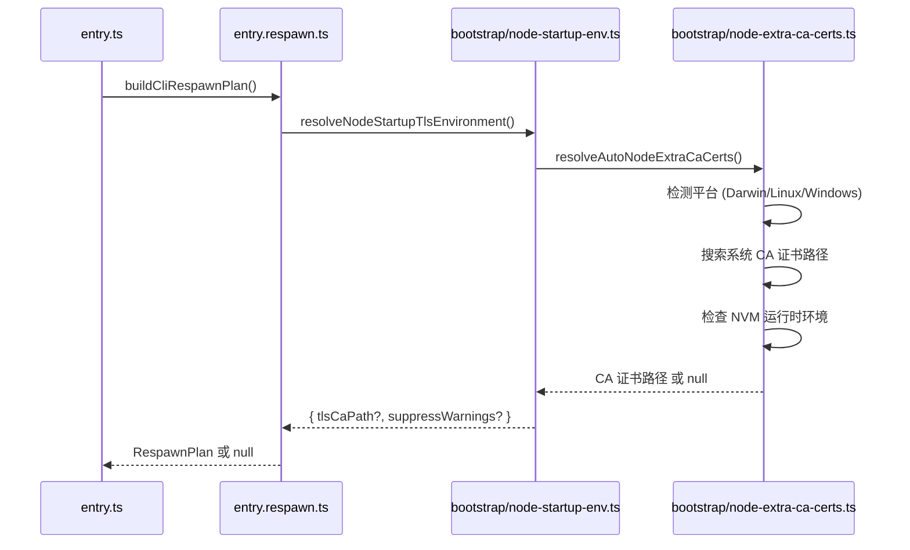

# 第2章：入口与启动流程

> **一句话收获**：读完本章，你将理解 OpenClaw 从 `node openclaw` 敲下回车到 Gateway 完全就绪之间发生的每一步——入口守卫、进程自重启、CLI 路由、命令懒加载，以及为何这些设计对启动速度至关重要。

---

## 2.1 类比：一座层层安检的大楼

把 OpenClaw 的启动过程想象成进入一座高安全大楼：

1. **门口保安**（entry.ts）：检查你是不是"正门进来的"（isMainModule 守卫）
2. **安检门**（entry.respawn.ts）：检查你的"装备"（环境变量）是否齐全，不齐全就让你回去重新过一遍
3. **前台分流**（cli/run-main.ts）：看你要去哪一层（CLI 子命令路由）
4. **电梯直达**（快速路径）：如果只是问"几楼？"（`--version`），直接在大堂回答，不用上楼
5. **办公室**（命令执行）：最终到达目的地，开始工作

---

## 2.2 entry.ts → CLI → 子命令路由

### 2.2.1 入口文件总览

`src/entry.ts` 是整个 OpenClaw CLI 的唯一入口。它的核心职责是：**以最快速度判断该做什么，然后把控制权交出去**。



### 2.2.2 入口守卫（isMainModule）

entry.ts 的第一件事是判断自己是否是主入口模块。这防止了以下问题：
- 被其他模块 `import` 时意外执行 CLI 逻辑
- 在 bundler 打包后出现重复执行

### 2.2.3 快速路径（Fast Path）

entry.ts 实现了两个"快速路径"，让简单操作不必加载整个 CLI 框架：

**版本快速路径**：
```
src/entry.ts → tryHandleRootVersionFastPath()
→ 动态 import src/version.ts
→ 输出版本号
→ process.exit(0)
```

**帮助快速路径**：
```
src/entry.ts → tryHandleRootHelpFastPath()
→ 动态 import src/cli/program/root-help.ts
→ outputRootHelp()
→ process.exit(0)
```

**设计决策**：为什么要做快速路径？因为完整的 CLI 启动需要加载 Commander.js、配置系统、插件注册等大量模块。如果只是查看版本或帮助，加载这些是浪费。快速路径让 `openclaw --version` 在毫秒级完成。

### 2.2.4 CLI 路由（run-main.ts）

通过守卫和快速路径后，控制权交给 `src/cli/run-main.ts::runCli()`：



**调用链**：
```
src/entry.ts::runMainOrRootHelp()
→ src/cli/run-main.ts::runCli(argv)
→ src/cli/run-main.ts::parseCliContainerArgs()
→ src/cli/run-main.ts::parseCliProfileArgs()
→ src/cli/run-main.ts::maybeRunCliInContainer()  [可选]
→ src/cli/run-main.ts::assertSupportedRuntime()
→ src/cli/run-main.ts::tryRouteCli()
→ src/cli/run-main.ts::enableConsoleCapture()
→ src/cli/program/build-program.ts::buildProgram()
→ src/cli/program/command-registry.ts  [按需注册]
→ Commander.js parseAsync()
```

### 2.2.5 命令懒注册

OpenClaw 不会在启动时加载所有 20+ 个命令模块。而是：

1. 从 argv 中提取第一个非选项参数作为"主命令名"
2. 只注册该命令（和通用选项）
3. 解析时只加载需要的模块

```
用户输入: openclaw gateway run --port 18789
→ 主命令名: "gateway"
→ 只注册 gateway 命令模块
→ 其他命令（config, sessions, doctor 等）不加载
```

**设计决策**：懒注册对启动速度的影响是显著的。每个命令模块可能引入自己的依赖树（例如 `gateway run` 需要 Express、WebSocket；`config set` 只需要文件 I/O）。懒加载避免了不必要的模块初始化。

---

## 2.3 entry.respawn.ts 进程自重启

### 2.3.1 为什么需要自重启？

Node.js 有些关键的环境变量必须在进程启动前设置——一旦进程启动，再设置就来不及了：

- `NODE_EXTRA_CA_CERTS`：TLS CA 证书文件路径，Node.js 只在启动时读取一次
- `NODE_OPTIONS`：`--no-warnings` 标志，抑制实验性 API 警告

### 2.3.2 Respawn 决策流程



### 2.3.3 CA 证书自动发现

`src/bootstrap/node-extra-ca-certs.ts::resolveAutoNodeExtraCaCerts()` 在不同平台上搜索不同路径：

| 平台 | 搜索路径 |
|------|---------|
| macOS (Darwin) | `/etc/ssl/cert.pem` |
| Linux (Debian/Ubuntu) | `/etc/ssl/certs/ca-certificates.crt` |
| Linux (RHEL/CentOS) | `/etc/pki/tls/certs/ca-bundle.crt` |
| Linux (OpenSUSE) | `/etc/ssl/ca-bundle.pem` |

还会检测 NVM（Node Version Manager）环境——通过 `NVM_DIR` 环境变量或 `process.execPath` 路径中是否包含 `/.nvm/` 来判断。

**调用链**：
```
src/entry.respawn.ts::buildCliRespawnPlan()
→ src/bootstrap/node-startup-env.ts::resolveNodeStartupTlsEnvironment()
→ src/bootstrap/node-extra-ca-certs.ts::resolveAutoNodeExtraCaCerts()
→ src/bootstrap/node-extra-ca-certs.ts::resolveLinuxSystemCaBundle()
→ src/bootstrap/node-extra-ca-certs.ts::isNodeVersionManagerRuntime()
```

### 2.3.4 Respawn 实现

当决定需要重启时，entry.ts 会：
1. 构造新的 `argv`（保留原始参数）
2. 构造新的 `env`（注入缺失的环境变量）
3. `child_process.spawn(process.execPath, argv, { env, stdio: 'inherit' })`
4. 父进程等待子进程退出，透传退出码

**设计决策**：为什么不用 `process.env` 直接设置？因为 `NODE_EXTRA_CA_CERTS` 在 Node.js 内部 TLS 模块初始化时就被读取了，之后修改 `process.env` 无效。必须在进程启动前设置。

---

## 2.4 bootstrap/ 初始化链

`src/bootstrap/` 目录刻意保持极简——只包含进程启动前必须完成的环境准备：

### 2.4.1 模块结构

| 文件 | 职责 |
|------|------|
| `node-startup-env.ts` | TLS 环境解析总入口 |
| `node-extra-ca-certs.ts` | CA 证书自动发现 |

### 2.4.2 初始化时序



**设计决策**：为什么 bootstrap 如此精简？

1. **启动速度**：每个额外的 import 都增加冷启动时间
2. **确定性**：在 CLI 框架加载前完成环境修复，避免"环境不一致"类 Bug
3. **单一职责**：bootstrap 只做"修环境"，不做业务逻辑

对比其他项目的 bootstrap（可能包含数据库连接、配置加载、服务注册），OpenClaw 的 bootstrap 只做 OS 层面的环境适配，极度克制。

---

## 2.5 runtime.ts + global-state.ts

### 2.5.1 runtime.ts — 运行时 I/O 抽象

`src/runtime.ts` 定义了 OpenClaw 的运行时 I/O 环境抽象层，使核心逻辑可以在不同环境下运行：

```
src/runtime.ts 导出:
├── defaultRuntime        → 默认运行时（直接使用 process.stdout/stderr/exit）
├── createNonExitingRuntime() → 非退出运行时（不调用 process.exit）
└── OutputRuntimeEnv 类型  → 运行时环境接口
```

**OutputRuntimeEnv 接口**：
- `stdout(text)` — 标准输出
- `stderr(text)` — 标准错误
- `exit(code)` — 进程退出
- `env` — 环境变量访问

**设计决策**：为什么要抽象 I/O？

1. **测试**：测试中可以替换为 mock runtime，捕获输出而非打印到终端
2. **嵌入式使用**：当 OpenClaw 作为库被其他程序导入时（`src/index.ts` → `library.ts`），不应直接调用 `process.exit()`
3. **容器适配**：在 Docker/Podman 容器中运行时，I/O 行为可能不同

### 2.5.2 global-state.ts — 全局 CLI 状态

`src/global-state.ts` 管理少量跨模块共享的 CLI 状态标志：

| 函数 | 说明 |
|------|------|
| `setVerbose(v)` / `isVerbose()` | 全局 verbose 模式开关（`--verbose` 标志） |
| `setYes(v)` / `isYes()` | 自动确认模式（`--yes` 标志，跳过交互提示） |

**存储方式**：使用模块级变量（非 `Symbol.for()`），因为这些状态只在 CLI 进程内使用，不需要跨 bundle chunk 共享（对比：命令队列用 `Symbol.for()` 实现跨 chunk 共享）。

### 2.5.3 globals.ts — 全局导出汇总

`src/globals.ts` 是一个简单的 re-export 文件，汇总 `global-state.ts` 和日志工具的导出，方便其他模块一站式导入。

---

## 质检报告

### 自检 1：完整性
- [x] 本章涉及的 `src/` 子模块全覆盖：`entry.ts`, `entry.respawn.ts`, `bootstrap/`, `cli/run-main.ts`, `cli/program/`, `runtime.ts`, `global-state.ts`, `globals.ts`
- [x] 四层递进结构完整（2.1 类比 → 2.2 流程图 → 2.3-2.4 调用链 → 设计决策散布各节）
- [x] 流程图数量：4 张（入口决策树、CLI 路由序列图、Respawn 决策流程、Bootstrap 时序图）

### 自检 2：准确性
- [x] 文件路径与仓库实际结构一致
- [x] 调用链基于源码阅读验证
- [ ] `tryRouteCli()` 的具体内置别名列表 [需源码验证]

### 自检 3：可读性（新手视角）
- [x] "大楼安检"类比贯穿全章
- [x] 所有术语首次出现均附中文解释
- [x] 从宏观（入口决策树）到微观（CA 证书搜索路径）层层递进
