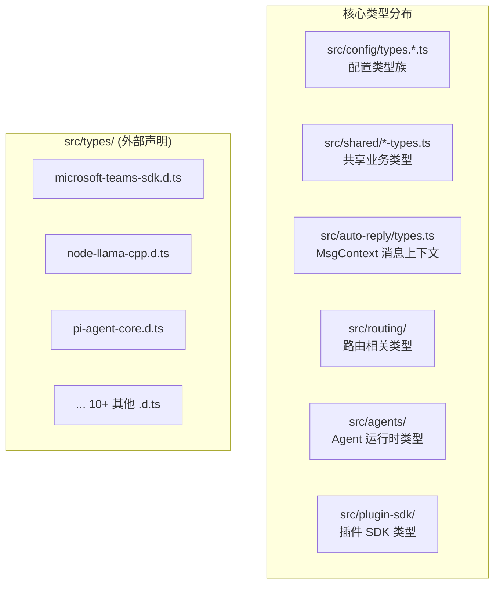
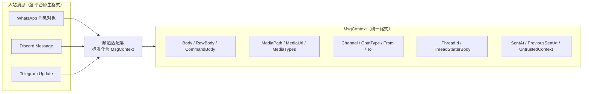
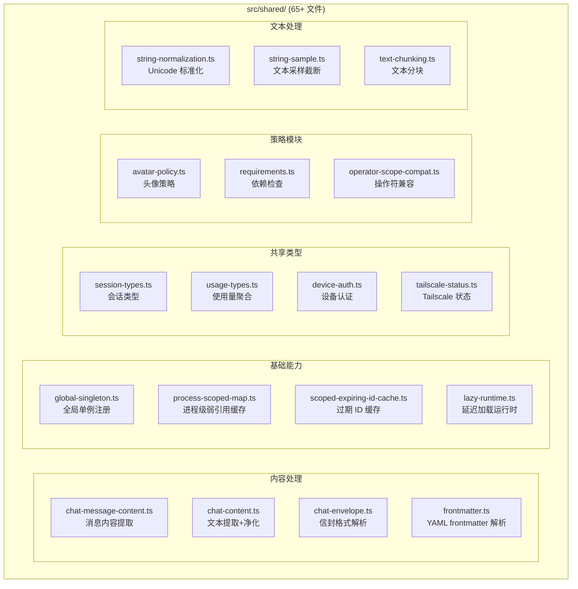
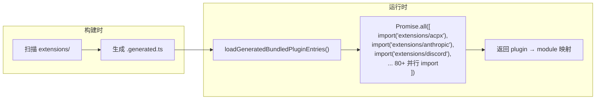
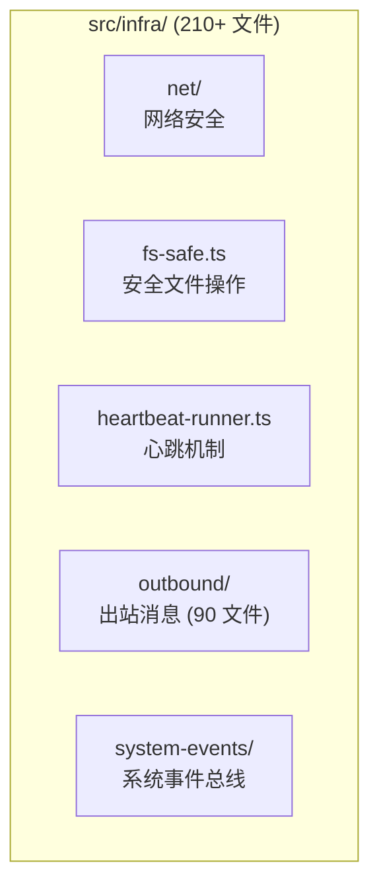
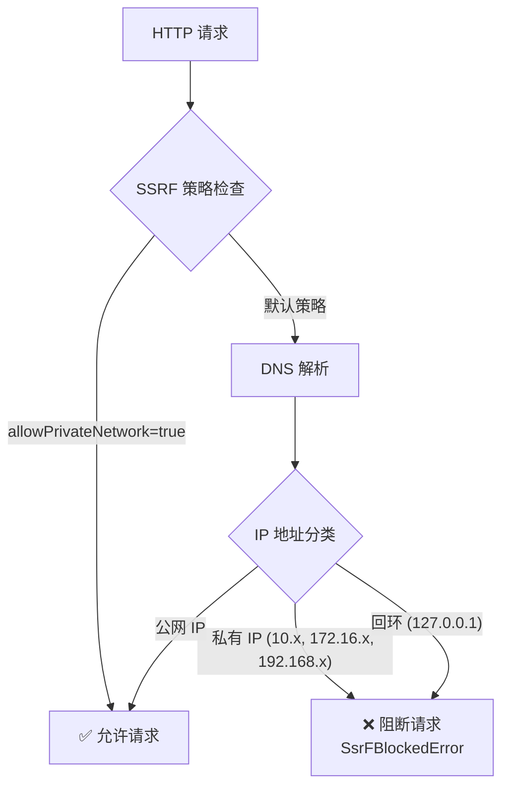
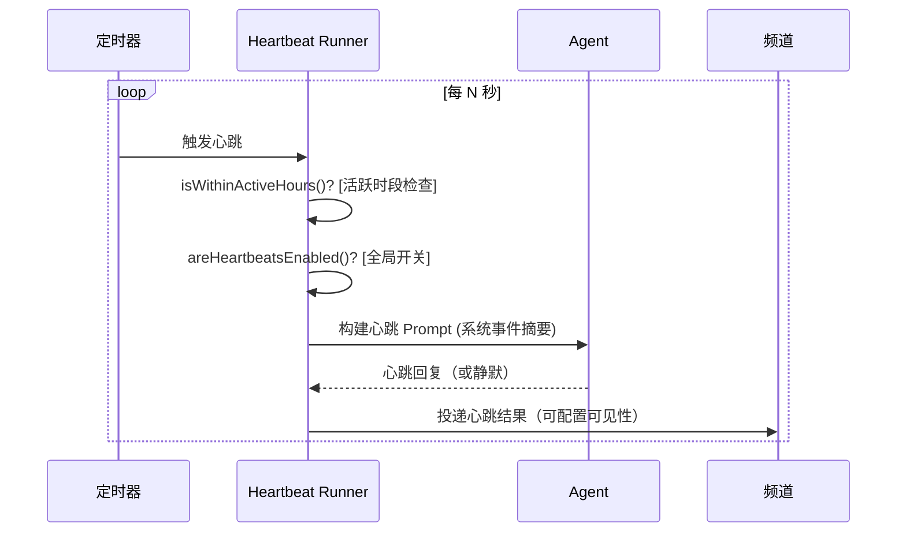
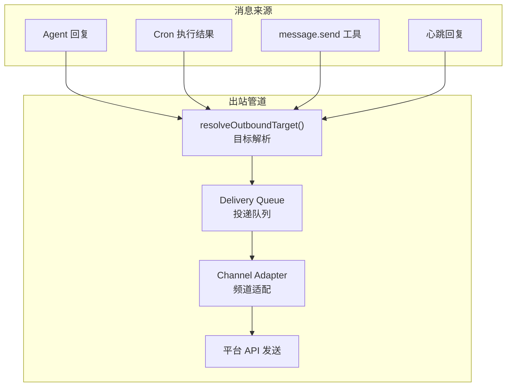

# 第3章：类型系统与共享基础设施

> **一句话收获**：读完本章，你将理解 OpenClaw 的"地基"——核心类型体系如何让 20+ 频道共享同一套消息格式，共享工具层如何避免重复代码，以及基础设施层如何提供 SSRF 防护、安全文件读写、心跳机制等"水电煤"能力。

---

## 3.1 核心类型体系

### 3.1.1 一句话理解

**OpenClaw 的类型系统就像一套"国际标准化组织（ISO）"的通信标准**——无论消息来自 WhatsApp 还是 Discord，无论 Agent 是 Claude 还是 GPT，它们在系统内部都用同一套类型语言对话。

### 3.1.2 类型分布：不在一处，而在各处

与很多项目把所有类型集中在 `types/` 目录不同，OpenClaw 的核心业务类型**分散在各功能模块中**，`src/types/` 目录仅存放第三方库的 `.d.ts` 类型声明文件。



### 3.1.3 六大核心类型族

| 类型族 | 主要定义位置 | 说明 |
|--------|-------------|------|
| **Message / MsgContext** | `src/auto-reply/types.ts` | 统一消息上下文，包含 Body、MediaPath、Channel、ChatType 等 |
| **Session** | `src/shared/session-types.ts`, `src/config/types.sessions.ts` | 会话数据结构、身份标识、列表结果 |
| **Channel** | `src/config/types.channels.ts` | 频道配置、健康监控、心跳可见性 |
| **Agent** | `src/config/types.agents.ts` | Agent 运行时配置、绑定匹配规则、沙箱策略 |
| **Tool** | `src/config/types.tools.ts` | 媒体理解能力、模型配置、作用域规则 |
| **Skill** | `src/config/types.skills.ts` | 技能目录、技能配置 |

### 3.1.4 MsgContext：消息标准化的核心

MsgContext 是 OpenClaw 中最重要的类型之一——它是所有入站消息经过频道适配后的"标准化格式"：



**MsgContext 关键字段**（来自 `src/auto-reply/types.ts`）：

| 字段组 | 字段 | 说明 |
|--------|------|------|
| **消息内容** | `Body`, `RawBody`, `CommandBody` | 三级文本：标准化文本、原始文本、命令解析文本 |
| | `BodyForAgent`, `BodyForCommands` | 派生字段：发给 Agent 的文本、发给命令解析器的文本 |
| **媒体** | `MediaPath`, `MediaPaths` | 本地媒体文件路径 |
| | `MediaUrl`, `MediaUrls` | 远程媒体 URL |
| | `MediaTypes` | MIME 类型列表 |
| **路由** | `Channel`, `ChatType` | 频道标识（"whatsapp"/"discord"）、聊天类型（"direct"/"group"） |
| | `From`, `To` | 发送者/接收者标识 |
| | `ThreadId` | 线程 ID（用于线程消息） |
| **上下文** | `Transcript` | 完整对话历史 |
| | `SentAt`, `PreviousSentAt` | 时间戳，用于计算消息间隔 |
| | `UntrustedContext` | 不可信上下文（来自外部的未验证内容） |

### 3.1.5 AgentBinding：路由绑定类型

```
AgentBinding = AgentRouteBinding | AgentAcpBinding

AgentRouteBinding = {
  match: AgentBindingMatch;    // channel + accountId + peer + roles
  agentId: string;             // 目标 Agent ID
  dmScope?: DmScopeMode;       // DM 会话范围
}

AgentAcpBinding = {
  match: AgentBindingMatch;
  acpEndpoint: string;         // ACP 协议端点
}
```

**设计决策**：为什么 Binding 分两种？Route Binding 用于本地 Agent 路由，ACP Binding 用于远程/外部 Agent 集成。这种分离让 OpenClaw 既能做本地 AI 助手，也能接入企业级 Agent 服务。

---

## 3.2 shared/ + utils/

### 3.2.1 一句话理解

**shared/ 是 OpenClaw 的"公共图书馆"**——存放所有模块都可能用到的类型定义、文本处理、缓存策略等横切关注点（Cross-cutting Concerns）。

### 3.2.2 shared/ 模块分类



### 3.2.3 关键共享模块详解

**global-singleton.ts — 跨 Bundle Chunk 的全局单例**

OpenClaw 使用 `Symbol.for()` 实现跨 bundle chunk 的全局单例注册。这是因为 tsdown 打包后，不同 chunk 可能各自拥有模块作用域，普通模块级变量无法跨 chunk 共享。

```
Symbol.for("openclaw.commandQueueState")  → 命令队列全局状态
Symbol.for("openclaw.singletonRegistry")  → 通用单例注册表
```

**requirements.ts — 依赖检查框架**

Hook 和 Plugin 可以声明自己的运行前提条件，这个模块负责检查：
- `bins` — 需要的可执行文件（如 `ffmpeg`、`node`）
- `env` — 需要的环境变量（如 `OPENAI_API_KEY`）
- `config` — 需要的配置路径（如 `channels.whatsapp.enabled`）
- `anyBins` — 上述可执行文件中至少有一个

### 3.2.4 utils/ 工具集

`src/utils.ts` 和 `src/utils/` 提供更细粒度的工具函数：

| 工具模块 | 关键函数 | 用途 |
|---------|---------|------|
| `utils.ts` (根) | `ensureDir()`, `pathExists()`, `safeParseJson()` | 文件系统、JSON 解析 |
| | `normalizeE164()` | 电话号码 E.164 格式标准化 |
| | `clampNumber()`, `escapeRegExp()` | 数值约束、正则转义 |
| `utils/fetch-timeout.ts` | `fetchWithTimeout()` | 带超时的 HTTP 请求 |
| `utils/directive-tags.ts` | `parseInlineDirectives()` | 解析 `:directive:` 标签 |
| `utils/mask-api-key.ts` | `maskApiKey()` | API Key 脱敏 (`sk-...xxxx`) |
| `utils/run-with-concurrency.ts` | `runWithConcurrency()` | 并发控制（限流） |
| `utils/chunk-items.ts` | `chunkItems()` | 数组分块 |
| `utils/shell-argv.ts` | — | Shell 参数解析 |

**设计决策**：shared/ vs utils/ 的分界线：
- **shared/** = 包含类型定义的模块，或需要在多个子系统间共享的"有状态"工具
- **utils/** = 纯函数工具，无状态，可独立使用

---

## 3.3 generated/ — 代码生成

### 3.3.1 一句话理解

**generated/ 是 OpenClaw 的"自动化工厂"**——把散布在 80+ 个扩展中的插件元数据自动汇总成 TypeScript 模块，避免手动维护一份"注册表"。

### 3.3.2 生成的文件

| 文件 | 内容 | 生成脚本 |
|------|------|---------|
| `bundled-plugin-entries.generated.ts` | 80+ 内置插件的 `import()` 加载函数 | `scripts/generate-bundled-plugin-metadata.mjs` |
| `bundled-channel-entries.generated.ts` | 13+ 内置频道的配置元数据 | `scripts/generate-bundled-channel-config-metadata.ts` |

### 3.3.3 插件加载的"注册表"模式



**关键设计**：
- 所有 80+ 插件通过 `Promise.all()` **并行**动态 import，最大化利用 Node.js 的模块加载并发能力
- 生成文件作为"单一真相源（Single Source of Truth）"，避免插件列表在多处不同步

---

## 3.4 infra/ — 基础设施层

### 3.4.1 一句话理解

**infra/ 是 OpenClaw 的"水电煤"**——提供网络安全、文件安全、心跳监控、出站消息投递等所有模块都需要但又不属于任何特定业务的基础能力。

### 3.4.2 infra/ 子模块总览



### 3.4.3 net/ssrf — SSRF 防护

SSRF（Server-Side Request Forgery，服务端请求伪造）是 AI Agent 系统的重大安全风险——Agent 可能被诱导请求内网地址。OpenClaw 在基础设施层提供了系统级 SSRF 防护：



**关键文件和函数**：
- `src/infra/net/ssrf.ts` — SSRF 策略定义和 IP 分类
- `src/infra/net/fetch-guard.ts` — 带 SSRF 防护的 `fetch` 封装，支持 DNS pinning
- `src/infra/net/hostname.ts` — 主机名规范化和验证
- `src/infra/net/proxy-env.ts` — 代理环境变量处理

### 3.4.4 fs-safe — 安全文件操作

防止符号链接攻击（Symlink Attack）和路径遍历攻击（Path Traversal）：

| 函数/类 | 说明 |
|---------|------|
| `SafeOpenError` | 安全文件打开错误，包含错误码：`invalid-path`, `not-found`, `outside-workspace`, `symlink`, `not-file`, `path-mismatch`, `too-large` |
| `safeOpen()` | 使用 `O_NOFOLLOW` 标志打开文件，拒绝符号链接 |
| `readFileWithinRoot()` | 只读取指定根目录内的文件 |
| `SafeLocalReadResult` | 安全读取结果，含 `buffer`、`realPath`、`stat` |

**设计决策**：为什么需要安全文件操作？因为 Agent 可能执行用户提供的路径参数，如果不做边界检查，攻击者可以通过 `../../etc/passwd` 类路径读取敏感文件。

### 3.4.5 heartbeat-runner — 心跳机制

心跳是 OpenClaw 的"健康脉搏"——定期检查 Agent 和频道状态、处理系统事件：



**关键文件**：
- `heartbeat-runner.ts` — 心跳运行器主逻辑
- `heartbeat-wake.ts` — 唤醒/信号处理（`requestHeartbeatNow()` 支持立即触发）
- `heartbeat-summary.ts` — 心跳间隔和配置解析
- `heartbeat-visibility.ts` — 可见性控制（是否在频道显示心跳 ACK/告警）
- `heartbeat-active-hours.ts` — 活跃时段过滤（如仅在 9:00-22:00 运行）
- `heartbeat-events.ts` — 心跳事件发射
- `heartbeat-events-filter.ts` — 事件过滤（Cron 事件、执行完成事件）

### 3.4.6 outbound/ — 出站消息投递

outbound/ 是 OpenClaw 中**最大的基础设施子模块**（90+ 文件），负责所有向外发送消息的逻辑：



**核心类型**：
- `OutboundTarget` — 投递目标（channel + to + accountId + threadId）
- `SessionDeliveryTarget` — 会话级投递目标
- `QueuedDelivery` — 队列中的投递任务（含重试次数和错误信息）

**关键函数**：
```
src/infra/outbound/targets.ts::resolveOutboundTarget()
→ src/infra/outbound/delivery-queue.ts::enqueueDelivery()
→ src/infra/outbound/channel-adapters.ts::dispatchChannelMessageAction()
→ extensions/{channel}/src/outbound-adapter.ts
```

### 3.4.7 system-events — 系统事件总线

系统事件总线收集和分发跨模块事件，主要用于心跳系统的事件摘要：

- Cron 执行事件（成功/失败/超时）
- Agent 执行完成事件
- 频道状态变更事件

---

## 质检报告

### 自检 1：完整性
- [x] 本章覆盖子模块：`src/types/`, `src/shared/`, `src/utils/`, `src/utils.ts`, `src/generated/`, `src/infra/`（含 net/ssrf, fs-safe, heartbeat, outbound, system-events）
- [x] 四层递进结构完整（类比 → 架构图 → 关键函数/类型拆解 → 设计决策）
- [x] 流程图数量：6 张

### 自检 2：准确性
- [x] 文件路径与仓库实际结构一致（基于源码阅读验证）
- [x] 类型定义基于实际代码中的 TypeScript 类型
- [ ] `outbound/` 子模块中 delivery-queue 的重试策略细节 [需源码验证]

### 自检 3：可读性（新手视角）
- [x] "ISO 标准" 和 "水电煤" 类比帮助建立直觉
- [x] MsgContext 字段表格化，便于查阅
- [x] SSRF 防护流程图直观展示安全检查链路
