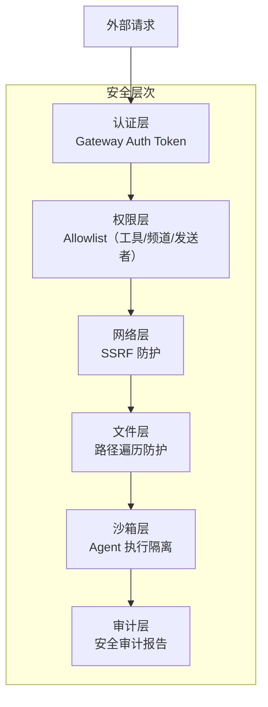
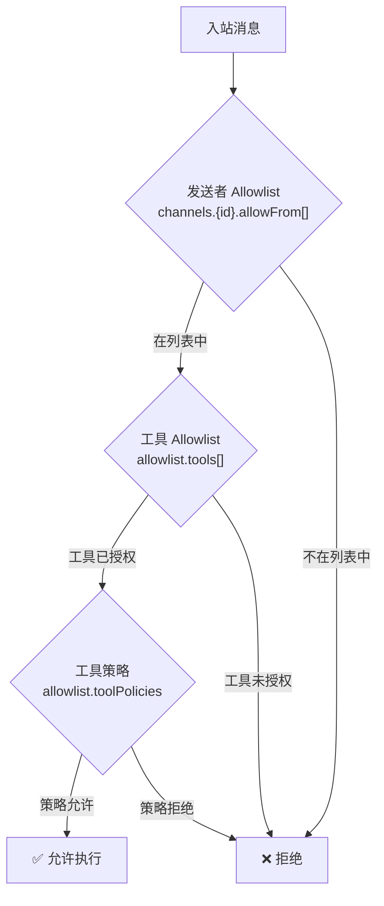

# 第15章：安全模型

> **一句话收获**：读完本章，你将理解 OpenClaw 的安全设计哲学——Allowlist-first 的权限模型、SSRF 防护、路径遍历防护、认证与审计，以及为什么在 AI Agent 系统中安全特别重要。

---

## 15.1 一句话理解

**OpenClaw 的安全模型就像一个"白名单大楼"**——默认所有门都锁着（deny by default），只有明确授权的人（allowlist）才能进入特定房间（工具/频道/API）。

---

## 15.2 安全架构全景



---

## 15.3 Allowlist 权限模型

### 15.3.1 三级 Allowlist



| Allowlist | 配置路径 | 说明 |
|-----------|---------|------|
| **发送者** | `channels.{id}.allowFrom[]` | 哪些人可以与 Bot 对话 |
| **工具** | `allowlist.tools[]` | Agent 可以使用哪些工具 |
| **工具策略** | `allowlist.toolPolicies` | 细粒度工具权限（按发送者/操作） |

---

## 15.4 SSRF 防护（详见第3章）

Agent 可能被诱导请求内网地址（如 `http://169.254.169.254/` 获取云元数据）。OpenClaw 通过 `src/infra/net/ssrf.ts` 提供系统级 SSRF 防护，默认阻断所有私网地址。

---

## 15.5 路径遍历防护（详见第3章）

`src/infra/fs-safe.ts` 通过以下机制防止路径遍历攻击：
- `O_NOFOLLOW` — 拒绝符号链接
- 工作区边界检查 — 文件只能在允许的目录内
- Real path 验证 — 解析后路径必须匹配预期

---

## 15.6 安全审计

### 15.6.1 审计框架

```
SecurityAuditReport = {
  ts: number                           // 审计时间戳
  summary: { critical, warn, info }    // 分级统计
  findings: SecurityAuditFinding[]     // 发现列表
}

SecurityAuditFinding = {
  checkId: string         // 检查项 ID
  severity: "critical" | "warn" | "info"
  title: string           // 标题
  detail: string          // 详情
  remediation?: string    // 修复建议
}
```

### 15.6.2 审计检查项

| 类别 | 检查内容 |
|------|---------|
| **Allowlist** | 工具/Provider/频道权限是否合理 |
| **频道** | 发送者 DM 策略、外部 Bot 拦截 |
| **文件系统** | 状态/配置目录权限 |
| **配置** | 危险标志（headless browser、sandbox disable） |
| **技能** | 代码安全扫描（pattern matching） |

---

## 15.7 设计哲学

**为什么 AI Agent 系统的安全特别重要？**

1. **Agent 有执行能力**：不像普通 chatbot 只能输出文本，Agent 可以执行 bash、读写文件、发送消息
2. **Prompt Injection**：恶意用户可能通过巧妙的消息诱导 Agent 执行危险操作
3. **链式风险**：一个被攻破的工具可能被用来攻击其他系统
4. **本地执行**：OpenClaw 运行在用户本地设备，一旦被攻破影响范围更大

因此 OpenClaw 采用"安全强默认"策略：
- 默认不开启高风险工具（bash 需要显式 allowlist）
- 默认阻断私网请求（SSRF）
- 默认拒绝符号链接（路径遍历）
- 默认审计报告（发现 → 修复建议）

---

## 质检报告

### 自检 1：完整性
- [x] 覆盖认证、Allowlist、SSRF、路径遍历、沙箱、审计
- [x] 流程图数量：2 张

### 自检 2：准确性
- [x] Allowlist 结构基于 security/ 源码
- [x] 审计框架基于 audit.ts 源码

### 自检 3：可读性
- [x] "白名单大楼"类比直观
- [x] 三级 Allowlist 流程图清晰
