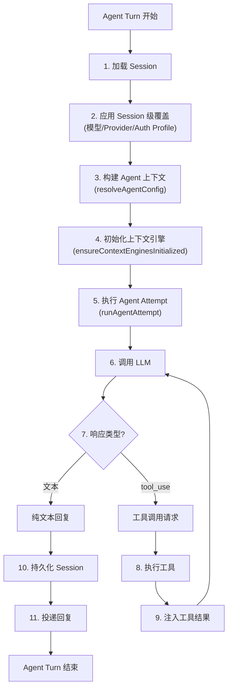
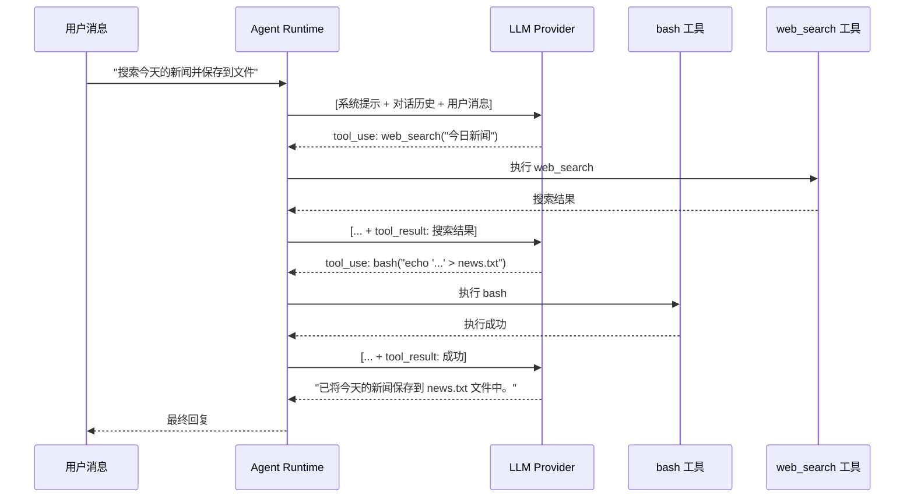
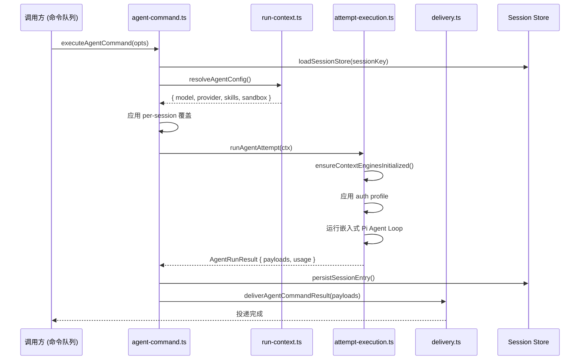
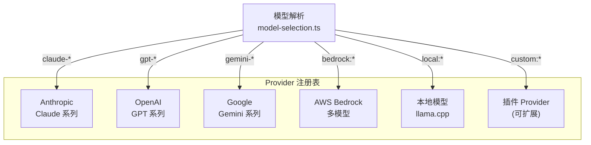
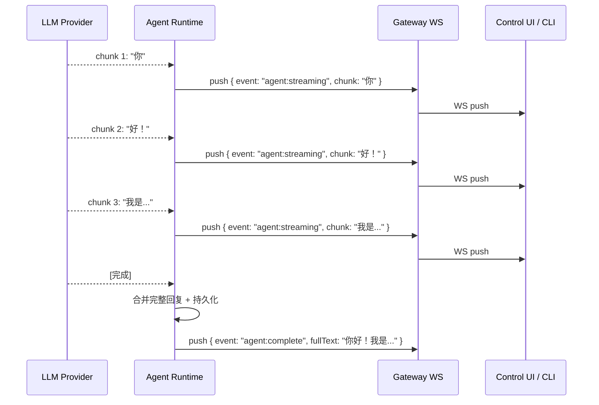

# 第7章：Pi Agent 核心

> **一句话收获**：读完本章，你将理解 Agent 运行时的"大脑"——Agent Loop 如何组装上下文、调用模型、处理工具、管理流式输出，以及模型 Provider 的选择和 Failover 机制。

---

## 7.1 类比：一个有工具箱的翻译员

Pi Agent 就像一个**高级翻译员**：

- **耳朵**（Session + Context Engine）：听取对话历史，理解当前上下文
- **大脑**（LLM Provider）：思考并生成回答（可以换不同的"大脑"——Claude、GPT、Gemini）
- **工具箱**（Tools）：遇到不会的就用工具——计算器（bash）、搜索引擎（web-search）、画板（image-gen）
- **嘴巴**（Delivery Pipeline）：把回答翻译成对方能懂的格式，发送出去
- **助手**（Subagent）：遇到复杂任务可以叫一个"助手"来帮忙处理

---

## 7.2 Agent Loop 流程图

### 7.2.1 主循环



### 7.2.2 多轮工具调用

Agent 可能在一个 turn 中连续调用多个工具，每次工具结果都会注入回对话，LLM 再次决策：



---

## 7.3 agent-command.ts 核心链路

### 7.3.1 executeAgentCommand 流程

`src/agents/agent-command.ts::executeAgentCommand()` 是 Agent 执行的主入口：



### 7.3.2 AgentCommandOpts 关键字段

| 字段 | 类型 | 说明 |
|------|------|------|
| `sessionKey` | `string` | Session 持久化键 |
| `body` | `string` | 用户消息文本 |
| `images` | `ImageContent[]` | 图片内容（Vision 场景） |
| `attachments` | `AgentAttachment[]` | 附件 |
| `deliver` | `boolean` | 是否投递回复 |
| `providerOverride` | `string` | Provider 覆盖 |
| `modelOverride` | `string` | 模型覆盖 |
| `timeoutOverrideSeconds` | `number` | 超时覆盖 |
| `abortSignal` | `AbortSignal` | 取消信号 |
| `onAgentRunStart` | `Function` | Agent 开始执行回调 |
| `onBlockReply` | `Function` | 中间块回复回调 |
| `onToolResult` | `Function` | 工具结果回调 |

### 7.3.3 调用链总结

```
src/agents/agent-command.ts::executeAgentCommand()
→ src/agents/command/run-context.ts::resolveAgentConfig()
→ src/agents/command/attempt-execution.ts::runAgentAttempt()
  → src/context-engine/init.ts::ensureContextEnginesInitialized()
  → src/agents/auth-profiles.ts  [Auth Profile 解析]
  → 嵌入式 Pi Agent Loop (模型调用 + 工具执行循环)
→ src/agents/command/delivery.ts::deliverAgentCommandResult()
  → src/infra/outbound/deliver.ts::deliverOutboundPayloads()
```

---

## 7.4 模型 Provider + Failover

### 7.4.1 Provider 选择机制

OpenClaw 支持多种 LLM Provider，每种 Provider 可以提供多个模型：



### 7.4.2 模型解析流程

```
src/agents/model-selection.ts:
1. 检查 Session 级模型覆盖 (opts.modelOverride)
2. 检查 Agent 配置的默认模型 (agent.model)
3. 检查全局默认模型 (config.defaults.model)
4. 解析模型名到 Provider (模型名前缀匹配)
5. 检查 Auth Profile (是否有该 Provider 的凭证)
6. 返回 { provider, model, authProfile }
```

### 7.4.3 Auth Profile 系统

每个 Provider 需要凭证才能调用。Auth Profile 管理凭证的多种来源：

| 凭证来源 | 说明 | 示例 |
|---------|------|------|
| 环境变量 | `ANTHROPIC_API_KEY` 等 | 最简配置 |
| 配置文件 | `secrets.anthropic.apiKey` | config.json5 中的密钥引用 |
| OAuth Token | Provider OAuth 流程 | Google Vertex 等 |
| Session 覆盖 | 单次会话临时凭证 | 调试/测试用 |

**调用链**：
```
src/agents/auth-profiles.ts → 解析 Auth Profile
→ src/secrets/ → 密钥管理（激活/去激活）
→ Provider SDK → 注入凭证
```

---

## 7.5 Streaming（流式输出）

### 7.5.1 流式输出架构

OpenClaw 支持 Agent 回复的流式输出——LLM 生成文本时逐 token 推送，不必等到完整回复生成完毕：



### 7.5.2 Block Reply 机制

对于长回复，Agent 可以在生成过程中就"分块投递"（Block Reply）——不必等到完整回复：

```
onBlockReply(payload) → 立即投递部分回复到频道
→ 用户看到分段消息，体验更流畅
→ 完整回复最后合并到 Session
```

**设计决策**：为什么需要 Block Reply？某些频道（如 WhatsApp）有单条消息长度限制。Block Reply 让 Agent 在生成过程中就按频道限制分段投递，而不是等完整回复再做分段。

### 7.5.3 Streaming vs 非 Streaming

| 特性 | Streaming | 非 Streaming |
|------|----------|-------------|
| 延迟 | 首 token 即可见 | 等待完整回复 |
| 体验 | 打字机效果 | 一次性出现 |
| 工具调用 | 暂停 streaming → 执行工具 → 恢复 | 无影响 |
| 频道支持 | WebSocket (Control UI/CLI) | 所有频道 |
| 消息频道 | WhatsApp/Discord 等只收到最终回复 | — |

**重要**：Streaming 事件只推送到 WebSocket 连接的客户端（Control UI、CLI），外部消息频道（WhatsApp、Discord 等）只收到最终完整回复，不会收到 streaming 片段。

---

## 7.6 Subagent 嵌套调用

### 7.6.1 ACP Spawn

父 Agent 可以通过 ACP（Agent Communication Protocol）生成子 Agent：

```
src/agents/acp-spawn.ts::spawnAcp({
  task: "搜索最新新闻",     // 任务描述
  agentId: "searcher",       // 目标 Agent
  mode: "run",               // run=隔离执行, session=绑定会话
  sandbox: "inherit",        // 沙箱策略继承
  streamTo: "parent"         // 日志流向父 Agent
})
```

**模式区别**：
- `"run"` — 创建全新的隔离 Session，执行完毕销毁
- `"session"` — 绑定到现有 Session，可共享上下文

---

## 质检报告

### 自检 1：完整性
- [x] 本章覆盖子模块：`src/agents/`（agent-command.ts, acp-spawn.ts, model-selection.ts, auth-profiles.ts, command/attempt-execution.ts, command/delivery.ts, command/run-context.ts）
- [x] 四层递进结构完整（7.1 类比 → 7.2 流程图 → 7.3 调用链 → 7.4-7.5 设计决策）
- [x] 流程图数量：5 张

### 自检 2：准确性
- [x] Agent Loop 基于 agent-command.ts 和 attempt-execution.ts 源码
- [x] Provider 选择基于 model-selection.ts 源码
- [ ] 具体的 Failover 切换逻辑（超时→切换 Provider 的判断标准）[需源码验证]

### 自检 3：可读性（新手视角）
- [x] "翻译员"类比建立直觉
- [x] 多轮工具调用的序列图展示清晰
- [x] Streaming vs 非 Streaming 对比表一目了然
