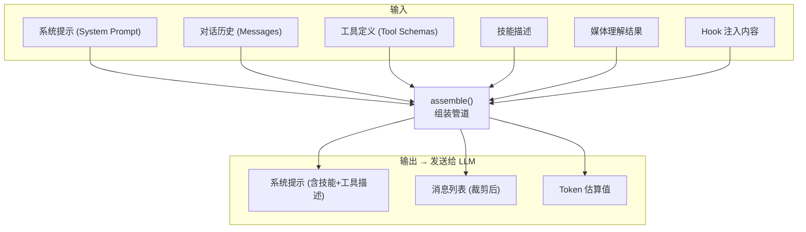
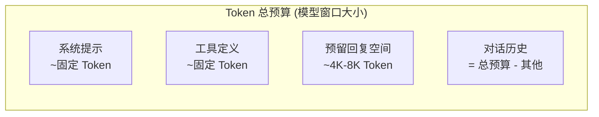
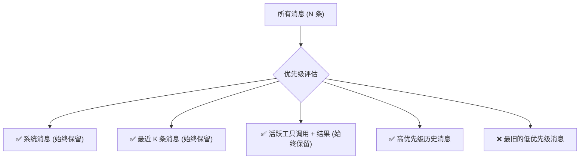
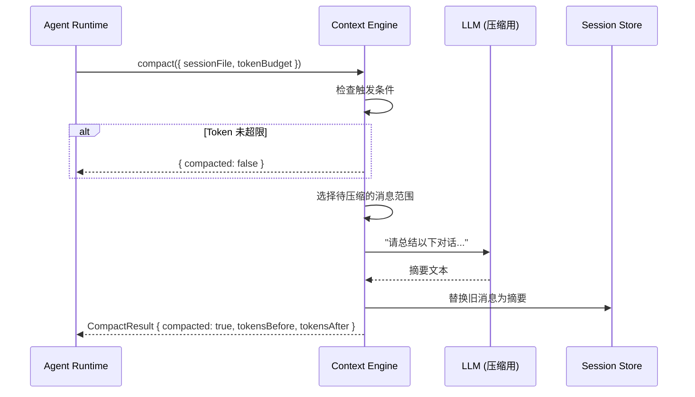

# 第8章：上下文引擎

> **一句话收获**：读完本章，你将理解 Context Engine 如何在有限的 Token 窗口内"装下最有价值的对话历史"——Prompt 组装管道、Token 窗口管理、以及 Compaction（对话压缩）的策略。

---

## 8.1 Prompt 组装管道

### 8.1.1 一句话理解

**Context Engine 就像一个"行李打包专家"**——你有一个有限大小的行李箱（Token 窗口），里面要放系统指令、对话历史、工具定义、技能描述等"行李"。打包专家的任务是选出最重要的物品，按正确的顺序放进箱子。

### 8.1.2 组装流程



### 8.1.3 ContextEngine 接口

`src/context-engine/types.ts` 定义了统一的 ContextEngine 接口，所有引擎实现必须遵守：

**核心方法**：

| 方法 | 说明 |
|------|------|
| `bootstrap()` | 初始化引擎（首次使用 Session 时） |
| `maintain()` | 维护操作（后台优化） |
| `ingest()` | 消息写入（单条） |
| `ingestBatch()` | 批量消息写入 |
| `assemble()` | **核心**：组装上下文（选择 + 排序 + Token 控制） |
| `compact()` | 对话压缩（Token 超限时） |
| `prepareSubagentSpawn()` | Subagent 上下文准备 |
| `onSubagentEnded()` | Subagent 结束后清理 |
| `dispose()` | 资源释放 |

### 8.1.4 AssembleResult

```
AssembleResult = {
  messages: AgentMessage[]        // 排序后的上下文消息
  estimatedTokens: number         // Token 估算值
  systemPromptAddition?: string   // 追加到系统提示的内容
}
```

**调用链**：
```
src/agents/command/attempt-execution.ts
→ src/context-engine/registry.ts::getContextEngine()
→ engine.assemble({ sessionId, messages, tokenBudget, model })
→ AssembleResult
```

---

## 8.2 Token 窗口管理

### 8.2.1 Token 预算分配



### 8.2.2 消息选择策略

当对话历史超过预算时，需要选择哪些消息保留：



**保留规则**（优先级从高到低）：
1. **系统提示** — 始终完整保留
2. **最近 N 条消息** — 保持对话连贯性
3. **活跃工具调用链** — tool_use + 对应 tool_result 必须成对保留
4. **Compaction 摘要** — 之前压缩的对话摘要
5. **最旧的普通消息** — 优先淘汰

---

## 8.3 Compaction（对话压缩）

### 8.3.1 压缩流程



### 8.3.2 CompactResult 结构

```
CompactResult = {
  ok: boolean              // 是否成功
  compacted: boolean       // 是否实际执行了压缩
  reason?: string          // 原因（未压缩时说明为什么）
  result?: {
    summary?: string       // 摘要文本
    firstKeptEntryId?: string  // 第一条保留的消息 ID
    tokensBefore: number   // 压缩前 Token 数
    tokensAfter?: number   // 压缩后 Token 数
  }
}
```

### 8.3.3 压缩目标模式

| 模式 | 说明 |
|------|------|
| `"budget"` | 压缩到 Token 预算以内 |
| `"threshold"` | 压缩到配置的阈值百分比（如窗口的 60%） |

### 8.3.4 插件扩展

Context Engine 支持插件注册自定义引擎：

```
src/context-engine/registry.ts::registerContextEngine(id, factory)
→ 插件可以提供自己的 assemble/compact 逻辑
→ 例如：基于 RAG 的上下文引擎、基于 Vector DB 的长期记忆
```

**LegacyContextEngine** 是默认实现——`ingest()` 是 no-op，`assemble()` 直通，`compact()` 委托给嵌入式压缩器。

**设计决策**：为什么 Context Engine 是可插拔的？因为上下文管理是 AI Agent 最活跃的研究领域之一——RAG、长期记忆、知识图谱等新技术不断涌现。可插拔设计让 OpenClaw 能快速集成新的上下文管理策略，而不需要修改核心 Agent Loop。

---

## 质检报告

### 自检 1：完整性
- [x] 本章覆盖子模块：`src/context-engine/`（types.ts, registry.ts, legacy.ts, delegate.ts, init.ts）
- [x] 四层递进结构完整（8.1 类比 → 组装流程图 → 调用链 → 8.3 设计决策）
- [x] 流程图数量：4 张

### 自检 2：准确性
- [x] ContextEngine 接口基于 types.ts 源码
- [x] CompactResult 结构基于源码验证
- [ ] Legacy 引擎具体的消息选择算法实现 [需源码验证]

### 自检 3：可读性（新手视角）
- [x] "行李打包专家"类比直观
- [x] Token 预算分配图帮助理解窗口约束
- [x] 压缩流程序列图清晰
