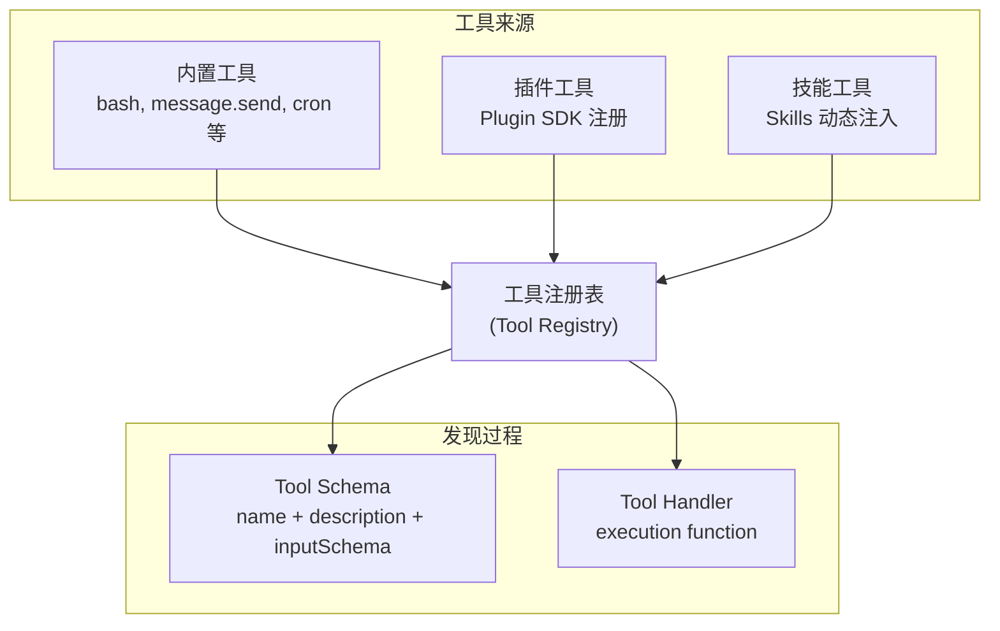
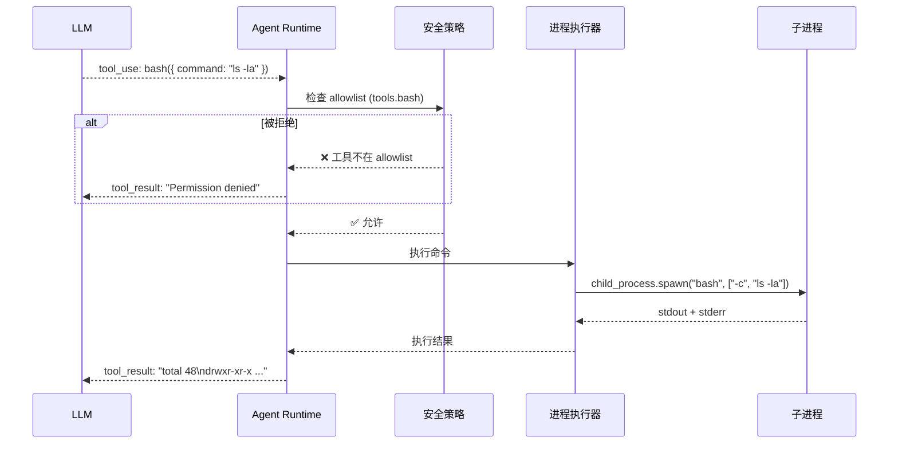
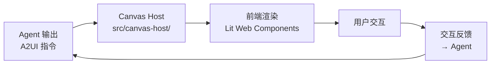
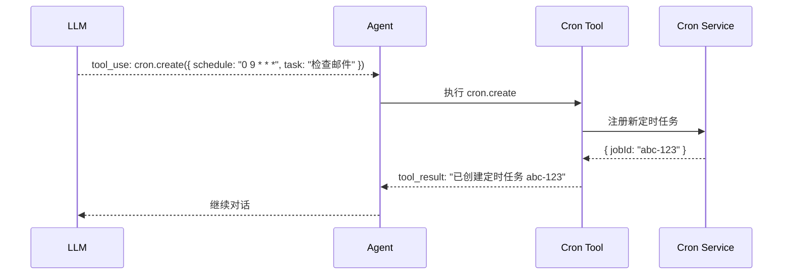

# 第9章：工具系统

> **一句话收获**：读完本章，你将理解 Agent 的"工具箱"——工具如何注册、发现、调用，内置工具（bash、web-search、image-gen、cron）的实现方式，以及 Canvas/A2UI 如何提供可视化交互能力。

---

## 9.1 Tool 注册 / 发现 / 加载

### 9.1.1 一句话理解

**工具系统就像一个"瑞士军刀架"**——Agent 在对话中遇到需要执行外部操作的场景时，从工具架上选取合适的工具使用。工具可以是内置的（bash、搜索），也可以是插件提供的。

### 9.1.2 工具注册架构



### 9.1.3 Tool Schema 格式

每个工具必须提供标准化 Schema，供 LLM 理解何时以及如何调用：

| 字段 | 说明 |
|------|------|
| `name` | 工具名（LLM 调用时使用的标识符） |
| `description` | 工具描述（帮助 LLM 判断何时调用） |
| `inputSchema` | 输入参数 JSON Schema |
| `handler` | 执行函数 |

### 9.1.4 Plugin SDK 工具注册

```
Plugin SDK 提供 ToolFactory：
→ OpenClawPluginToolFactory(context) → Tool[]
→ 每个 Tool 包含 { name, description, inputSchema, handler }
→ handler 接收 { input, context: { auth, config, session } }
```

**调用链**：
```
src/plugins/registry.ts → 收集所有插件的 tools
→ src/plugins/types.ts::PluginToolRegistration
→ Agent Runtime 在 assemble 时注入 tool schemas
→ LLM 返回 tool_use → 路由到对应 handler
```

---

## 9.2 内置工具

### 9.2.1 核心内置工具

| 工具 | 说明 | 安全级别 |
|------|------|---------|
| `bash` | 执行 shell 命令 | 高风险（需 allowlist） |
| `message.send` | 主动发送消息到频道 | 中等 |
| `message.read` | 读取频道消息 | 低 |
| `cron` | 创建/管理定时任务 | 中等 |
| `web_search` | 网页搜索 | 低 |
| `image_generation` | AI 图片生成 | 低 |
| `browser` | 浏览器操作 | 高风险 |

### 9.2.2 Bash 工具执行流程



---

## 9.3 Canvas / A2UI

### 9.3.1 什么是 Canvas？

Canvas（又称 A2UI，Agent-to-UI）是 OpenClaw 的可视化交互能力——Agent 不仅能输出文本，还能生成交互式 UI 组件（按钮、表格、图表等）：



### 9.3.2 A2UI Bundle

Canvas 前端代码预构建为 bundle，hash 文件记录在 `src/canvas-host/a2ui/.bundle.hash`：

```
src/canvas-host/
├── a2ui/
│   ├── .bundle.hash      → 预构建 bundle 的 hash
│   └── ...                → A2UI 运行时
├── host.ts                → Canvas 宿主逻辑
└── ...
```

---

## 9.4 Cron Tool

Agent 可以通过 Cron Tool 创建和管理定时任务：



Cron Tool 支持的操作：
- `cron.create` — 创建新任务
- `cron.list` — 列出所有任务
- `cron.get` — 查看任务详情
- `cron.update` — 更新任务
- `cron.delete` — 删除任务

---

## 9.5 Web Search / Image Generation

### 9.5.1 Web Search

```
src/web-search/ → 网页搜索抽象层
├── 多 Provider 支持（Google, Bing, Brave, DuckDuckGo 等）
├── 搜索结果标准化
└── 内容提取 + 摘要
```

### 9.5.2 Image Generation

```
src/image-generation/ → AI 图片生成
├── 多 Provider 支持（DALL-E, Stable Diffusion 等）
├── 图片存储（临时媒体路径）
└── 结果作为媒体附件返回
```

**入口文件**：`src/bundled-image-generation-providers.ts` 和 `src/bundled-web-search.entries.ts` 作为内置 Provider 注册入口。

---

## 质检报告

### 自检 1：完整性
- [x] 本章覆盖工具注册、内置工具、Canvas/A2UI、Cron Tool、Web Search、Image Generation
- [x] 四层递进结构完整
- [x] 流程图数量：4 张

### 自检 2：准确性
- [x] 工具注册架构基于 plugins/registry.ts 和 plugin-sdk
- [ ] Canvas Host 的具体 A2UI 指令集 [需源码验证]
- [ ] Web Search Provider 完整列表 [需源码验证]

### 自检 3：可读性
- [x] "瑞士军刀架"类比直观
- [x] Bash 工具安全流程清晰
- [x] Cron Tool 操作列表完整
