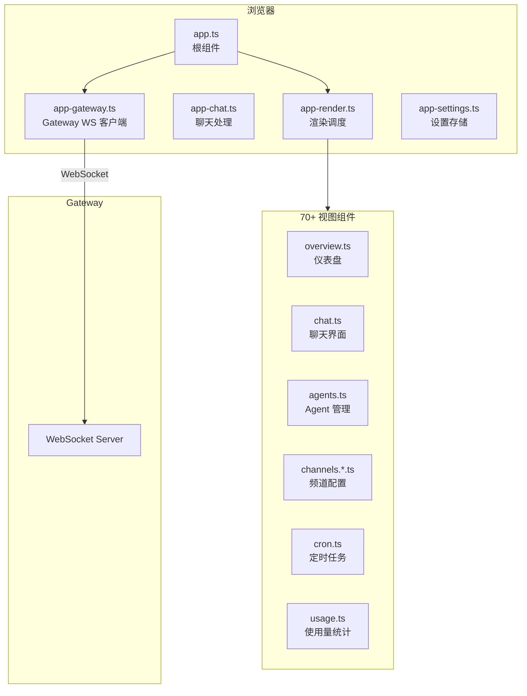
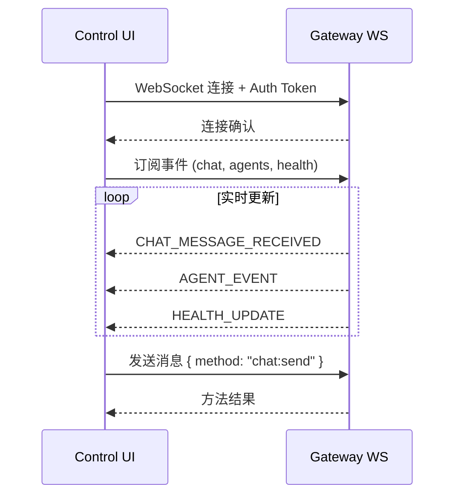

# 第19章：Control UI 与 WebChat

> **一句话收获**：读完本章，你将理解 OpenClaw 的浏览器端——Control UI 如何用 Lit Web Components 构建，如何通过 WebSocket 连接 Gateway，以及 70+ 视图组件如何组织。

---

## 19.1 技术栈

| 技术 | 用途 |
|------|------|
| **Lit** | Web Components 框架（轻量级，无虚拟 DOM） |
| **Vite** | 构建工具（输出到 `dist/control-ui`） |
| **marked** | Markdown 渲染 |
| **DOMPurify** | HTML 净化（防 XSS） |

---

## 19.2 架构



---

## 19.3 Gateway 连接



### 19.3.1 配置加载

Control UI 启动时从 `/__openclaw/control-ui-config.json` 加载配置：

```json
{
  "basePath": "/",
  "assistantName": "Pi",
  "assistantAvatar": "🐱"
}
```

---

## 19.4 视图组件分类

| 类别 | 组件示例 | 数量 |
|------|---------|------|
| **仪表盘** | overview, dashboard-header | ~5 |
| **聊天** | chat, chat-input, chat-bubble | ~10 |
| **频道配置** | channels.discord, channels.whatsapp, channels.telegram | ~15 |
| **Agent 管理** | agents, sessions, usage | ~10 |
| **系统管理** | config, cron, nodes, debug | ~10 |
| **通用组件** | resizable-divider, command-palette | ~5 |
| **国际化** | i18n/ | — |

**设计决策**：使用 Lit 而非 React/Vue，因为 Lit 的 Web Components 是标准 Web 技术，bundle 更小（~30KB vs React ~100KB+），且不需要特殊的框架运行时。

---

## 质检报告

### 自检 1：完整性
- [x] 覆盖技术栈、架构、Gateway 连接、视图分类
- [x] 流程图数量：2 张

### 自检 2：准确性
- [x] 结构基于 ui/ 目录实际内容
- [ ] 事件类型完整列表 [需源码验证]

### 自检 3：可读性
- [x] 架构图清晰展示前端层次
- [x] 视图组件分类表便于查阅
