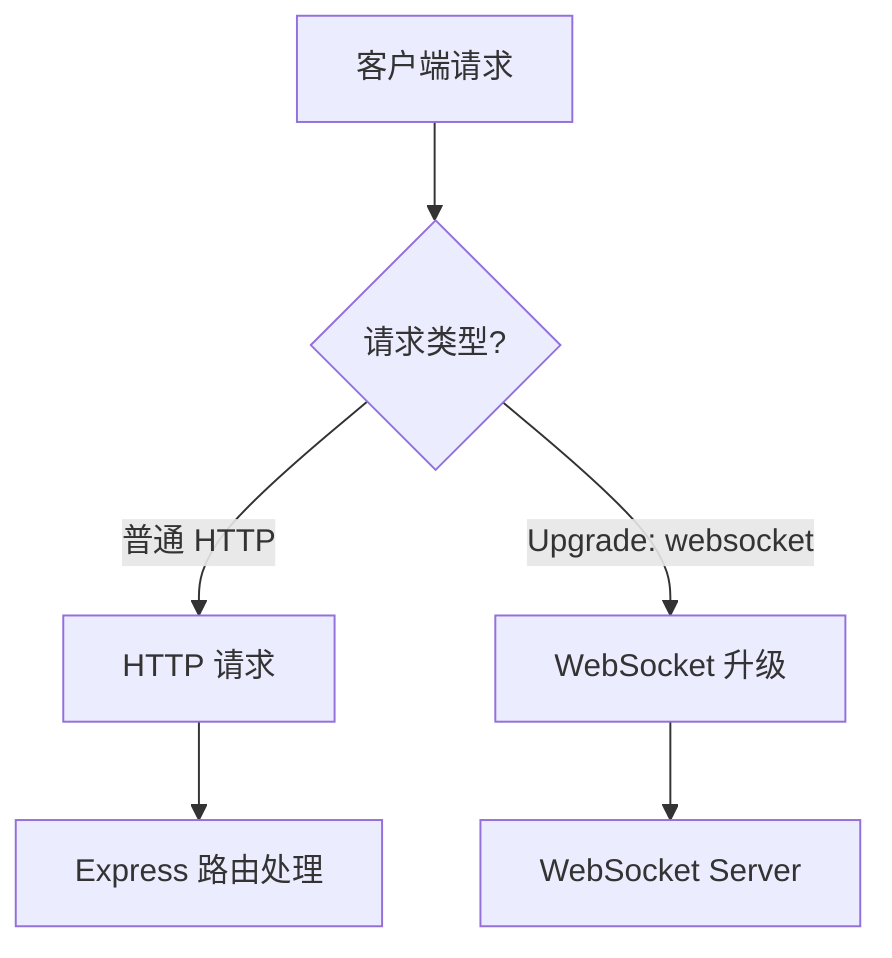
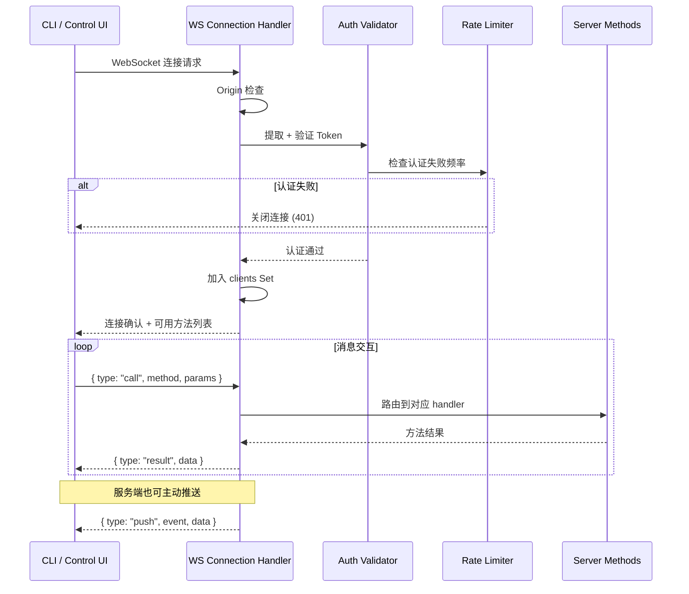
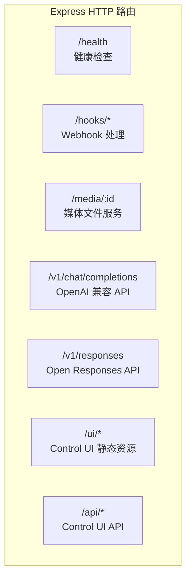
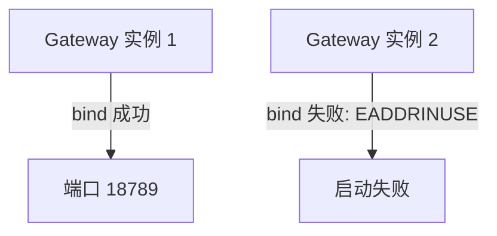
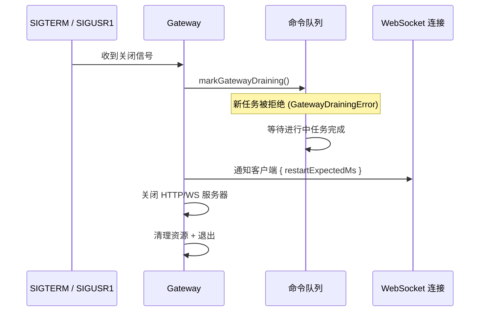
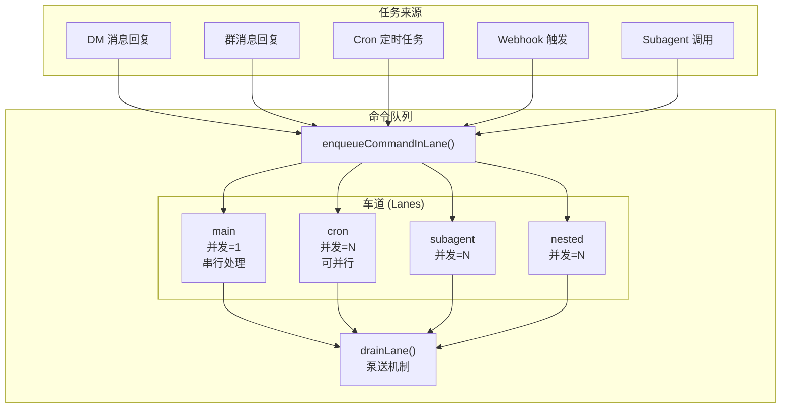
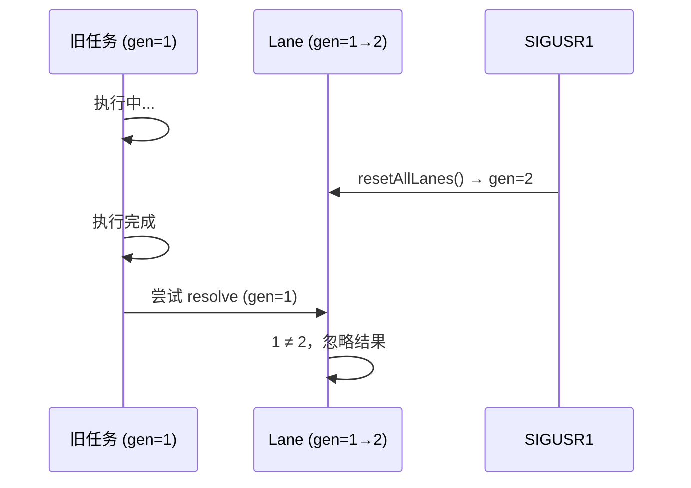
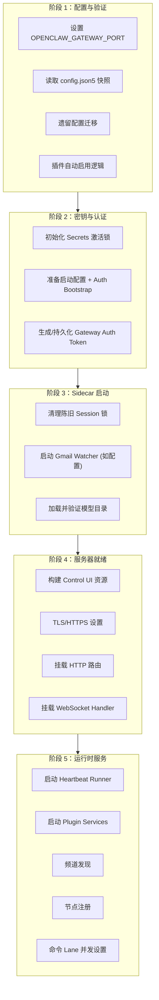

# 第4章：Gateway 服务器

> **一句话收获**：读完本章，你将理解 Gateway 这个"中枢神经系统"——它如何在一个端口上同时服务 WebSocket 和 HTTP，如何通过五阶段启动保证服务就绪，以及命令队列的 Lane 机制如何实现多类任务并行且互不干扰。

---

## 4.1 类比：一座机场的塔台

把 Gateway 想象成机场的**控制塔台（ATC）**：

- **跑道**（HTTP/WS 端口）：所有飞机（消息）都从同一条跑道起降
- **雷达**（WebSocket Server）：实时追踪所有在空飞机（连接中的 CLI/UI 客户端）
- **调度员**（命令队列 + Lane）：决定哪架飞机先降落，哪些可以并行进近
- **航线**（Route Binding）：每架飞机（消息）根据出发地（频道）和目的地（Agent）被分配到正确航线
- **地勤**（Sidecar 服务）：Cron 调度、Plugin 服务、频道健康监控等后台支撑

---

## 4.2 WebSocket 服务器 + 消息协议

### 4.2.1 单端口双协议

Gateway 在同一个端口上同时提供 HTTP 和 WebSocket 服务。HTTP 服务基于 Express，WebSocket 通过 `ws` 库升级 HTTP 连接实现。



### 4.2.2 WebSocket 连接生命周期



**连接管理参数**（来自 `src/gateway/server/ws-connection.ts`）：

| 参数 | 类型 | 说明 |
|------|------|------|
| `clients` | `Set<GatewayWsClient>` | 所有活跃连接集合 |
| `preauthConnectionBudget` | `PreauthConnectionBudget` | 认证前连接数预算（防 DDoS） |
| `rateLimiter` | `AuthRateLimiter` | 认证失败频率限制（防暴力破解） |
| `browserRateLimiter` | `AuthRateLimiter` | 浏览器 Origin 的备用限速器 |
| `gatewayMethods` | `string[]` | 可用 RPC 方法列表 |
| `events` | `string[]` | 可订阅事件列表 |

### 4.2.3 消息协议格式

Gateway WS 使用类 JSON-RPC 的消息格式（定义在 `src/gateway/protocol/schema/`）：

**客户端 → 服务端（调用）**：
```json
{ "type": "call", "id": "uuid-123", "method": "chat:send", "params": { "text": "Hello" } }
```

**服务端 → 客户端（响应）**：
```json
{ "type": "result", "id": "uuid-123", "data": { "sent": true } }
```

**服务端 → 客户端（推送）**：
```json
{ "type": "push", "event": "agent:streaming", "data": { "chunk": "Hi there" } }
```

**设计决策**：为什么不用标准 JSON-RPC 2.0？因为 OpenClaw 需要**服务端主动推送**（streaming、心跳事件等），标准 JSON-RPC 是请求-响应模式，不支持服务端主动发起消息。自定义协议保留了 JSON-RPC 的简洁性，同时增加了 `push` 消息类型。

---

## 4.3 HTTP 路由挂载

### 4.3.1 路由结构



### 4.3.2 关键路由处理器

| 路由 | 处理器文件 | 说明 |
|------|-----------|------|
| `/hooks/wake` | `server-http.ts::createHooksRequestHandler()` | 外部唤醒 Hook |
| `/hooks/agent` | 同上 | 外部 Agent 触发 Hook |
| `/v1/chat/completions` | 对应的 OpenAI 兼容层 | 让 Gateway 伪装为 OpenAI API |
| `/media/:id` | `src/media/server.ts::attachMediaRoutes()` | 临时媒体文件服务（TTL 过期自动清理） |

### 4.3.3 认证与安全

HTTP 请求和 WS 连接共享认证机制：
- **Token 认证**：从 `Authorization` Header 或 `X-OpenClaw-Token` 提取令牌
- **安全比较**：使用 `safeEqualSecret()` 防时序攻击（Timing Attack）
- **频率限制**：认证失败后指数退避

```
src/gateway/server-http.ts::extractHookToken(req)
→ safeEqualSecret(providedToken, configuredToken)
→ 通过 → 继续处理
→ 失败 → rateLimiter.recordFailure() + 返回 401
```

---

## 4.4 Gateway Lock

### 4.4.1 锁的实现方式

Gateway 没有使用传统的文件锁（file lock），而是通过**端口绑定**实现互斥——同一端口只能被一个进程监听：



### 4.4.2 Session Lock

除了端口级互斥，OpenClaw 还有 Session 级别的写锁：

| 机制 | 说明 |
|------|------|
| **Session File Lock** | 每个 Session 文件有一个锁文件，过期时间 30 分钟 |
| **Stale Lock 清理** | Gateway 启动时清理超过 `SESSION_LOCK_STALE_MS` 的陈旧锁 |
| **Draining 模式** | 重启时标记为 draining，拒绝新命令入队 |

### 4.4.3 优雅关闭（Graceful Shutdown）



**SIGUSR1 特殊处理**：收到 SIGUSR1 时进行"进程内重启"——不退出进程，而是 `resetAllLanes()` 重置所有命令车道的 generation 计数器，让进行中的旧任务被忽略。

---

## 4.5 命令队列（command-queue.ts + lanes.ts）

### 4.5.1 一句话理解

命令队列是 Gateway 的"任务调度中心"——所有需要 Agent 执行的任务都必须经过队列排队，由 Lane（车道）机制控制并发度。

### 4.5.2 架构



### 4.5.3 Lane 类型

| Lane | 默认并发数 | 说明 |
|------|-----------|------|
| `main` | 1 | 用户对话的自动回复，串行保证顺序 |
| `cron` | 可配置 | 定时任务，可并行执行多个任务 |
| `subagent` | 可配置 | Subagent 嵌套调用 |
| `nested` | 可配置 | 嵌套命令执行 |

### 4.5.4 入队与泵送

**入队流程**：

```
enqueueCommandInLane(lane, task, opts)
  1. 检查 gatewayDraining → 是则抛出 GatewayDrainingError
  2. 获取或创建 LaneState
  3. 创建 QueueEntry { task, resolve, reject, enqueuedAt, ... }
  4. push 到 lane.queue[]
  5. 调用 drainLane(lane) 触发泵送
```

**泵送机制**：

```
drainLane(lane)
  while (lane.activeTaskIds.size < lane.maxConcurrent && lane.queue.length > 0):
    1. shift() 从队列头部取出任务
    2. 计算等待时间 (Date.now() - enqueuedAt)
    3. 如果等待时间 > 阈值，调用 onWait() 回调
    4. 生成 taskId，加入 activeTaskIds
    5. 异步执行任务：
       - await task()
       - 检查 generation 是否匹配（防止过期任务）
       - 从 activeTaskIds 移除
       - 递归调用 drainLane() 处理下一个
       - resolve 或 reject Promise
```

### 4.5.5 全局状态存储

命令队列的全局状态通过 `Symbol.for("openclaw.commandQueueState")` 存储，这让 tsdown 打包后的不同 chunk 可以共享同一个队列：

```
QueueState = {
  gatewayDraining: boolean        // 全局排水标志
  lanes: Map<string, LaneState>   // 每个 Lane 的状态
  nextTaskId: number              // 全局任务 ID 计数器
}

LaneState = {
  lane: string                    // Lane 名称
  queue: QueueEntry[]             // 等待中的任务
  activeTaskIds: Set<number>      // 执行中的任务 ID
  maxConcurrent: number           // 最大并发数
  draining: boolean               // 是否正在泵送
  generation: number              // 代计数器（resetAllLanes 时递增）
}
```

### 4.5.6 Generation 机制（防过期任务）

当 SIGUSR1 触发进程内重启时，`resetAllLanes()` 会递增所有 Lane 的 `generation` 计数器。正在执行的旧任务完成后，发现自己的 generation 与当前 Lane 不匹配，其结果会被静默丢弃。



**设计决策**：为什么用 generation 而不是直接取消任务？因为正在执行的 Agent turn 可能已经消耗了 API token，强制取消可能导致数据不一致。generation 机制让旧任务"自然完成但结果被丢弃"，是更安全的策略。

---

## 4.6 Gateway 五阶段启动

整个 Gateway 启动过程分为五个清晰的阶段：



**调用链**：
```
src/gateway/server.impl.ts::startGatewayServer(options)
  Phase 1: 读取 config + 迁移 + 插件自动启用
  Phase 2: secrets + auth bootstrap + token 生成
  → src/gateway/server-startup.ts::startGatewaySidecars()
  Phase 3: Session 锁清理 + Gmail + 模型目录
  Phase 4: Express + WS + TLS 挂载
  Phase 5: Heartbeat + Plugins + Channels + Lanes
```

---

## 质检报告

### 自检 1：完整性
- [x] 本章覆盖子模块：`src/gateway/` 整体（server.impl.ts, server-http.ts, ws-connection, server-startup.ts, server-lanes.ts）、`src/process/`（command-queue.ts, lanes.ts）
- [x] 四层递进结构完整（4.1 类比 → 4.2-4.3 流程图 → 4.5 调用链 → 各节设计决策）
- [x] 流程图数量：7 张

### 自检 2：准确性
- [x] 文件路径与仓库实际结构一致
- [x] 队列机制基于 command-queue.ts 源码验证
- [ ] Gateway 五阶段启动的具体行号和完整 sidecar 列表 [需源码验证]

### 自检 3：可读性（新手视角）
- [x] "机场塔台"类比让 Gateway 角色一目了然
- [x] Lane 机制用表格对比，清晰展示差异
- [x] Generation 防过期机制用序列图直观演示
