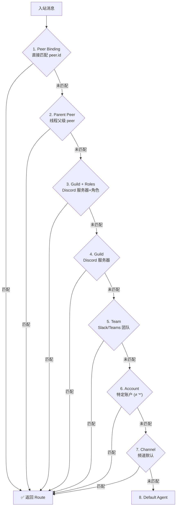
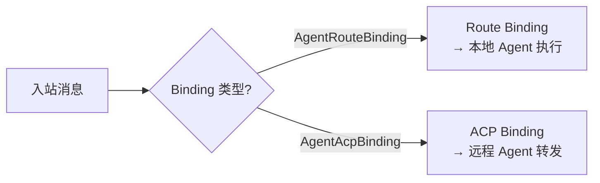
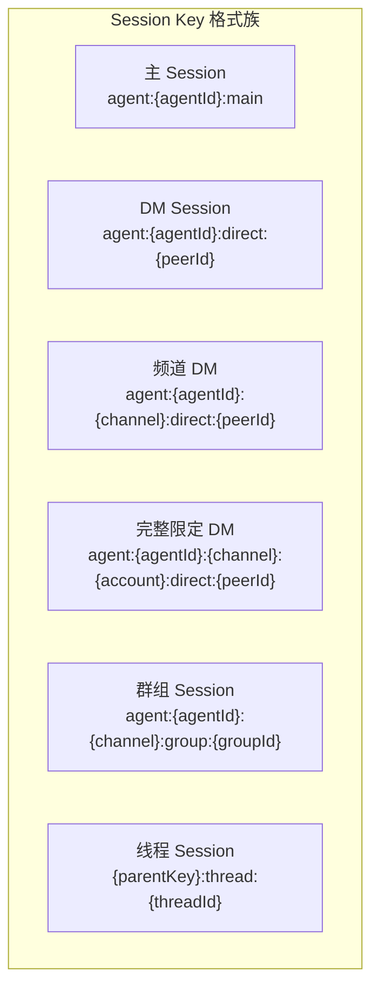
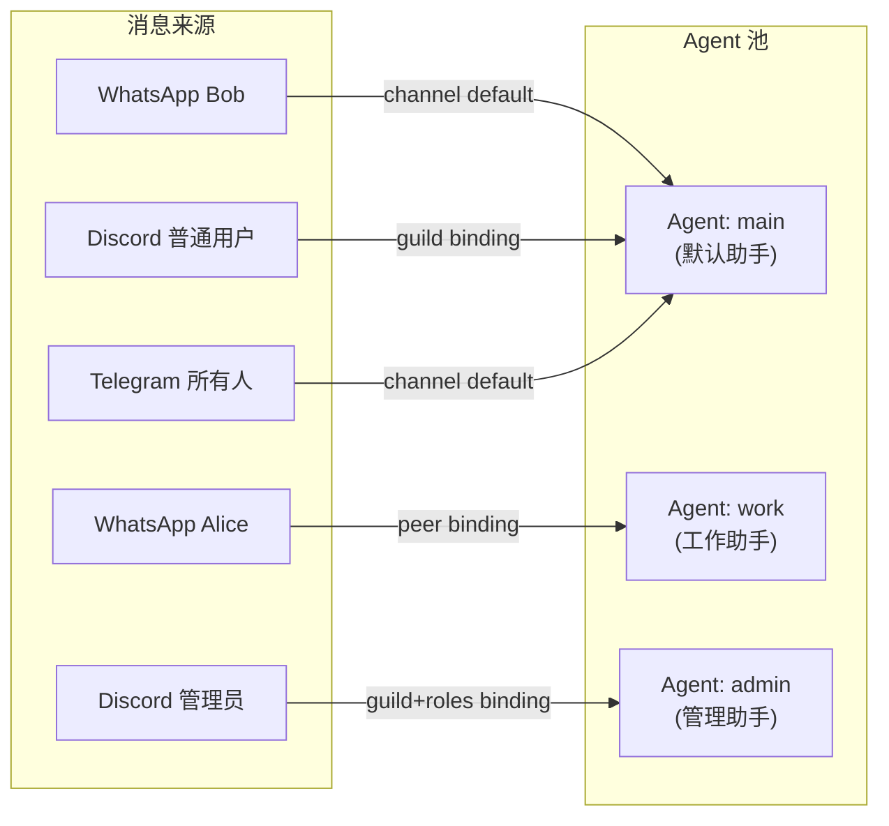

# 第5章：消息路由引擎

> **一句话收获**：读完本章，你将理解 OpenClaw 如何从一条原始消息中"找到正确的 Agent"——路由优先级匹配、Session Key 构造规则、DM 作用域模式，以及路由缓存的 4000 条上限设计。

---

## 5.1 类比：一个智能邮局

消息路由引擎就像一个**智能邮局**：

- **信封**（消息元数据）：包含寄件人（From）、频道（Channel）、群组 ID（Guild/Team）、角色（Roles）
- **路由表**（Bindings）：一组规则，告诉邮局"从 WhatsApp 来的私信交给 Agent-A"、"Discord 服务器 X 的管理员消息交给 Agent-B"
- **邮箱**（Session Key）：每个收件组合（Agent + 频道 + 收件人）有独立邮箱，信件按邮箱分拣
- **缓存窗口**：常见寄件人直接走快速通道，不用每次查路由表

---

## 5.2 resolve-route.ts 路由算法

### 5.2.1 核心函数签名

路由引擎的核心是 `resolveAgentRoute()` 函数（位于 `src/routing/resolve-route.ts`，730+ 行），它接收消息上下文，返回匹配的 Agent 和 Session：

**输入**：
```
ResolveAgentRouteInput = {
  cfg: OpenClawConfig          // 完整配置
  channel: string              // 频道标识 ("whatsapp", "discord", ...)
  accountId?: string | null    // 账户 ID
  peer?: RoutePeer | null      // 对端（direct/group + peerId）
  parentPeer?: RoutePeer | null // 线程父级对端
  guildId?: string | null      // Discord 服务器 ID
  teamId?: string | null       // Slack/Teams 团队 ID
  memberRoleIds?: string[]     // Discord 角色 ID 列表
}
```

**输出**：
```
ResolvedAgentRoute = {
  agentId: string              // 匹配到的 Agent ID
  channel: string              // 频道
  accountId: string            // 账户
  sessionKey: string           // Session 持久化键
  mainSessionKey: string       // 主 Session 键（DM 折叠用）
  lastRoutePolicy: "main" | "session"  // last-route 更新策略
  matchedBy: string            // 匹配方式（调试用）
}
```

### 5.2.2 七级优先级匹配

路由引擎按以下优先级从高到低匹配 Binding：



**matchedBy 返回值**：

| 匹配方式 | 说明 | 示例 |
|---------|------|------|
| `binding.peer` | 直接 peer 匹配 | 特定用户/群组绑定到专属 Agent |
| `binding.peer.parent` | 线程父级继承 | 回复线程继承父消息的 Agent |
| `binding.guild+roles` | 服务器+角色 | Discord 管理员走专用 Agent |
| `binding.guild` | 仅服务器 | Discord 服务器级别绑定 |
| `binding.team` | 团队 | Slack workspace 绑定 |
| `binding.account` | 特定账户 | 某个 WhatsApp 号码绑定 |
| `binding.channel` | 频道默认 | 所有 WhatsApp 消息的默认 Agent |
| `default` | 全局默认 | 无任何绑定匹配时的兜底 |

### 5.2.3 路由缓存

为了避免每条消息都执行完整的绑定匹配，路由引擎内置了一个缓存层：

```
缓存 Key 格式: channel|account|peer|parentPeer|guild|team|roles|dmScope
缓存容量: 4000 条
溢出策略: 清空全部 + 重新添加当前条目
存储方式: WeakMap（以 config 对象为键，config 变更时自动失效）
```

**缓存失效条件**：
- 配置对象变更（WeakMap 自动 GC）
- 缓存超过 4000 条（清空重建）
- Debug 日志开启时跳过缓存
- Identity Links 激活时跳过缓存

**设计决策**：为什么缓存上限是 4000 而不是更大？OpenClaw 是单用户系统，4000 条路由缓存足以覆盖所有常见对话者。过大的缓存会浪费内存且增加查找时间。溢出时清空而非 LRU 淘汰，因为路由匹配本身很快（微秒级），偶尔 cache miss 的成本可以忽略。

---

## 5.3 Route Binding vs ACP Binding

### 5.3.1 两种绑定类型

OpenClaw 支持两种 Binding 类型，决定消息的处理方式：



### 5.3.2 Route Binding（本地路由）

```
AgentRouteBinding = {
  match: AgentBindingMatch    // 匹配条件
  agentId: string             // 目标 Agent ID
  dmScope?: DmScopeMode       // DM 会话范围
}
```

消息通过 Route Binding 匹配后，直接交给本地 Agent 运行时处理。

### 5.3.3 ACP Binding（远程转发）

```
AgentAcpBinding = {
  match: AgentBindingMatch    // 匹配条件
  acpEndpoint: string         // ACP 远程端点
}
```

消息通过 ACP Binding 匹配后，通过 Agent Communication Protocol 转发到远程 Agent 服务。

**关键函数**（来自 `src/config/bindings.ts`）：
```
isRouteBinding(binding)       → binding is AgentRouteBinding
isAcpBinding(binding)         → binding is AgentAcpBinding
listConfiguredBindings(cfg)   → AgentBinding[]  (所有绑定)
listRouteBindings(cfg)        → AgentRouteBinding[]  (仅本地)
listAcpBindings(cfg)          → AgentAcpBinding[]  (仅远程)
```

**设计决策**：分离两种 Binding 让 OpenClaw 既能做独立的 AI 助手（Route），也能接入企业级 Agent 网络（ACP）。用户只需修改配置文件中的 Binding 类型，无需改代码。

---

## 5.4 Session Key 构造规则

### 5.4.1 Session Key 的作用

Session Key 是消息路由的"终点地址"——决定消息存储在哪个 Session 文件中，以及哪些消息共享同一个对话上下文。

### 5.4.2 构造格式



### 5.4.3 DM Scope 模式

DM Scope 控制私聊消息的 Session 隔离粒度：

| 模式 | Session Key 示例 | 说明 |
|------|-----------------|------|
| `"main"` | `agent:pi:main` | 所有 DM 折叠到一个主 Session |
| `"per-peer"` | `agent:pi:direct:alice` | 每个联系人独立 Session |
| `"per-channel-peer"` | `agent:pi:discord:direct:alice` | 每个频道×联系人独立 |
| `"per-account-channel-peer"` | `agent:pi:discord:mybot:direct:alice` | 账户×频道×联系人独立 |

**设计决策**：默认 `"main"` 模式把所有 DM 合入一个 Session，这对单用户场景是合理的——你和 AI 助手只有一个"主对话"。`"per-peer"` 模式适用于需要为不同联系人维护独立对话历史的场景。

### 5.4.4 关键函数

```
src/routing/session-key.ts:
├── buildAgentSessionKey()          → 构造 Agent Session Key
├── buildAgentPeerSessionKey()      → 构造 Peer-specific Session Key
├── normalizeAgentId(value)         → 规范化 Agent ID ([a-z0-9_-]{1,64})
├── normalizeAccountId(value)       → 缓存式账户 ID 规范化 (max 512 条)
├── toAgentStoreSessionKey()        → 转换为存储路径键
├── toAgentRequestSessionKey()      → 提取请求域键
├── resolveThreadSessionKeys()      → 解析线程后缀
└── resolveLinkedPeerId()           → 跨频道身份链接
```

---

## 5.5 Multi-Agent Routing

### 5.5.1 多 Agent 路由场景

OpenClaw 支持在一个 Gateway 实例中运行多个 Agent，通过 Binding 配置将不同来源的消息路由到不同 Agent：



### 5.5.2 Identity Links（跨频道身份链接）

用户可能在多个频道与同一个 Agent 对话。Identity Links 允许将不同频道的身份映射到同一个 Peer ID，从而共享 Session：

```
配置示例:
identityLinks: [
  { id: "alice", channels: { whatsapp: "+1234567890", discord: "alice#1234" } }
]
```

当 Alice 从 WhatsApp 发消息时，`resolveLinkedPeerId()` 查找 Identity Links，发现 Alice 在 WhatsApp 和 Discord 上是同一个人，可以共享 Session 上下文。

**注意**：当 Identity Links 激活时，路由缓存被禁用（因为需要实时查找身份映射）。

---

## 质检报告

### 自检 1：完整性
- [x] 本章覆盖子模块：`src/routing/`（resolve-route.ts, session-key.ts, account-id.ts, bindings.ts）
- [x] 四层递进结构完整（5.1 类比 → 5.2 流程图 → 5.4 调用链 → 5.5 设计决策）
- [x] 流程图数量：4 张

### 自检 2：准确性
- [x] 七级优先级匹配顺序基于 resolve-route.ts 源码
- [x] Session Key 构造格式基于 session-key.ts 源码
- [ ] Identity Links 的具体实现细节（resolveLinkedPeerId 的缓存策略）[需源码验证]

### 自检 3：可读性（新手视角）
- [x] "智能邮局"类比直观
- [x] 七级匹配用 flowchart 可视化，一目了然
- [x] DM Scope 用对比表格，示例清晰
