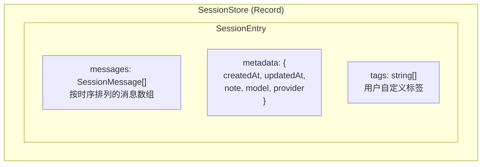
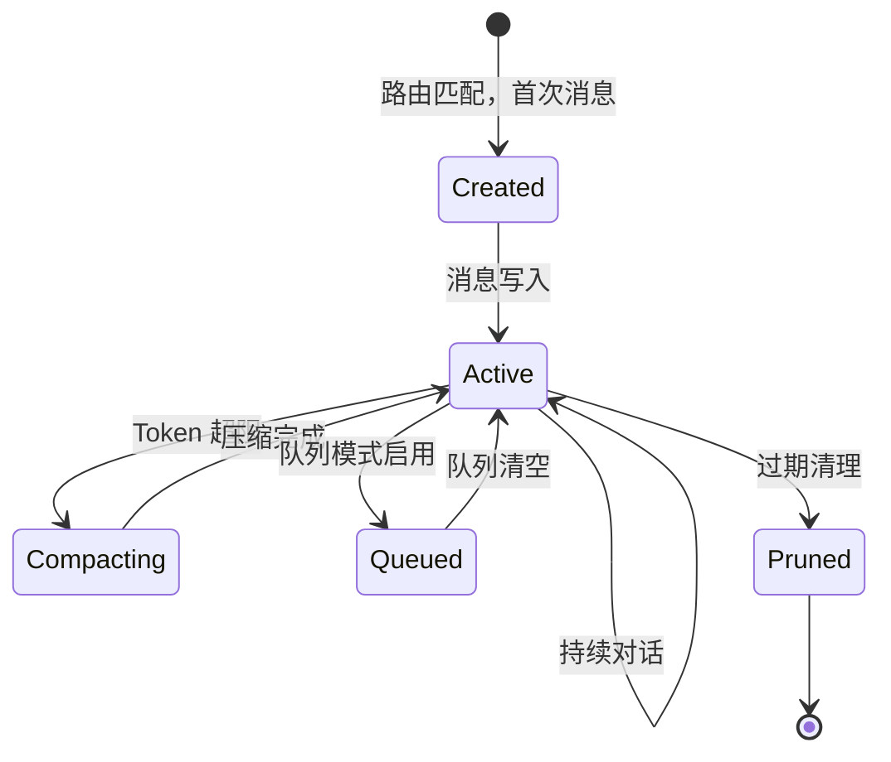
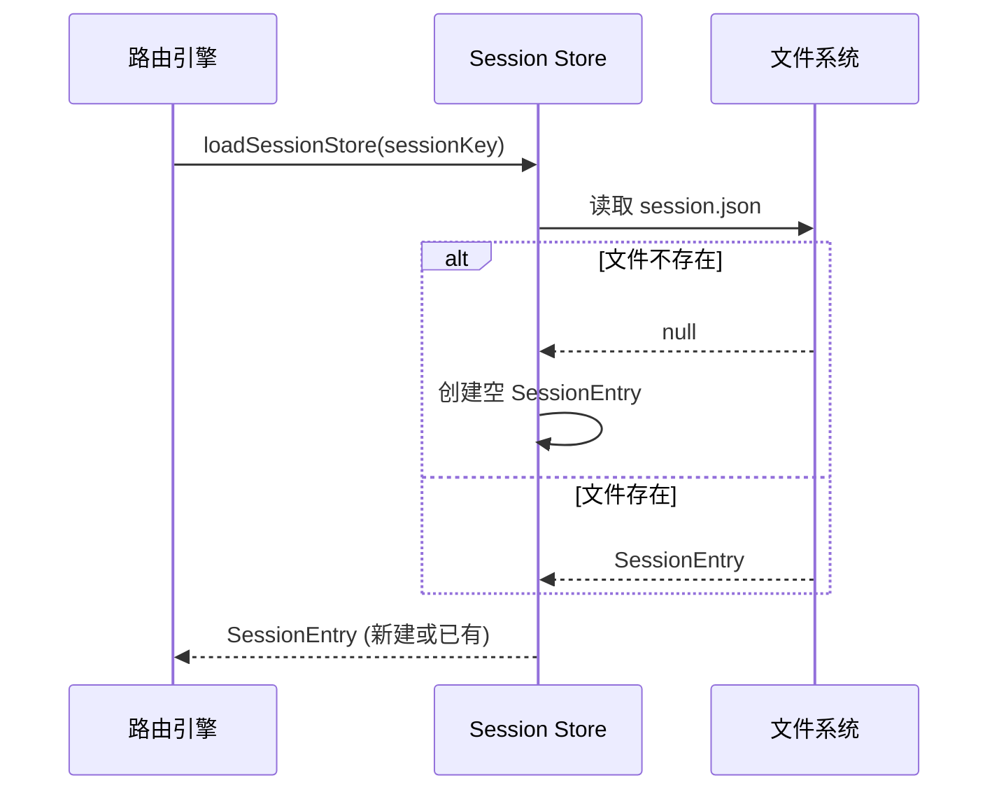
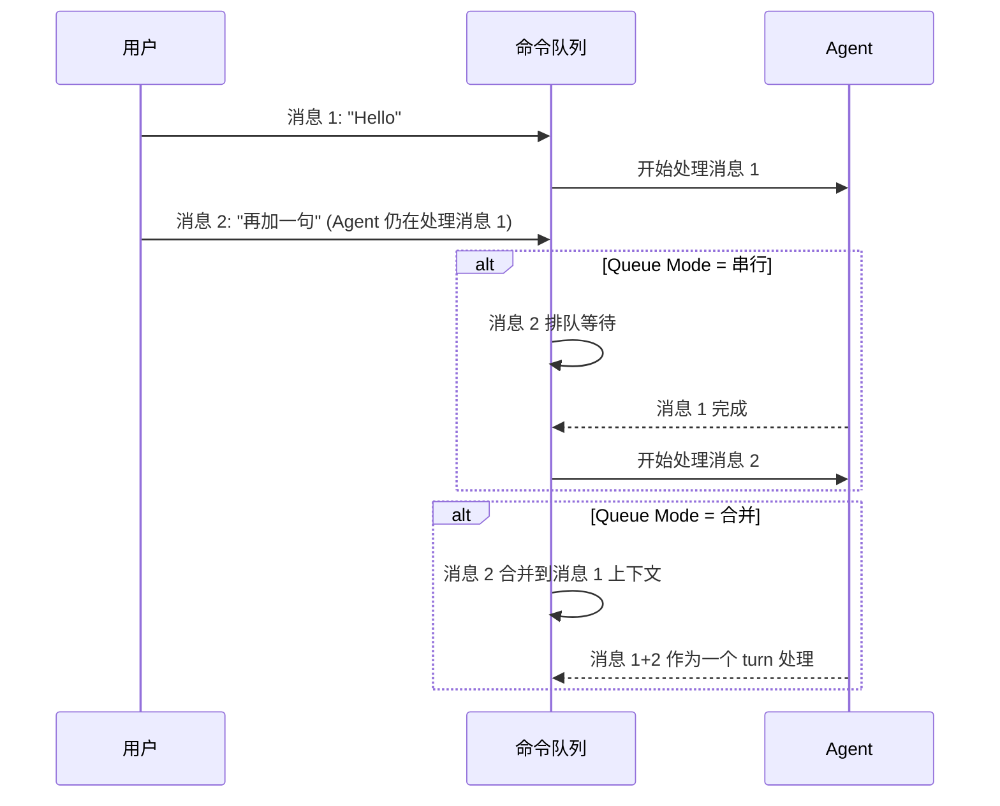
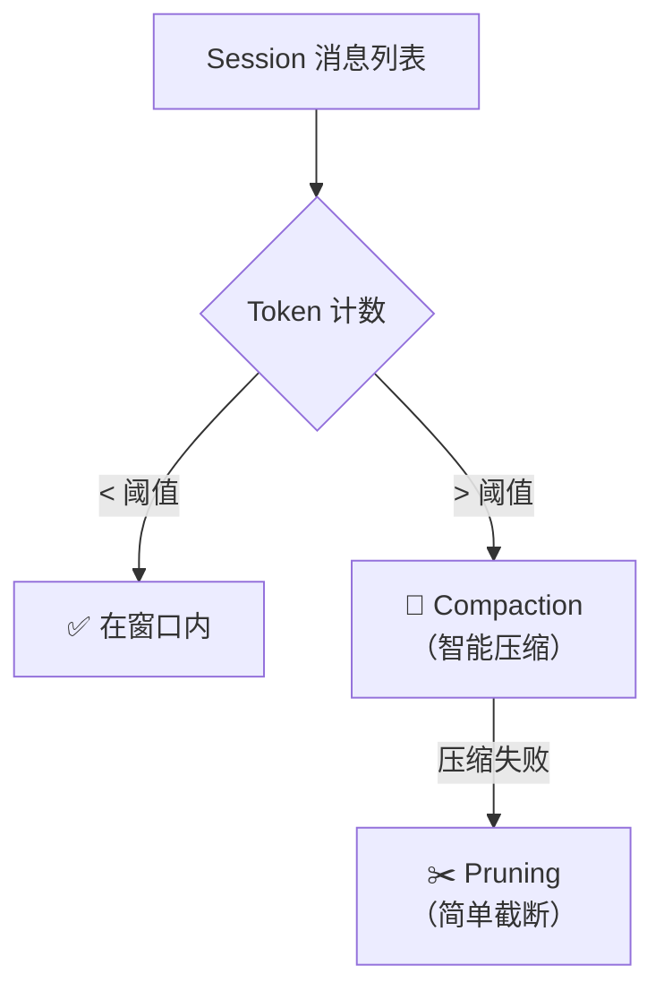
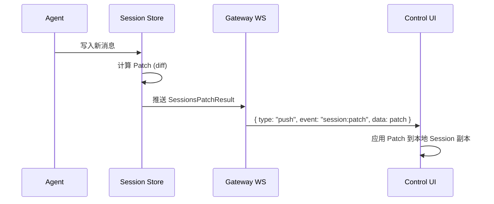

# 第6章：Session 会话管理

> **一句话收获**：读完本章，你将理解 Session 的"一生"——从创建、消息写入、上下文裁剪、队列模式、到最终持久化，以及 Session Patch 如何实现跨客户端的实时状态同步。

---

## 6.1 数据结构与状态机

### 6.1.1 一句话理解

**Session 就像一本"对话日记"**——每次你和 Agent 聊天，对话内容会按时间顺序记录在一个 Session 文件中，包括你说的话、Agent 的回复、工具调用结果等。

### 6.1.2 Session 数据结构



**SessionEntry 核心字段**：

| 字段 | 类型 | 说明 |
|------|------|------|
| `messages` | `SessionMessage[]` | 对话消息列表，按时间排序 |
| `metadata.createdAt` | `string` | 创建时间（ISO 8601） |
| `metadata.updatedAt` | `string` | 最后更新时间 |
| `metadata.note` | `string` | 会话备注 |
| `metadata.model` | `string` | 使用的模型 |
| `metadata.provider` | `string` | 使用的 Provider |
| `tags` | `string[]` | 用户标签（用于筛选/搜索） |

### 6.1.3 Session 状态机



---

## 6.2 创建 / 销毁 / 持久化

### 6.2.1 Session 创建

Session 不是"预创建"的——第一条消息到达时，路由引擎生成 Session Key，如果对应的 Session 文件不存在，自动创建：



### 6.2.2 存储路径

Session 文件存储在结构化目录中：

```
~/.openclaw/agents/{agentId}/sessions/{channel}/{target}/session.json
```

示例：
```
~/.openclaw/agents/main/sessions/whatsapp/+1234567890/session.json
~/.openclaw/agents/main/sessions/discord/guild-12345/session.json
~/.openclaw/agents/work/sessions/main/session.json
```

### 6.2.3 持久化策略

```
持久化时机:
├── Agent turn 完成后 → 写入完整消息列表
├── Compaction 完成后 → 写入压缩后的消息
├── Session Patch 应用后 → 增量更新
└── 显式 save 调用 → 手动触发

持久化方式:
├── 原子写入（写临时文件 → rename）
├── 写前备份（旧文件保留）
└── Session Lock（防止并发写入冲突）
```

**调用链**：
```
src/agents/command/delivery.ts::persistSessionEntry()
→ src/sessions/store.ts  [Session Store 读写]
→ src/infra/fs-pinned-write-helper.ts  [原子写入]
```

---

## 6.3 Queue Mode（队列模式）

### 6.3.1 什么是 Queue Mode？

当一条消息正在被 Agent 处理时，新消息到达怎么办？Queue Mode 定义了这种并发场景的处理策略：



### 6.3.2 队列与 Lane 的关系

Queue Mode 在 Session 层面管理消息排队，而 Lane（第4章）在 Gateway 层面管理任务并发。两者配合工作：

| 层次 | 机制 | 作用域 | 说明 |
|------|------|--------|------|
| **Gateway** | Lane | 全局 | 控制不同类型任务的并发度 |
| **Session** | Queue Mode | 单个 Session | 控制同一 Session 中消息的处理策略 |

---

## 6.4 Pruning / Compaction

### 6.4.1 为什么需要裁剪？

LLM 有 Context Window（上下文窗口）限制——Claude 最多 200K tokens，GPT-4 最多 128K tokens。当对话历史超过窗口大小时，需要裁剪。

### 6.4.2 两种裁剪策略



**Compaction（智能压缩）**：

由 Context Engine 执行（详见第8章），使用 LLM 对旧对话进行摘要：

```
压缩前: [系统提示, 消息1, 消息2, ..., 消息50, 消息51, ..., 消息100]
压缩后: [系统提示, 摘要(消息1-50), 消息51, ..., 消息100]
```

**Compaction 触发条件**：
- `currentTokenCount > tokenBudget` — 超出预算
- `force: true` — 管理员手动触发
- `compactionTarget: "threshold"` — 低于配置阈值

**Pruning（简单截断）**：

当 Compaction 不可用或失败时的兜底策略——直接丢弃最旧的消息：

```
截断前: [消息1, 消息2, ..., 消息100]
截断后: [消息51, ..., 消息100]  (保留最近 50 条)
```

### 6.4.3 Compaction 结果

```
CompactResult = {
  ok: boolean                    // 是否成功
  compacted: boolean             // 是否实际执行了压缩
  reason?: string                // 失败原因
  result?: {
    summary?: string             // 压缩摘要文本
    firstKeptEntryId?: string    // 第一条保留消息的 ID
    tokensBefore: number         // 压缩前 token 数
    tokensAfter?: number         // 压缩后 token 数
  }
}
```

---

## 6.5 Session Patch

### 6.5.1 什么是 Session Patch？

Session Patch 是一种增量更新机制——当 Session 内容变化时，不需要传输完整 Session，只需要传输"变化的部分"（Patch）。



### 6.5.2 Patch 数据结构

```
SessionsPatchResult = {
  path: string              // Session 存储路径
  key: string               // Session Key
  entry: SessionEntry       // 更新后的完整 Entry（或增量）
}
```

### 6.5.3 使用场景

| 场景 | Patch 内容 | 说明 |
|------|-----------|------|
| Agent 新回复 | 追加 assistant 消息 | 最常见的 Patch 类型 |
| 工具调用结果 | 追加 tool_result 消息 | Agent 调用工具后的中间结果 |
| 流式输出 | 增量文本 chunk | Streaming 模式下的实时更新 |
| Compaction | 替换消息列表 | 压缩后的完整替换 |
| 元数据更新 | 更新 metadata 字段 | 模型切换、标签修改等 |

**设计决策**：为什么需要 Session Patch 而非全量同步？因为 Session 可能包含数千条消息（数 MB 数据），每次 Agent turn 后全量推送会浪费带宽。Patch 机制让 Control UI 能实时追踪对话状态，同时保持低延迟。

---

## 质检报告

### 自检 1：完整性
- [x] 本章覆盖子模块：`src/sessions/`（store, paths, types）、Session 相关的 config 和 agent 模块
- [x] 四层递进结构完整（6.1 类比 → 6.1-6.2 结构图 → 6.3-6.4 调用链 → 6.5 设计决策）
- [x] 流程图数量：5 张（数据结构、状态机、创建流程、裁剪策略、Patch 流程）

### 自检 2：准确性
- [x] 存储路径基于 sessions/paths.ts 源码
- [x] CompactResult 类型基于 context-engine/types.ts 源码
- [ ] Queue Mode 的具体合并策略实现 [需源码验证]
- [ ] Session Patch 的增量 diff 算法 [需源码验证]

### 自检 3：可读性（新手视角）
- [x] "对话日记"类比直观
- [x] 状态机图展示 Session 全生命周期
- [x] Queue Mode 用序列图对比两种模式
