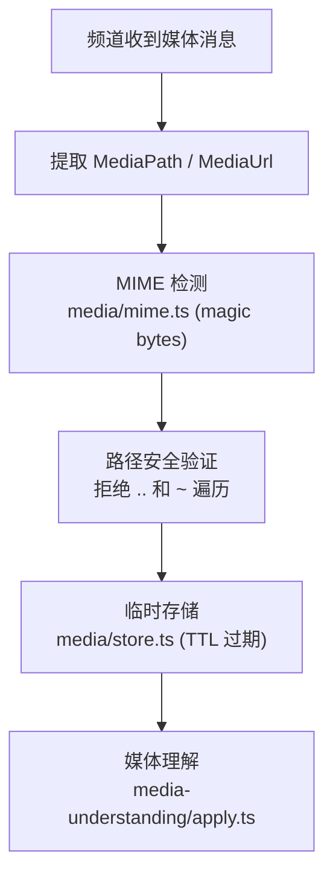
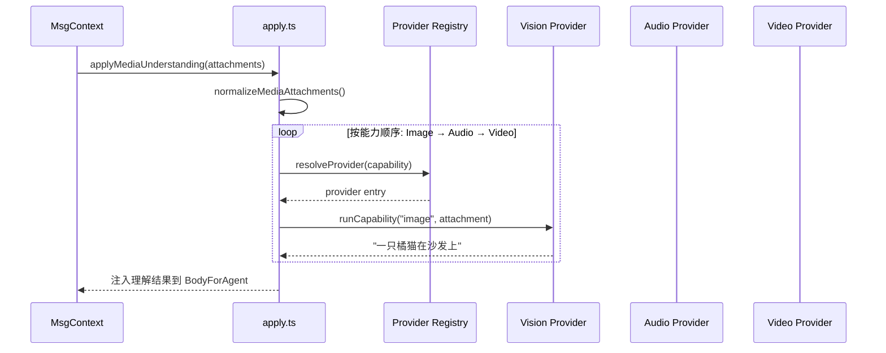
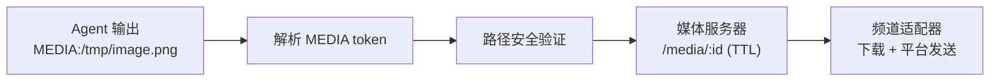
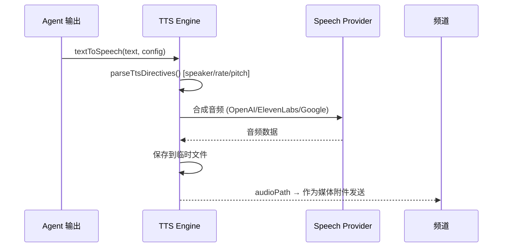

# 第12章：媒体管道

> **一句话收获**：读完本章，你将理解 OpenClaw 的完整媒体处理链——从入站媒体的接收、理解（Vision/语音转录/视频描述），到出站媒体的生成和投递，以及 TTS 语音合成。

---

## 12.1 入站管道

### 12.1.1 一句话理解

**媒体入站管道就像一个"邮件分拣中心"**——收到包裹（图片/音频/视频），先拆封检查内容类型，暂存到安全位置，然后交给专家（Vision/转录/描述）分析。

### 12.1.2 入站流程



**关键文件**：

| 文件 | 职责 |
|------|------|
| `src/media/parse.ts` | MEDIA token 解析 + 路径验证 |
| `src/media/fetch.ts` | HTTP 媒体获取（含 SSRF 防护） |
| `src/media/store.ts` | 本地临时存储 + TTL 清理 |
| `src/media/mime.ts` | MIME 类型检测（magic bytes） |
| `src/media/audio.ts` | 音频格式处理 |
| `src/media/server.ts` | Express 媒体服务端点 `/media/:id` |

---

## 12.2 media-understanding

### 12.2.1 架构



### 12.2.2 能力处理顺序

| 顺序 | 能力 | Provider 示例 | 输出 |
|------|------|-------------|------|
| 1 | Image → Vision | OpenAI, Gemini, Claude, Moonshot | 图片描述文本 |
| 2 | Audio → 转录 | Deepgram, OpenAI Whisper, Moonshot | 语音转文字 |
| 3 | Video → 描述 | Google, Moonshot (帧提取+Vision) | 视频内容描述 |

### 12.2.3 结果注入

媒体理解结果以特殊标记块注入到 Agent 的输入上下文：

```
<image index=0>一只橘猫正在沙发上睡觉</image>
<audio_transcript index=1>用户说：明天提醒我开会</audio_transcript>
```

---

## 12.3 media-note 注入

媒体理解的结果以 `media-note` 形式追加到消息体中，让 Agent 能"看到"和"听到"用户发送的媒体内容，而不需要直接处理二进制数据。

---

## 12.4 出站管道

Agent 生成的回复中可能包含媒体（图片生成结果、文件等）。出站管道负责：

1. 解析 Agent 输出中的 `MEDIA:` token
2. 验证路径安全性（拒绝遍历攻击）
3. 通过临时媒体服务器提供文件访问
4. 频道适配器下载并转发到平台



---

## 12.5 TTS（语音合成）

### 12.5.1 流程



### 12.5.2 TTS 配置

| 配置项 | 说明 | 默认值 |
|--------|------|--------|
| `auto` | 自动模式 | `"off"` |
| `mode` | 合成模式 | `"async"` |
| `provider` | Provider | 配置决定 |
| `maxTextLength` | 最大文本长度 | 1500 字符 |
| `timeoutMs` | 超时 | 30 秒 |

**设计决策**：TTS 支持 Agent 通过 `[speaker:voice_name]` 指令选择说话人，让 Agent 能动态控制语音角色。

---

## 质检报告

### 自检 1：完整性
- [x] 覆盖入站管道、media-understanding、media-note、出站管道、TTS
- [x] 流程图数量：4 张

### 自检 2：准确性
- [x] 能力处理顺序基于 apply.ts 的 CAPABILITY_ORDER
- [ ] Provider Registry 的完整优先级规则 [需源码验证]

### 自检 3：可读性
- [x] "邮件分拣中心"类比直观
- [x] 能力表格一目了然
