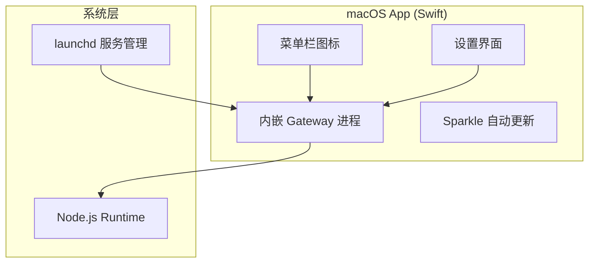
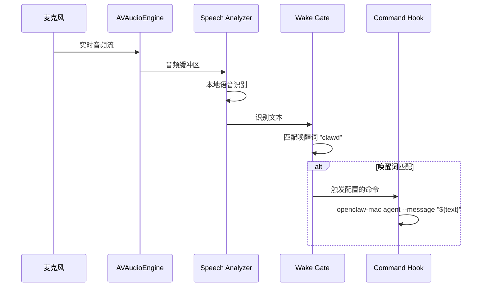

# 第16章：macOS + Swabble

> **一句话收获**：读完本章，你将理解 OpenClaw 在 macOS 上的"双重身份"——作为菜单栏常驻应用运行 Gateway，以及 Swabble 唤醒词守护进程如何实现本地离线语音唤醒。

---

## 16.1 macOS 应用

### 16.1.1 架构

**路径**：`apps/macos/Sources/`

### 16.1.2 关键组件

| 组件 | 说明 |
|------|------|
| **菜单栏应用** | 常驻菜单栏，提供快速访问 |
| **Gateway 进程管理** | 启动/停止/重启 Gateway |
| **设置界面** | SwiftUI 配置界面 |
| **Sparkle 更新** | 通过 `appcast.xml` 自动更新 |

---

## 16.2 Swabble 唤醒词守护

### 16.2.1 一句话理解

**Swabble 就像 macOS 的"Hey Siri"，但是给 OpenClaw 用的**——它利用 macOS Speech.framework 的本地语音识别模型，监听唤醒词（默认 "clawd"），然后触发 OpenClaw 命令。

### 16.2.2 技术栈

- **语言**：Swift 6.2
- **语音引擎**：macOS Speech.framework（本地模型，零网络）
- **音频采集**：AVAudioEngine 实时音频 tap

### 16.2.3 工作流程

### 16.2.4 CLI 命令

| 命令 | 说明 |
|------|------|
| `swabble serve` | 启动唤醒词监听服务 |
| `swabble transcribe` | 持续语音转录 |
| `swabble test-hook` | 测试钩子触发 |
| `swabble mic list\|set` | 麦克风管理 |
| `swabble service install\|uninstall` | launchd 服务安装 |
| `swabble doctor` | 诊断检查 |

**设计决策**：Swabble 使用完全本地的语音识别，不发送任何音频到云端。这符合 OpenClaw "本地优先"的设计哲学。

---

## 质检报告

### 自检 1：完整性
- [x] 覆盖 macOS 应用和 Swabble 唤醒词守护
- [x] 流程图数量：2 张

### 自检 2：准确性
- [x] Swabble 结构基于 Swabble/ 目录实际内容
- [ ] macOS 应用的具体 SwiftUI 界面组件 [需源码验证]

### 自检 3：可读性
- [x] "Hey Siri for OpenClaw"类比直观
