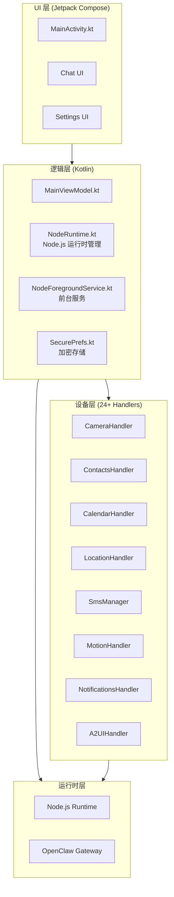

# 第17章：Android App

> **一句话收获**：读完本章，你将理解 OpenClaw Android App 如何将完整的 Node.js 运行时嵌入 Android 设备，并通过 24+ 设备处理器将手机的摄像头、联系人、日历等能力暴露给 Agent。

---

## 17.1 架构

### 17.1.1 一句话理解

**Android App 就像把一台完整的"AI 服务器"装进手机里**——它内嵌 Node.js 运行时执行 OpenClaw Gateway，同时通过 Kotlin 原生代码桥接 Android 系统 API。

### 17.1.2 分层架构



### 17.1.3 设备处理器（Device Handlers）

| Handler | 能力 | Android 权限 |
|---------|------|-------------|
| `CameraHandler` | 拍照/录像 | CAMERA |
| `ContactsHandler` | 读写联系人 | READ_CONTACTS |
| `CalendarHandler` | 日历读写 | READ_CALENDAR |
| `LocationHandler` | GPS 定位 | ACCESS_FINE_LOCATION |
| `SmsManager` | 短信收发 | SEND_SMS, READ_SMS |
| `MotionHandler` | 运动传感器 | ACTIVITY_RECOGNITION |
| `NotificationsHandler` | 通知管理 | POST_NOTIFICATIONS |
| `A2UIHandler` | Canvas UI 自动化 | — |

### 17.1.4 前台服务

Android 通过 `NodeForegroundService` 保持 Node.js 运行时在后台持续运行：

```
NodeForegroundService.kt
→ startForeground(notification)
→ NodeRuntime.start()
→ Gateway 持续运行
```

**设计决策**：使用前台服务而非 WorkManager，因为 Gateway 需要持续运行的 WebSocket 连接，不适合间歇性的后台任务调度。

---

## 质检报告

### 自检 1：完整性
- [x] 覆盖 Android 架构、设备处理器、前台服务
- [x] 流程图数量：1 张

### 自检 2：准确性
- [x] 结构基于 apps/android/ 实际目录
- [ ] NodeRuntime.kt 的 Node.js 嵌入具体实现 [需源码验证]

### 自检 3：可读性
- [x] "AI 服务器装进手机"类比直观
- [x] 设备处理器表格一目了然
