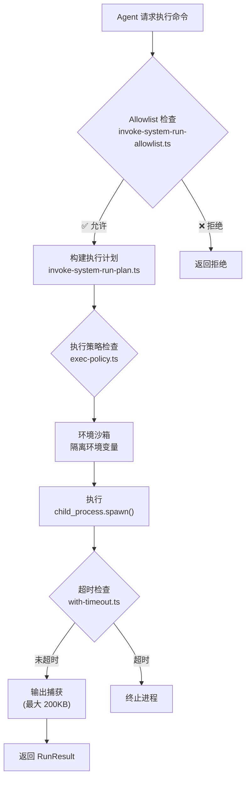

# 第18章：Node 设备系统

> **一句话收获**：读完本章，你将理解 `src/node-host/` 如何提供安全的命令执行能力——从 Allowlist 验证到执行环境沙箱，确保 Agent 的系统操作不会越权。

---

## 18.1 一句话理解

**Node Host 就像一个"保安室"**——Agent 想执行任何系统命令都要经过这个保安室，保安会检查命令是否在白名单上、环境变量是否安全、输出是否超限。

---

## 18.2 执行流程

### 18.2.1 关键文件

| 文件 | 职责 |
|------|------|
| `invoke.ts` | 执行主入口 |
| `invoke-system-run.ts` | 系统命令运行器 |
| `invoke-system-run-plan.ts` | 执行计划构建 |
| `invoke-system-run-allowlist.ts` | Allowlist 验证 |
| `exec-policy.ts` | 安全策略 |
| `runner.ts` | 凭证解析 + 执行逻辑 |
| `config.ts` | 配置管理 |
| `with-timeout.ts` | 超时封装 |

### 18.2.2 安全约束

| 约束 | 说明 |
|------|------|
| **Allowlist** | 只有白名单中的可执行文件才能运行 |
| **环境隔离** | 敏感环境变量不传递给子进程 |
| **输出限制** | stdout + stderr 上限 200KB |
| **超时控制** | 可配置超时，超时自动 kill |
| **路径验证** | Skill bin 信任验证（PATH 解析） |

---

## 质检报告

### 自检 1：完整性
- [x] 覆盖 node-host 执行流程和安全约束
- [x] 流程图数量：1 张

### 自检 2：准确性
- [x] 文件列表基于 src/node-host/ 实际结构
- [ ] exec-policy 的具体策略规则 [需源码验证]

### 自检 3：可读性
- [x] "保安室"类比直观
