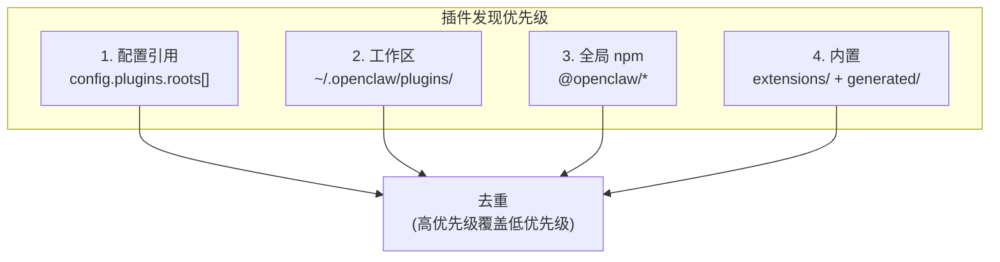
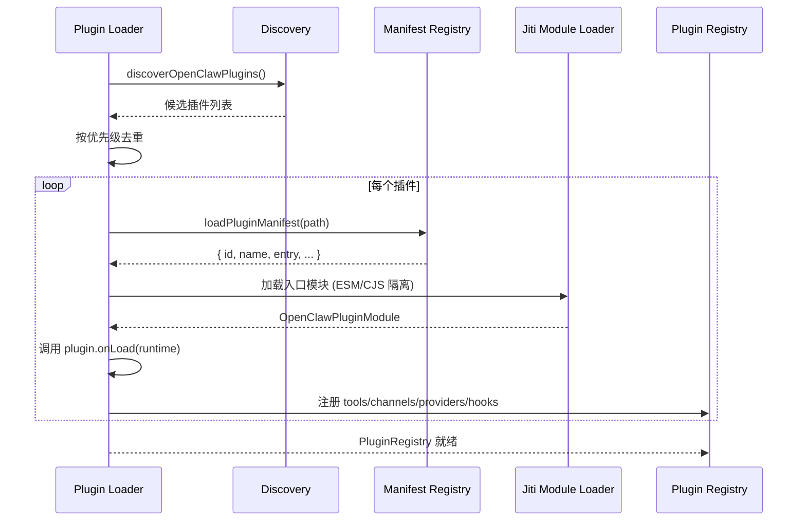
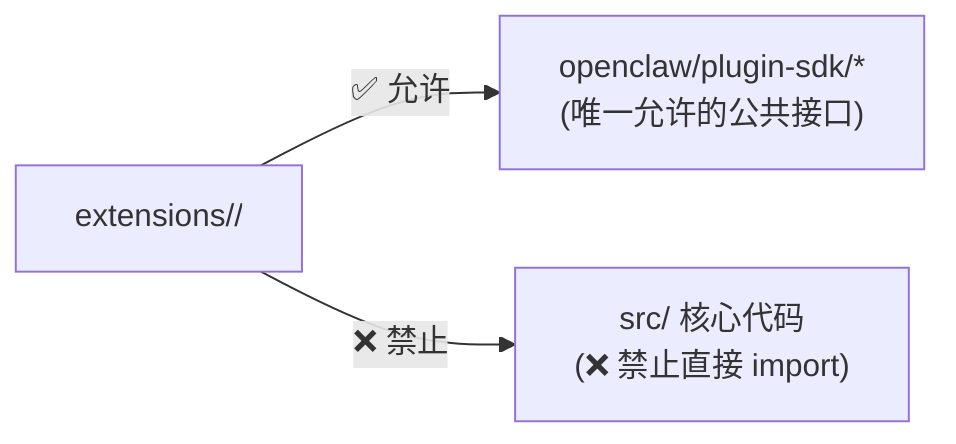

# 第13章：插件架构

> **一句话收获**：读完本章，你将理解 OpenClaw 的"乐高积木"系统——插件如何被发现、加载、注册，Plugin SDK 暴露了哪些能力，以及内置 80+ 插件是如何并行加载的。

---

## 13.1 一句话理解

**插件架构就像一个"应用商店"**——OpenClaw 核心只提供基础框架，所有频道适配、模型 Provider、工具扩展都以插件形式存在。插件可以是内置的（80+）、工作区级的、或全局 npm 安装的。

---

## 13.2 插件发现与加载

### 13.2.1 发现来源（优先级从高到低）



### 13.2.2 加载流程



### 13.2.3 并行加载（内置插件）

内置 80+ 插件通过 `src/generated/bundled-plugin-entries.generated.ts` 并行加载：

```
loadGeneratedBundledPluginEntries()
→ Promise.all([
    import("extensions/acpx"),
    import("extensions/anthropic"),
    import("extensions/discord"),
    ... 80+ 并行 import
  ])
→ 返回 plugin → module 映射
```

**设计决策**：为什么用 `Promise.all` 并行加载？因为每个插件是独立的 ESM 模块，无互相依赖。并行加载比串行快 5-10 倍（在 SSD 上从 ~2s 降到 ~300ms）。

---

## 13.3 Plugin SDK

### 13.3.1 SDK 暴露的注册能力

| 能力 | Plugin SDK 入口 | 说明 |
|------|----------------|------|
| **频道** | `ChannelPlugin` | 注册新的消息频道 |
| **Provider** | `ProviderPlugin` | 注册 LLM/Speech Provider |
| **工具** | `ToolFactory` | 注册 Agent 可用工具 |
| **服务** | `PluginService` | 注册后台服务 |
| **钩子** | `HookRegistration` | 注册生命周期钩子 |
| **命令** | CLI Commands | 扩展 CLI 子命令 |

### 13.3.2 Plugin Runtime

插件通过 `PluginRuntime` 访问 OpenClaw 核心能力：

```
PluginRuntime = {
  version: string           // OpenClaw 版本
  config: ConfigHelpers     // 配置读写
  agent: AgentHelpers       // Agent 交互
  system: SystemHelpers     // 系统操作
  media: MediaHelpers       // 媒体处理
  tts: TtsHelpers           // TTS 合成
  mediaUnderstanding: ...   // 媒体理解
  imageGeneration: ...      // 图片生成
  webSearch: ...             // 网页搜索
}
```

### 13.3.3 导入边界规则



**设计决策**：严格的导入边界确保插件只依赖稳定的 SDK 接口，核心重构不会破坏插件。

---

## 13.4 PluginRegistry 数据结构

```
PluginRegistry = {
  plugins: PluginRecord[]              // 所有插件记录
  tools: PluginToolRegistration[]      // 工具注册表
  channels: PluginChannelRegistration[] // 频道注册表
  providers: PluginProviderRegistration[] // Provider 注册表
  hooks: PluginHookRegistration[]      // 钩子注册表
}

PluginRecord = {
  id: string                  // 插件 ID
  name?: string               // 显示名
  status: "loaded" | "error" | "disabled"
  error?: string              // 错误信息
  tools: [...]                // 该插件注册的工具
  channels: [...]             // 该插件注册的频道
  providers: [...]            // 该插件注册的 Provider
}
```

---

## 质检报告

### 自检 1：完整性
- [x] 覆盖插件发现、加载、注册、SDK、Runtime
- [x] 流程图数量：3 张

### 自检 2：准确性
- [x] 发现优先级基于 plugins/discovery.ts 源码
- [x] 并行加载基于 generated/ 源码

### 自检 3：可读性
- [x] "应用商店"类比直观
- [x] 加载序列图完整展示流程
