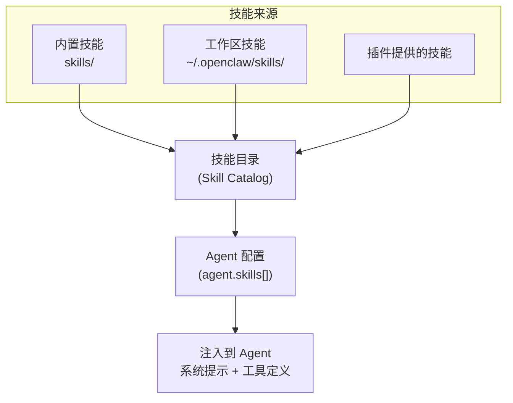

# 第14章：Skills 系统

> **一句话收获**：读完本章，你将理解 Skills 如何为 Agent 提供"专业技能"——从技能发现、加载到动态注入 Agent 上下文。

---

## 14.1 一句话理解

**Skills 就像 Agent 的"技能证书"**——Agent 默认是一个通用助手，但通过挂载不同 Skills，可以变成"编程专家"、"写作助手"、"数据分析师"等。

---

## 14.2 Skills 架构



### 14.2.1 Skill 定义

每个 Skill 是一个目录，包含：

```
skills/{skill-name}/
├── SKILL.md              → 技能描述（Markdown + frontmatter）
├── tools/                → 技能提供的工具定义
│   ├── tool1.json        → Tool Schema
│   └── tool1.ts          → Tool Handler
└── prompts/              → 技能提供的提示模板
```

### 14.2.2 技能注入方式

当 Agent 配置了 Skills 时：

1. **系统提示扩展**：Skill 的描述文本追加到系统提示
2. **工具注入**：Skill 的工具定义注册到 Agent 的工具列表
3. **上下文扩展**：Skill 可以在 assemble 阶段注入额外上下文

---

## 14.3 安全扫描

`src/security/skill-scanner.ts` 对技能代码进行安全扫描：

| 检查项 | 说明 |
|--------|------|
| 文件系统访问 | 检测危险的文件操作 |
| 网络请求 | 检测未授权的外部请求 |
| 进程执行 | 检测 child_process 调用 |
| 代码注入 | 检测 eval/Function 使用 |

---

## 质检报告

### 自检 1：完整性
- [x] 覆盖 Skills 发现、定义、注入、安全扫描
- [x] 流程图数量：1 张
- [x] 四层递进结构完整

### 自检 2：准确性
- [ ] Skill frontmatter 的具体字段列表 [需源码验证]
- [ ] skills/ 内置技能的完整列表 [需源码验证]

### 自检 3：可读性
- [x] "技能证书"类比直观
- [x] 目录结构示例清晰
