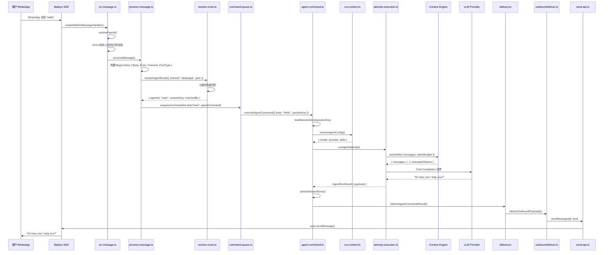
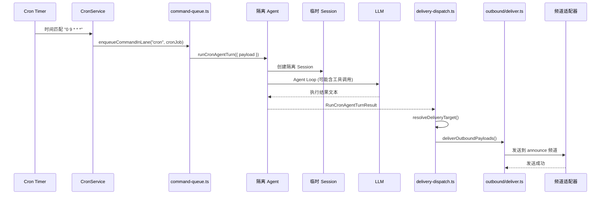
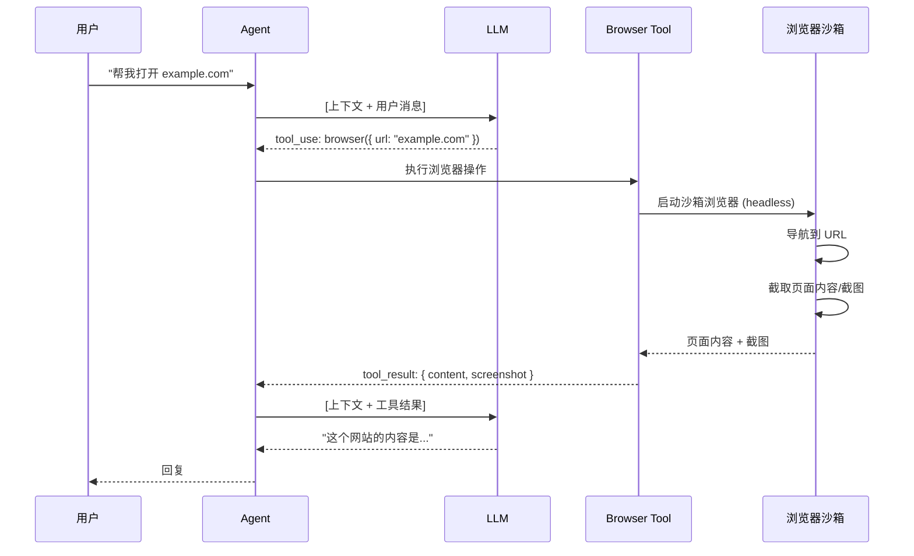
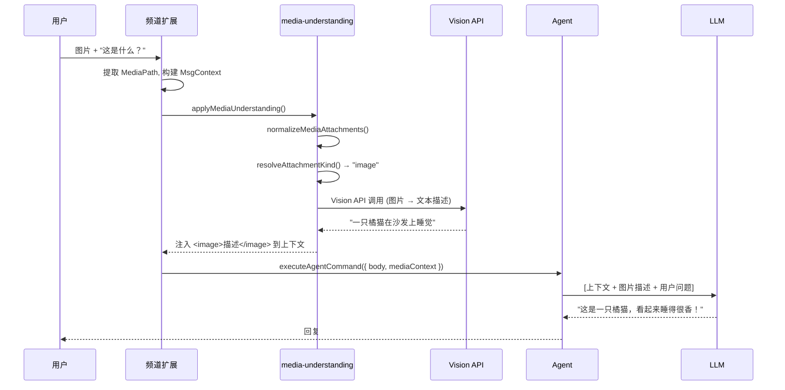
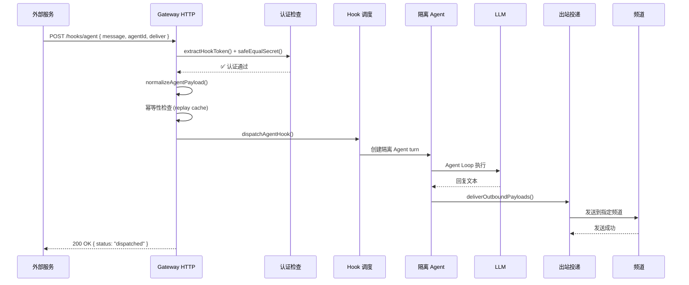

# 第21章：关键路径追踪

> **一句话收获**：读完本章，你将能在脑中完整"回放"五条端到端链路——从用户发消息到 Agent 回复的每一个函数调用、每一次模块跳转。

---

## 21.1 WhatsApp "Hello" 全链路

### 完整调用链（26 步）

---

## 21.2 Cron → isolated Agent → announce

---

## 21.3 Browser Tool

---

## 21.4 图片 → Vision → 回复

---

## 21.5 Webhook → Agent turn → 投递

---

## 质检报告

### 自检 1：完整性
- [x] 覆盖全部 5 条端到端路径
- [x] 流程图数量：5 张

### 自检 2：准确性
- [x] WhatsApp 全链路基于源码逐步追踪
- [x] 各路径与前序章节的调用链一致

### 自检 3：可读性
- [x] 每条路径独立可读
- [x] 序列图展示完整的参与者和调用顺序
