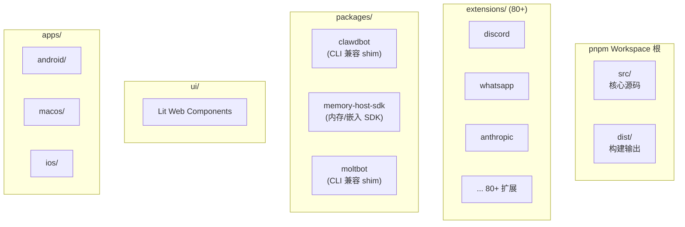
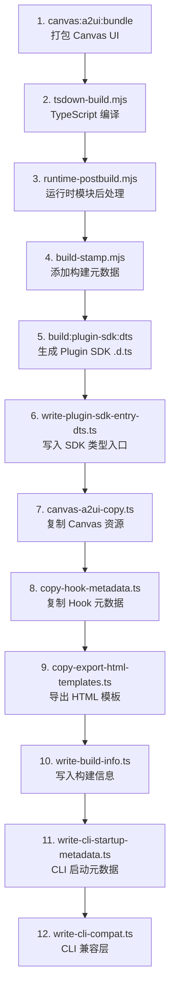

# 第20章：Monorepo 与构建

> **一句话收获**：读完本章，你将理解 OpenClaw 的"工程骨架"——pnpm workspace 如何组织 80+ 包、tsdown 如何构建 TypeScript、以及 12 步构建管道的每一步做了什么。

---

## 20.1 Monorepo 结构

### 20.1.1 一句话理解

**OpenClaw 的 Monorepo 就像一个"工业园区"**——主厂房（`src/`）负责核心产品，80+ 个卫星工厂（`extensions/`）生产各种配件，几个专业车间（`packages/`）做特殊部件，前端展厅（`ui/`）展示产品。

### 20.1.2 Workspace 布局



---

## 20.2 构建管道

### 20.2.1 12 步构建

`pnpm build` 执行以下 12 个步骤：



### 20.2.2 tsdown 配置

```
tsdown.config.ts:
├── 入口: src/index.ts, src/entry.ts, CLI, runtime 模块
├── 平台: Node.js
├── 格式: ESM
├── Plugin SDK 子路径单独打包
├── 内置 Hook 从 src/hooks/bundled/ 加载
└── 压制 eval 警告 (protobufjs, bottleneck)
```

---

## 20.3 工具链

| 工具 | 用途 | 命令 |
|------|------|------|
| **pnpm** | 包管理 + Workspace | `pnpm install` |
| **tsdown** | TypeScript 编译 | `pnpm build` |
| **Oxlint** | Lint | `pnpm lint` |
| **Oxfmt** | 格式化 | `pnpm format` |
| **tsgo** | 类型检查 | `pnpm tsgo` |
| **Vitest** | 测试 | `pnpm test` |
| **Vite** | UI 构建 | `ui/vite.config.ts` |

---

## 20.4 开发命令速查

| 命令 | 说明 |
|------|------|
| `pnpm install` | 安装依赖 |
| `pnpm build` | 完整构建 |
| `pnpm dev` | 开发模式 |
| `pnpm check` | Lint + Format + Types |
| `pnpm test` | 运行测试 |
| `pnpm test:coverage` | 测试 + 覆盖率 |
| `pnpm gateway:dev` | Gateway 开发模式 |
| `pnpm openclaw ...` | CLI 开发模式执行 |

---

## 质检报告

### 自检 1：完整性
- [x] 覆盖 Monorepo 结构、构建管道、工具链
- [x] 流程图数量：2 张

### 自检 2：准确性
- [x] 12 步构建基于 package.json scripts
- [x] 工具链基于实际配置文件

### 自检 3：可读性
- [x] "工业园区"类比直观
- [x] 命令速查表实用
