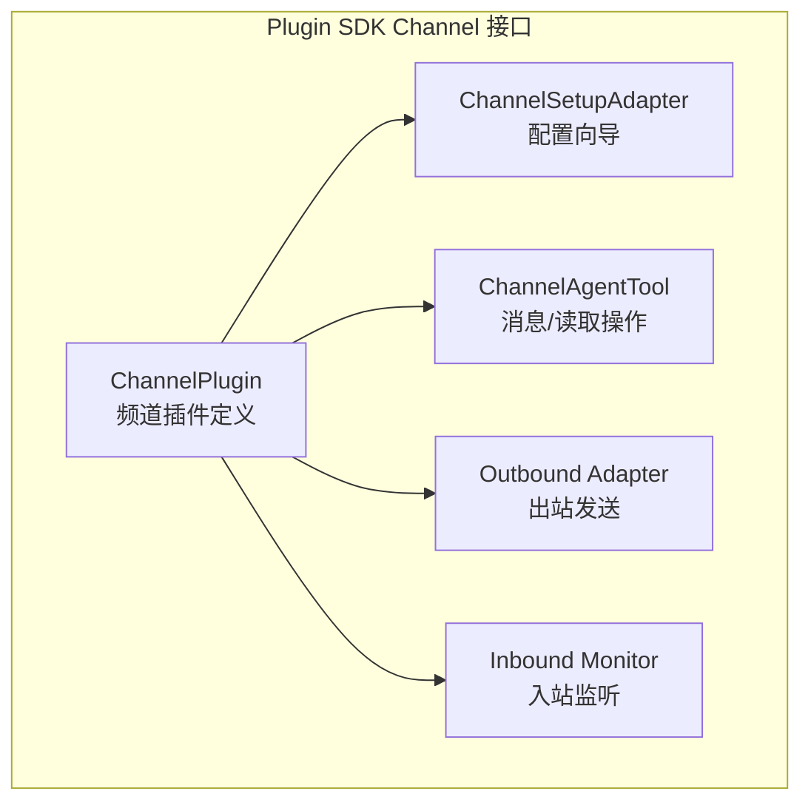
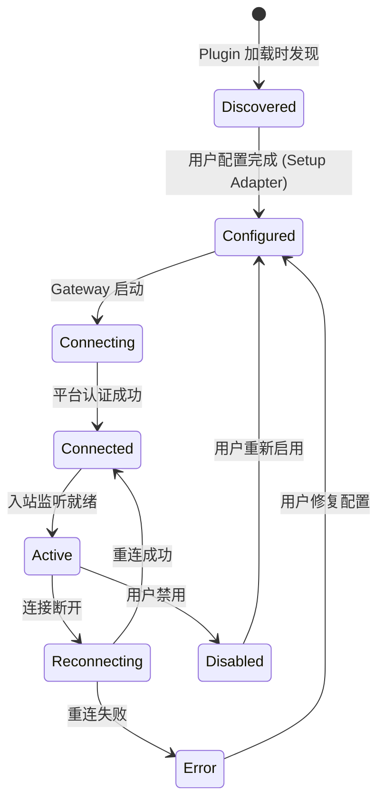
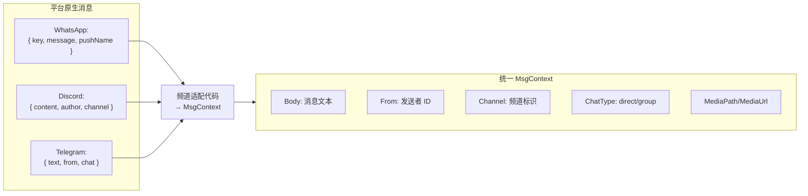

# 第10章：频道抽象层

> **一句话收获**：读完本章，你将理解 OpenClaw 如何用一套统一的 ChannelPlugin 接口适配 20+ 即时通讯平台——从接口体系到频道生命周期，再到消息标准化。

---

## 10.1 类比：一个万能翻译局

频道抽象层就像一个**万能翻译局**——每个平台（WhatsApp、Discord、Telegram…）说自己的"方言"，翻译局把它们全部翻译成统一的"普通话"（MsgContext），反过来也把 Agent 的回复从"普通话"翻译回各平台方言。

---

## 10.2 ChannelPlugin 接口体系

### 10.2.1 核心接口

### 10.2.2 ChannelPlugin 必须实现的能力

| 能力 | 说明 | 是否必须 |
|------|------|---------|
| **Inbound Monitor** | 监听平台消息并转为 MsgContext | ✅ 必须 |
| **Outbound Adapter** | 将 Agent 回复发送到平台 | ✅ 必须 |
| **Setup Adapter** | 配置向导（API Key 输入、账号登录等） | 推荐 |
| **Agent Tool** | message.send / message.read 工具能力 | 推荐 |
| **Health Monitor** | 频道健康状态上报 | 可选 |

---

## 10.3 频道生命周期

### 生命周期事件

| 事件 | 触发时机 | 处理 |
|------|---------|------|
| `channel:discovered` | 插件加载时 | 注册到频道列表 |
| `channel:configured` | Setup 完成 | 保存凭证 |
| `channel:connected` | 平台认证成功 | 开始监听入站消息 |
| `channel:disconnected` | 连接断开 | 触发重连策略 |
| `channel:error` | 不可恢复错误 | 上报健康状态 |

---

## 10.4 消息标准化

### 10.4.1 入站标准化

每个频道扩展负责将平台原生消息转为 MsgContext：

### 10.4.2 出站格式化

反过来，Agent 回复需要转为各平台的原生格式：

| 平台 | 转换 | 示例 |
|------|------|------|
| WhatsApp | Markdown → WhatsApp 格式 | `**粗体**` → `*粗体*` |
| Discord | Markdown → Discord 格式 | 支持 embed, code block |
| Telegram | Markdown → Telegram HTML | `**粗体**` → `<b>粗体</b>` |
| Slack | Markdown → mrkdwn | `**粗体**` → `*粗体*` |

**设计决策**：为什么在频道层做格式转换而不是 Agent 层？因为 Agent 应该只关心"说什么"（内容），而不关心"怎么说"（格式）。格式转换是频道的责任，这样新增频道不需要修改 Agent 逻辑。

---

## 质检报告

### 自检 1：完整性
- [x] 本章覆盖 `src/channels/` 和 `extensions/` 的频道抽象层
- [x] 四层递进结构完整
- [x] 流程图数量：3 张

### 自检 2：准确性
- [x] ChannelPlugin 接口基于 plugin-sdk 源码
- [ ] ChannelHealthMonitor 的具体心跳协议 [需源码验证]

### 自检 3：可读性
- [x] "万能翻译局"类比直观
- [x] 生命周期状态机清晰
