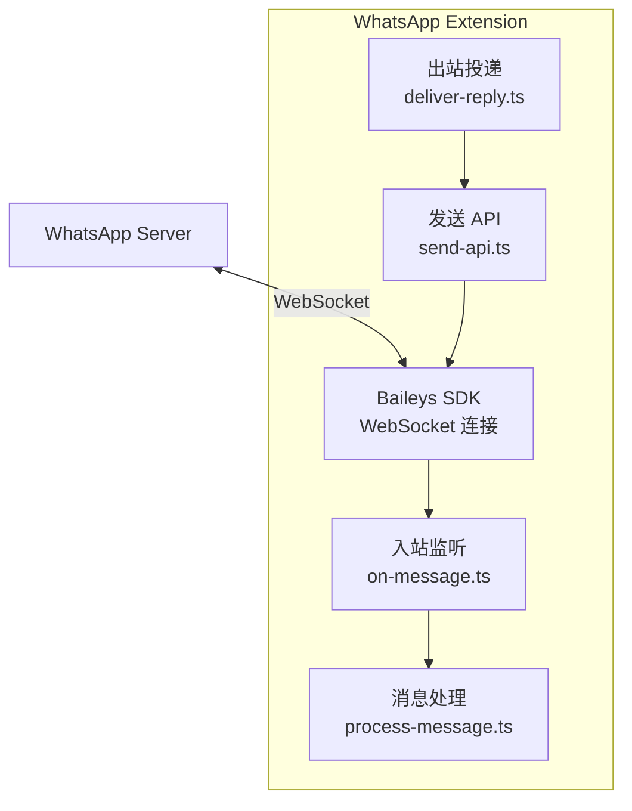
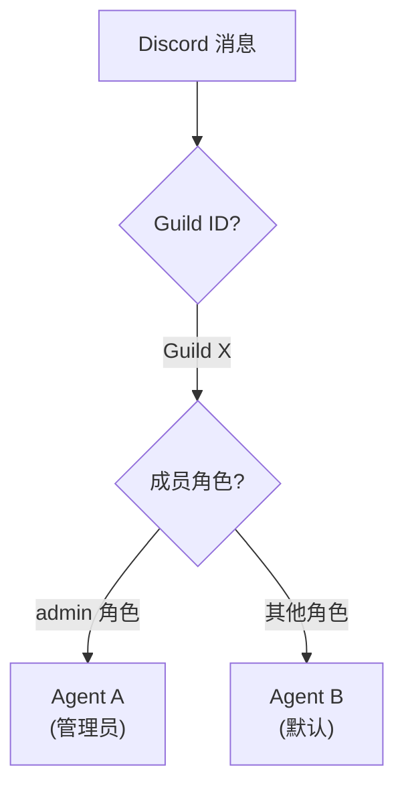
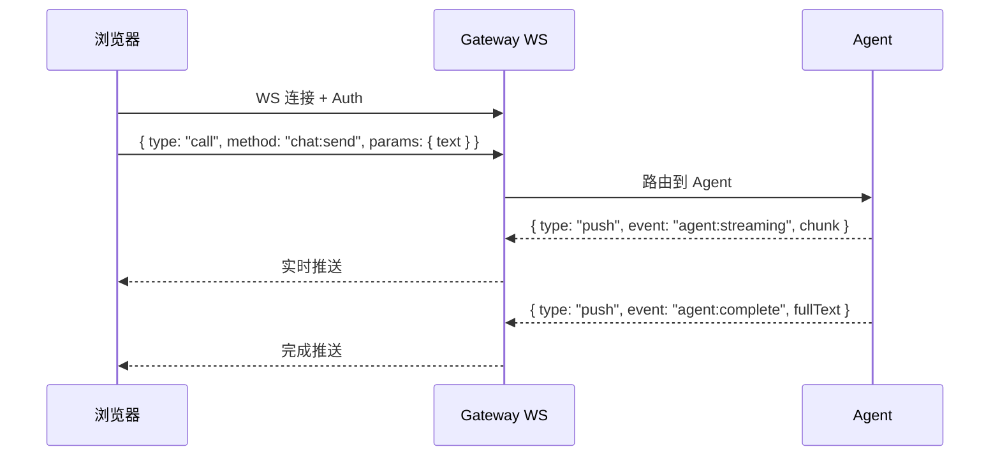

# 第11章：典型频道实现

> **一句话收获**：读完本章，你将通过 WhatsApp、Telegram、Discord、WebChat 四个典型频道的实现，理解 ChannelPlugin 接口在不同平台上的具体落地方式。

---

## 11.1 WhatsApp

### 11.1.1 技术栈

- **SDK**：Baileys（非官方 WhatsApp Web API，基于 WebSocket）
- **认证**：QR 码扫描 → 本地 Session 保持
- **扩展路径**：`extensions/whatsapp/`

### 11.1.2 架构

### 11.1.3 关键文件

| 文件 | 职责 |
|------|------|
| `src/auto-reply/monitor/on-message.ts` | 创建消息处理器 |
| `src/auto-reply/monitor/process-message.ts` | 消息解析 + MsgContext 构建 |
| `src/auto-reply/deliver-reply.ts` | 回复格式化 + 分块发送 |
| `src/inbound/send-api.ts` | Baileys 发送 API 封装 |

### 11.1.4 特殊处理

- **Echo 检测**：通过 echo tracker 避免回复自己的消息
- **群组 @mention 门控**：群消息只在被 @mention 时触发
- **Markdown 转换**：`markdownToWhatsApp()` 将标准 Markdown 转为 WhatsApp 格式

---

## 11.2 Telegram

### 11.2.1 技术栈

- **SDK**：Telegraf / Bot API
- **认证**：Bot Token（通过 @BotFather 创建）
- **扩展路径**：`extensions/telegram/`

### 11.2.2 特殊能力

| 能力 | 说明 |
|------|------|
| Bot 命令 | 支持 `/start`, `/help` 等 Bot 命令 |
| 内联按钮 | 支持 InlineKeyboard 交互 |
| HTML 格式 | 回复使用 Telegram HTML 格式 |
| 群管理 | 群组权限检查 |

---

## 11.3 Discord

### 11.3.1 技术栈

- **SDK**：discord.js
- **认证**：Bot Token + OAuth2
- **扩展路径**：`extensions/discord/`

### 11.3.2 路由特殊性

Discord 是唯一支持 **Guild + Role** 级别路由的频道：

### 11.3.3 关键文件

| 文件 | 职责 |
|------|------|
| `src/monitor/message-handler.ts` | 消息处理入口 |
| `src/monitor/message-handler.preflight.ts` | 预检（Bot 自身过滤、DM 策略） |
| `src/mentions.ts` | @mention 检测 |

---

## 11.4 WebChat

### 11.4.1 技术栈

- **协议**：Gateway WebSocket（直连，无第三方 SDK）
- **前端**：Lit Web Components（`ui/` 目录）
- **入口**：`src/channel-web.ts` / `src/provider-web.ts`

### 11.4.2 架构特点

WebChat 与其他频道的最大区别——它不经过外部平台，直接通过 Gateway WebSocket 通信：

**设计决策**：WebChat 可以支持完整的 streaming，因为它直接使用 WebSocket，不受第三方平台消息格式限制。

---

## 质检报告

### 自检 1：完整性
- [x] 覆盖 WhatsApp、Telegram、Discord、WebChat 四个典型频道
- [x] 四层递进结构完整
- [x] 流程图数量：4 张

### 自检 2：准确性
- [x] 文件路径基于 extensions/ 目录实际结构
- [ ] Telegram Bot 命令的具体注册方式 [需源码验证]

### 自检 3：可读性
- [x] 每个频道独立可读
- [x] Discord 路由特殊性用图表清晰展示
